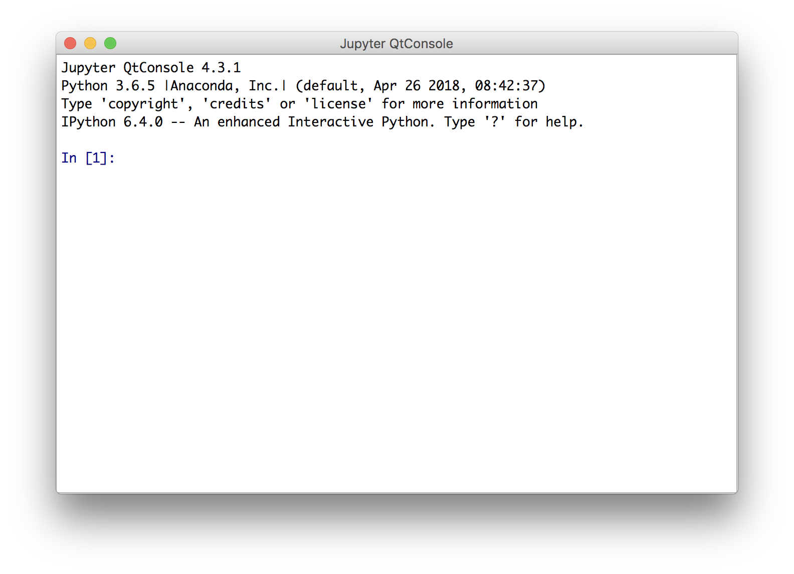
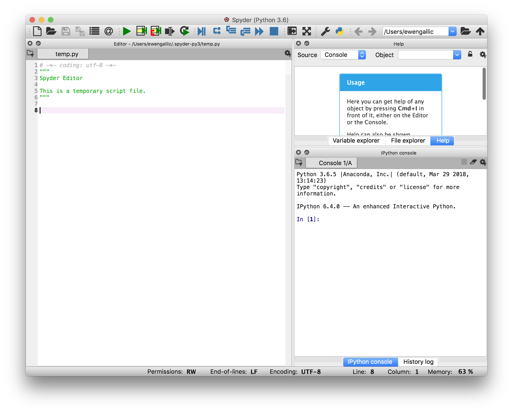
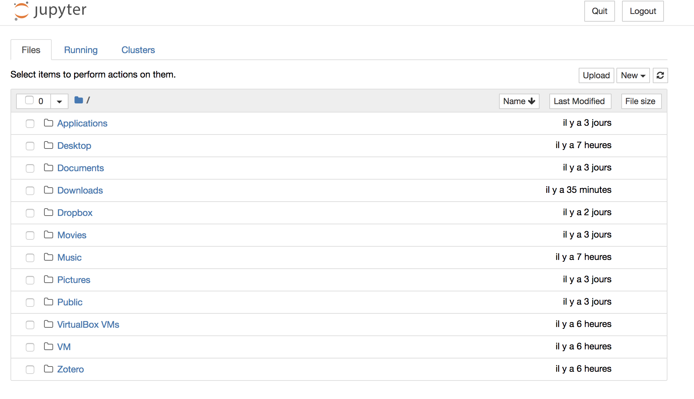
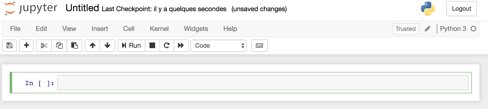
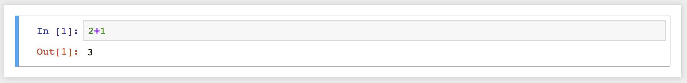
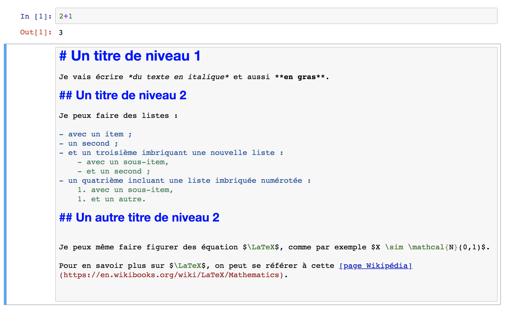
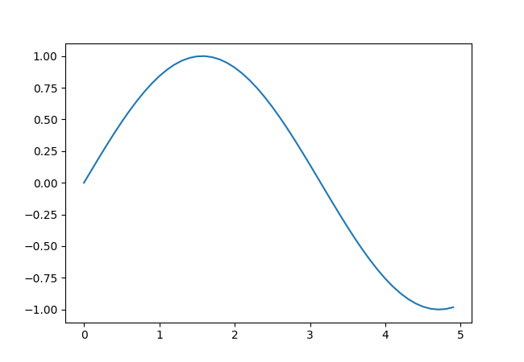

```{r knitr_init, echo=FALSE, cache=FALSE, include=FALSE}

library(knitr)
library(tidyverse)

## Global options
options(max.print="75")
opts_chunk$set(echo=TRUE,
	             cache=FALSE,
               prompt=FALSE,
               tidy=TRUE,
               # comment=NA,
               message=FALSE,
               warning=FALSE,
               size="scriptsize",
               tidy.opts=list(width.cutoff=80))
opts_knit$set(width=80)


# library(reticulate)
# use_python('/anaconda3/bin/python')

knitr::opts_chunk$set(engine.path = list(
  python = '/anaconda3/bin/python'
))
knitr::knit_engines$set(python = reticulate::eng_python)
# use_python("/anaconda3/bin/python/")
# py_config()


# toto <- import("pandas")

# ## a common hook for messages, warnings and errors
# hook_lst_bf = function(x, options) {
#     paste("\\begin{lstlisting}[basicstyle={\\bfseries}]\n", x, 
#         "\\end{lstlisting}\n", sep = "")
# }
# knit_hooks$set(source = function(x, options) {
#     paste("\\begin{lstlisting}\n", x, 
#         "\\end{lstlisting}\n", sep = "")
# }, output = function(x, options) {
#     paste("\\begin{lstlisting}[basicstyle={\\ttfamily}]\n", x, 
#         "\\end{lstlisting}\n", sep = "")
# }, warning = hook_lst_bf, message = hook_lst_bf, error = hook_lst_bf)
# 
# ## empty highlight header since it is not useful any more
# set_header(highlight = "")

options(bookdown.post.latex = function(x) {
  # x is the content of the LaTeX output file
  gsub('^\\\\(begin|end)\\{verbatim\\}$', '\\\\\\1{lstlisting}', x)
})


```


# Propos liminaires {-}

<!-- ```{r, echo=F} -->
<!-- invisible(py_config()) -->
<!-- ``` -->


Ces notes de cours ont été réalisées dans le cadre d'un enseignement d'introduction à Python adressé à des étudiants du parcours Économétrie et Big Data de [l'École d'Economie d'Aix-Marseille / Aix-Marseille School of Economics (AMSE)](https://www.amse-aixmarseille.fr/) d'Aix-Marseille Université.


## Objectifs

Cet ouvrage a pour but l'initiation au langage de programmation Python, afin d'être capable de s'en servir de manière efficace et autonome. Le lecteur peut exécuter tous les exemples fournis (et est vivement encouragé à le faire). Des exercices viennent clore certains chapitres, pour mieux s'approprier les notions couvertes au fur et à mesure de la lecture.


Bien évidemment, Python étant un langage très vaste, ces notes ne sauraient et n'ont pas pour vocation à être exhaustives de l'utilisation de ce langage informatique.


## À qui s'adressent ces notes ?

Dans un premier temps, cet ouvrage s'adresse aux débutants qui souhaientent apprendre les bases en Python. Il est à destination des étudiants de l'AMSE mais pourrait intéresser des individus ayant une approche de la donnée à travers la discipline économique désirant découvrir Python.

# Introduction


Ce document est construit principalement à l'aide de différentes références, parmi lesquelles :

- des livres : @briggs_2013_python, @grus_2015_data, @vanderplas2016python, @mckinney_2017_python ;
- des (excellents) notebooks : @navaro_python.


## Historique


Python est un langage de programmation multi plates-formes, écrit en `C`, placé sous une licence libre. Il s'agit d'un langage interprété, c'est-à-dire qu'il nécessite un interprète pour exécuter les commandes, et n'a pas de phase de compilation. Sa première version publique date de 1991. L'auteur principal, [Guido van Rossum](https://en.wikipedia.org/wiki/Guido_van_Rossum) avait commencé à travailler sur ce langage de programmation durant la fin des années 1980. Le nom accordé au langage Python provient de l'intérêt de son créateur principal pour une série télévisée britannique diffusée sur la BBC intitulée "*Monty Python's Flying Circus*".

La popularité de Python a connu une croissance forte ces dernières années, comme le confirment les résultats de sondages proposés par [Stack Overflow](https://stackoverflow.com/) depuis 2011. Stack Overflow propose à ses utilisateurs de répondre à une enquête dans laquelle de nombreuses questions leur sont proposées, afin de décrire leur expérience en tant que développeur. [Les résultats de l'enquête de 2018](https://insights.stackoverflow.com/survey/2018#technology) montrent une nouvelle avancée de l'utilisation de Python par les développeurs. En effet, comme le montre la Figure\ \@ref(fig:intro-stack-langages), 38.8% des répondants indiquent développer en Python, soit 6.8 points de pourcentage de plus qu'un an auparavant, ce qui fait de ce langage de programmation celui dont la croissance a été la plus importante entre 2017 et 2018.

```{r intro-stack-langages, echo=FALSE, fig.cap="Langages de programmation, de scripting et de balisage.", fig.align='center'}
df_stack <-
  c("JavaScript", 69.8,
"HTML", 68.5,
"CSS",65.1,
"SQL",57.0,
"Java",45.3,
"Bash/Shell",39.8,
"Python",38.8,
"C#",34.4,
"PHP",30.7,
"C++",25.4,
"C",23.0,
"TypeScript",17.4,
"Ruby",10.1,
"Swift",8.1,
"Assembly",7.4,
"Go",7.1,
"Objective-C",7.0,
"VB.NET",6.7,
"R",6.1,
"Matlab",5.8,
"VBA",4.9,
"Kotlin",4.5,
"Scala",4.4,
"Groovy",4.3,
"Perl",4.2) %>%
  matrix(ncol=2, byrow = TRUE) %>%
  data.frame(stringsAsFactors = FALSE) %>%
  magrittr::set_colnames(c("Langage", "Pourcentage"))

df_stack <-
  df_stack %>%
  mutate(Langage = factor(Langage, levels = df_stack$Langage),
         Pourcentage = as.numeric(Pourcentage),
         py = Langage == "Python")

ggplot(df_stack, aes(x = Langage, y = Pourcentage, fill = py)) +
  geom_bar(stat="identity") +
  xlab(NULL) +
  ylab("Pourcentage de répondants") +
  coord_flip() +
  scale_fill_manual(values = c("TRUE" = "#0065bd", "FALSE" = "grey"), guide = "none")
```

## Versions

Ces notes de cours visent à fournir une introduction à Python, dans sa version 3.x. En ce sens, les exemples fournis corresponderont à cette version, non pas aux précédentes.

Comparativement à la version 2.7, la version 3.0 a apporté des modofications profondes. Il faut noter que Python 2.7 prendra "[sa retraite](https://pythonclock.org/)" le premier janvier 2020. Passée cette date, le support ne sera plus assuré.

## Espace de travail

Il existe de nombreux environnements dans lesquels programmer en Python. Nous allons en présenter succinctement quelques uns.

Il est supposé ici que vous vous avez installé [Anaconda](https://www.anaconda.com/) sur votre poste. Anaconda est une distribution gratuite et open source des langages de programmation Python et R pour les applications en *data science* et apprentissage automatique. Par ailleurs, lorsqu'il est fait mention du terminal dans les notes, il est supposé que le système d'exploitation de votre machine est soit Linux, soit Mac OS.

### Python dans un terminal

Il est possible d'appeler Python depuis un terminal, en exécutant la commande suivante (sous Windows : dans le menu démarrer, lancer le logiciel "Python 3.6") :
```{shell, echo=T, eval=F}
python
```

Ce qui donne le rendu visible sur la Figure\ \@ref(fig:intro-python-terminal) :

```{r intro-python-terminal, echo=F, out.width = "70%", fig.cap="Python dans un terminal.", fig.align='center', fig.pos='H'}
include_graphics("figs/python_terminal.png")
```

On note la présence des caractères `>>>` (*prompt*), qui invitent l'utilisateur à inscrie une commande. Les expressions sont évaluées une fois qu'elle sont soumises (à l'aide de la touche `ENTREE`) et le résultat est donné, lorsqu'il n'y a pas d'erreur dans le code.

Par exemple, lorsque l'on évalue `2+1` :
```{shell, echo=TRUE, eval=FALSE}
>>> 2+1
3
>>>
```

On note la présence du *prompt* à la fin, indiquant que Python est prêt à recevoir de nouvelles instructions.


### IPython

Il existe un environnement un peu plus chaleureux que Python dans le terminal : IPython. Il s'agit également d'un terminal interactif, mais avec davantages de fonctionnalités, notamment la coloration syntaxique ou l'auto-complétion (en utilisant la touche de tabulation).

Pour lancer IPython, on peut ouvrir un terminal et taper (puis valider) :
```{shell, echo=T, eval=F}
ipython
```

On peut également lancer IPython depuis la fenêtre d'accueil d'Anaconda, en cliquant sur le bouton `Launch` de l'application `qtconsole`, visible sur la Figure\ \@ref(fig:intro-anaconda-navigator).


```{r intro-anaconda-navigator, echo=F, out.width = "100%", fig.cap="Fenêtre d'accueil d'Anaconda.", fig.align='center', fig.pos='H'}

```


La console IPython, une fois lancée, ressemble à ceci :
```{r, echo=F, out.width = "70%", fig.cap="Console IPython.", fig.align='center', fig.pos='H'}

```

Soumettons une instruction simple pour évaluation à Python :
```{python, echo=TRUE, eval=FALSE}
print("Hello World")
```


Le résultat donne :
```{shell, echo=T,eval=FALSE}
In [1]: print("Hello World")
Hello World

In [2]:
```


Plusieurs choses sont à noter. Premièrement, on note qu'à la fin de l'exécution de l'instruction, IPython nous indique qu'il est prêt à recevoir de nouvelles instruction, par la présence du *prompt* `In [2]:`. Le numéro entre les crochets désigne le numéro de l'instruction. On note qu'il est passé de 1 à 2 après l'exécution. Ensuite, on note que le résultat de l'appel à la fonction `print()`, avec la chaîne de caractères (délimitée par des guillemets), affiche à l'écran ce qui était contenu entre les parenthèses.

### Spyder

Tandis que lorsqu'on utilise Python via un terminal, il est préférable d'avoir un éditeur de texte ouvert à côté (pour pouvoir sauvegarder les instructions), comme, par exemple, [Sublime Text](https://www.sublimetext.com/) sous Linux ou Mac OS, ou [notepad++](https://notepad-plus-plus.org/) sous Windows.

Une autre alternative consiste à utiliser un environnement de développement (IDE, pour *Integrated development environment*) unique proposant notamment, à la fois un éditeur et une console. C'est ce que propose [Spyder](https://www.spyder-ide.org/), avec en outre de nombreuses fonctionnalités supplémentaires, comme la gestion de projet, un explorateur de fichier, un historique des commandes, un débugger, etc.


Pour lancer Spyder, on peut passer par un terminal, en évaluant tout simplement `Spyder` (ou en lançant le logiciel depuis le menu démarrer sous Windows). Il est également possible de lancer Spyder depuis Anaconda.

L'environnement de développement, comme visible sur la Figure\ \@ref(fig:intro-spyder), se décompose en plusieurs fenêtres :

- à gauche : l'éditeur de script ;
- en haut à droite : une fenêtre permettant d'afficher l'aide de Python, l'arborescence du système ou encore les variables créées ;
- en bas à droite : une ou plusieurs consoles.


```{r intro-spyder, echo=F, out.width = "100%", fig.cap="Spyder.", fig.align='center', fig.pos='H'}

```

### Jupyter

Il existe une interface graphique par navigateur d'IPython, appelée [Jupyter Notebook](http://jupyter.org/). Il s'agit d'une application en open-source permettant de créer et partager des documents qui contiennent du code, des équations, des représentations graphiques et du texte. Il est possible de faire figurer et exécuter des codes de langages différents dans les notebook Jupyter.


Pour lancer Jupyter, on peut passer par Anaconda. Après avoir cliqué sur le bouton `Launch`, de Jupyter Notebook, le navigateur web se lance et propose une arborescence, comme montré sur la Figure\ \@ref(fig:intro-jupyter). Sans que l'on s'en rendiez compte, un serveur local web a été lancé ainsi qu'un processus Python (un *kernel*).

Si le navigateur en se lance pas automatiquement, on peut accéder à la page qui aurait dû s'afficher, en se rendant à l'adresse suivante : http://localhost:8890/tree?.

```{r intro-jupyter, echo=F, out.width = "100%", fig.cap="Jupyter.", fig.align='center', fig.pos='H'}

```


Pour aborder les principales fonctions de Jupyter, nous allons créer un dossier `jupyter` dans un répertoire de notre choix. Une fois ce dossier créé, y naviguer à travers l'arborescence de Jupyter, dans le navigateur web.


Une fois dans le dossier, créer un nouveau Notebook `Python 3` (en cliquant sur le bouton `New` en haut à gauche de la fenêtre, puis sur  Python 3`).


Un notebook intitulé `Untitled` vient d'être créé, la page affiche un document vide, comme visible sur la Figure\ \@ref(fig:intro-jupyter-notebook).


```{r intro-jupyter-notebook, echo=F, out.width = "100%", fig.cap="Un notebook vide.", fig.align="center", fig.pos="H"}

```


Si on regarde dans notre explorateur de fichier, dans le dossier `jupyter` fraîchement créé, un nouveau fichier est apparu : `Untitled.ipynb`.


#### Évaluation d'une instruction

Retournons dans le navigateur web, sur la page affichant notre *notebook*.

En dessous de la barre des menus, on note la présence d'une zone encadrée, **une cellule**, commençant, à l'instar de ce que l'on voyait dans la console sur IPython, par `IN []:`. À droite, la zone grisée nous invite à soumettre des instructions en Python.

Inscrivons :
```{python, echo=T,eval=F}
2+1
```

Pour soumettre l'instruction à évaluation, il existe plusieurs manières (il s'assurer d'avoir cliqué à l'intérieur de la cellule) :

- dans la barre des menus : `Cell > Run Cells` ;
- dans la barre des raccourcis : bouton `Run` ;
- avec le clavier : maintenir la touche `CTRL`et presser sur `Entree`.

```{r, echo=F, out.width = "100%", fig.cap="Cellule évaluée.", fig.pos="H", fig.align="center"}

```

#### Cellules de texte

Un des intérêts des *notebooks* est qu'il est possible d'ajouter des cellules de texte.

Ajoutons une cellule en-dessous de la première. Pour ce faire, on peut procéder soit :

- par la barre de menu : `Insert > Insert Cell Below` (pour insérer une cellule en-dessous ; si on désire une insertion au-dessus, il suffit de choisir `Insert Cell Above`) ;
- en cliquant dans le cadre de la cellule à partir de laquelle on désire faire un ajout (n'importe où, sauf dans la zone grisée de code, de manière à passer en mode `commande`), puis en appuyant sur la touche `B` du clavier (`A` pour une insertion au-dessus).

La nouvelle cellule appelle à nouveau à inscrire une instruction en Python. Pour indiquer que le contenu doit être interprété comme du texte, il est nécessaire de le préciser. Encore une fois, plusieurs méthodes permettent de le faire :

- par la barre de menu : `Cell > Cell Type > Markdown` ;
- par la barre des raccourcis : dans le menu déroulant où est inscrit `Code`, en sélectionnant `Markdown` ;
- en mode commande (après avoir cliqué à l'intérieur du cadre de la cellule, mais pas dans la zone de code), en appuyant sur la touche `M` du clavier.

La cellule est alors prête à recevoir du texte, rédigé en markdown. Pour plus d'informations sur la rédaction en Markdown, se référer à cette [antisèche](https://github.com/adam-p/markdown-here/wiki/Markdown-Cheatsheet) par exemple.

Entrons quelques lignes de texte pour voir très rapidement le fonctionnement des cellules rédigées en Markdown.

```{shell, echo=T, eval=F}
# Un titre de niveau 1

Je vais écrire *du texte en italique* et aussi **en gras**.

## Un titre de niveau 2

Je peux faire des listes :

- avec un item ;
- un second ;
- et un troisième imbriquant une nouvelle liste :
    - avec un sous-item,
    - et un second ;
- un quatrième incluant une liste imbriquée numérotée :
    1. avec un sous-item,
    1. et un autre.

## Un autre titre de niveau 2


Je peux même faire figurer des équation $\LaTeX$.
Comme par exemple $X \sim \mathcal{N}(0,1)$.

Pour en savoir plus sur $\LaTeX$, on peut se référer à cette :
  [page Wikipédia](https://en.wikibooks.org/wiki/LaTeX/Mathematics).
```

Ce qui donne, dans Jupyter :

```{r, echo=F, out.width = "100%", fig.cap="Cellule textuelle non évaluée.", fig.align="center", fig.pos="h"}

```

Reste alors à l'évaluer, comme s'il s'agissait d'une cellule contenant une instruction Python, pour basculer vers un affichage Markdown (`CTRL` et `ENTREE`).

Pour **éditer le texte** une fois que l'on a basculé en markdown, un simple double-clic dans la zone de texte de la cellule fait l'affaire.

Pour **changer le type de la cellule pour qu'elle devienne du code** :

- par la barre de menu : `Cell > Cell Type > Code` ;
- par la barre des raccourcis : dans le menu déroulant où est inscrit `Code`, en sélectionnant `Code` ;
- en mode commande, appuyer sur la touche du clavier `Y`.


#### Suppression d'une cellule

Pour supprimer une cellule :

- par la barre de menu : `Edit > Delete Cells` ;
- par la barre des raccourcis : icône en forme de ciseaux ;
- en mode commande, appuyer deux fois sur la touche du clavier `D`.


## Les variables

### Assignation et suppression

Lorsque nous avons évalué les instructions `2+1` précédemment, le résultat s'est affiché dans la console, mais il n'a pas été enregistré. Dans de nombreux cas, il est utile de conserver le contenu du résultat dans un objet, pour pouvoir le réutiliser par la suite. Pour ce faire, on utilise des *variables*. Pour créer une variable, on utilise le signe d'égalité (`=`), que l'on fait suivre par ce que l'on veut sauvegarder (du texte, un nombre, plusieurs nombres, etc.) et précéder par le nom que l'on utilisera pour désigner cette variable.

Par exemple, si on souhaite stocker le résultat du calcul `2+1` dans une variable que l'on nommera `x`, il faudra écrire :
```{python, eval=T, echo=T}
x = 2+1
```

Pour afficher la valeur de notre variable `x`, on fait appel à la fonction `print()` :
```{python, eval=T, echo=T}
print(x)
```


Pour changer la valeur de la variable, il suffit de faire une nouvelle assignation :
```{python, eval=T, echo=T}
x = 4
print(x)
```

Il est également possible de donner plus d'un nom à un même contenu (on réalise une copie de `x`) :
```{python, eval=T, echo=T}
x = 4;
y = x;
print(y)
```


Si on modifie la copie, l'original ne sera pas affecté :
```{python, eval=T, echo=T}
y = 0
print(y)
```

```{python, eval=T, echo=T}
print(x)
```

Pour **supprimer** une variable, on utilise l'instruction `del` :
```{python, eval=T, echo=T, error=TRUE}
del y
```

L'affichage du contenu de `y` renvoit une erreur :
```{python, eval=T, echo=T, error=TRUE}
print(y)
```

Mais on note que la variable `x` n'a pas été supprimée :
```{python, eval=T, echo=T}
print(x)
```

### Conventions de nommage

Le nom d'une variable peut être composé de caractères alphanumériques ainsi que du trait de soulignement (`_`) (il n'y a pas de limite sur la longueur du nom). Il est proscrit de faire commencer le nom de la variable par un nombre. Il est également interdit de faire figurer une espace dans le nom d'une variable.

Pour accroitre la lisibilité du nom des variables, plusieurs méthodes existes. Nous adopterons la suivante :

- toutes les lettres en minuscule ;
- la séparation des termes par un trait de soulignement.

Exemple, pour une variable contenant la valeur de l'identifiant d'un utilisateur : `id_utilisateur`.

Il faut noter que le nom des variables est **sensible à la casse** :
```{python, eval=T, echo=T, error=TRUE}
x = "toto"
print(x)
```

```{python, eval=T, echo=T, error=TRUE}
print(X)
```

## Les commentaires


Pour ajouter des commentaires en python, il existe plusieurs façons.


Une des manières de faire est d'utiliser le symbole dièse (`#`) pour effectuer un **commentaire sur une seule ligne**. Tout ce qui suit le dièse jusqu'à la fin de la ligne ne sera pas évalué par Python. En revanche, ce qui vient avant le dièse le sera.
```{python, eval=T, echo=T, error=TRUE}
# Un commentaire print("Bonjour")
print("Hello") # Un autre commentaire
```

L'introduction d'un **bloc de commentaires** (des commentaires sur plusieurs lignes) s'effectue quant à elle en entourant ce qui est ) commenter d'un délimiteur : trois guillemets simples ou doubles :
```{python, eval=F, echo=T, error=TRUE}
"""
Un commentaire qui commencer sur une ligne
et qui continue sur une autre
et s'arrête à la troisième
"""
```

## Les modules et les packages


Certaines fonctions de base en Python sont chargées par défaut. D'autres, nécessitent de charger un **module**. Ces modules sont des fichiers qui contiennent des **définitions** ainsi que des **instructions**.

Lorsque plusieurs modules sont réunis pour offrir un ensemble de fonctions, on parle alors de _**package**_.

Parmi les *packages* qui seront utilisés dans ces notes, on peut citer :

- [NumPy](http://www.numpy.org/), un *package* fondamental pour effectuer des calculs scientifiques ;
- [pandas](https://pandas.pydata.org/), un *package* permettant de manipuler facilement les données et de les analyser ;
- [Matplotlib](https://matplotlib.org/), un *package* permettant de réaliser des graphiques.

Pour charger un module (ou un *package*), on utilise la commande `import`. Par exemple, pour charger le *package* `pandas` :
```{python, eval=T, echo=T, error=TRUE}
import pandas
```

Ce qui permet de faire appel à des fonctions contenues dans le module ou le *package*. Par exemple, ici, on peut faire appel à la fonction `Series()`, contenue dans le *package* `pandas`, permettant de créer un tableau de données indexées à une dimension :

```{python, eval=T, echo=T, error=TRUE}
x = pandas.Series([1, 5, 4])
print(x)
```

Il est possible de donner un alias au module ou au *package* que l'on importe, en le précisant à l'aide de la syntaxe suivante :
```{python, echo=T, eval=F}
import module as alias
```

Cette pratique est courante pour abréger les noms des modules que l'on va être amené à utiliser beaucoup. Par exemple, pour `pandas`, il est coutume d'écourter le nom en `pd` :

```{python, eval=T, echo=T, error=TRUE}
import pandas as pd
x = pd.Series([1, 5, 4])
print(x)
```

On peut également importer une seule fonction d'un module, et lui attribuer (optionnellement) un alias. Par exemple, avec la fonction `pyplot` du *package* `matplotlib`, il est coutume de faire comme suit :

```{python, eval=F, echo=T, error=TRUE}
import matplotlib
import matplotlib.pyplot  as plt
import numpy  as np
x = np.arange(0, 5, 0.1);
y = np.sin(x)
plt.plot(x, y)
```

```{python, eval=T, echo=FALSE, error=TRUE}
import matplotlib
import matplotlib.pyplot  as plt
import numpy  as np

x = np.arange(0, 5, 0.1);
y = np.sin(x)

fig, ax = plt.subplots()
ax.plot(x, y)
fig.savefig("figs/intro_pyplot.png")
plt.close(fig)
```


```{r, echo=FALSE, fig.pos="H", fig.align="center"}

```


## L'aide


Pour conclure cette introduction, il semble important de mentionner la présence de l'**aide** et de la **documentation** en Python.

Pour obtenir des informations sur des fonctions, il est possible de se référer à la [documentation en ligne](https://docs.python.org/3/). Il est également possible d'obtenir de l'aide à l'intérieur de l'environnement que l'on utilise, en utilisant le point d'interrogation (`?`).

Par exemple, lorsque l'on utilise IPython (ce qui, rappelons-le, est le cas dans Jupyter), on peut accéder à l'aide à travers différentes syntaxes :

- `?` : fournit une introduction et un aperçu des fonctionnalités offertes en Python (on la quitte avec la touche `ESC` par exemple);
- `object?` : fournit des détails au sujet de `'object'` (par exemple `x?` ou encore `plt.plot?`) ;
- `object??` : plus de détails à propos de `'object'` ;
- `%quickref` : référence courte sur les syntaxes en Python ;
- `help()` : accès à l'aide de Python.


*Note* : la touche de **tabulation** du clavier permet non seulement une **autocomplétion**, mais aussi une **exploration du contenu** d'un objet ou module.

Par ailleurs, lorsqu'il s'agit de trouver de l'aide sur un problème plus complèxe, le bon réflèxe à adopter est de ne pas hésiter à chercher sur un moteur de recherche, dans des mailing-lists et bien évidemment sur les nombreuses questions sur [Stack Overflow](https://stackoverflow.com).


# Types de données

Il existe quelques types de données intégrés dans Python. Nous allons dans cette partie évoquer les chaînes de caractères, les valeurs numériques, les bouléens (`TRUE`/`FALSE`), la valeur `null` et les dates et temps.


## Chaînes de caractères


Une chaîne de caractères, ou *string* en anglais, est une collection de caractères comme des lettres, des nombres, des espaces, des signes de ponctuation, etc.

Les chaînes de caractères sont repérées à l'aide de guillemets simples, doubles, ou triples.

Voici un exemple :

```{python, eval=T, echo=TRUE, error=TRUE}
x = "Hello World"
```

Pour afficher dans la console le contenu de notre variable `x` contenant la chaîne de caractères, on fait appel à la fonction `print()` :

```{python, eval=T, echo=TRUE, error=TRUE}
print(x)
```


Comme indiqué juste avant, des guillemets simples peuvent être utilisés pour créer une chaîne de caractères :
```{python, eval=T, echo=TRUE, error=TRUE}
y = 'How are you?'
print(y)
```


Pour faire figurer des apostrophes dans une chaîne de caractères créée à l'aide de guillemets simples, il est nécessaire d'utiliser un caracrère d'échappement : une barre oblique inversée (`\`) :
```{python, eval=T, echo=TRUE, error=TRUE}
z = 'I\'m fine'
print(z)
```

On peut noter que si la chaîne de caractères est créée à l'aide de guillemets doubles, il n'est pas nécessaire d'avoir recours au caractère d'échappement :
```{python, eval=T, echo=TRUE, error=TRUE}
z = "I'm \"fine\""
print(z)
```


Pour indiquer un retour à la ligne, on utilise la chaîne `\n` :

```{python, eval=T, echo=TRUE, error=TRUE}
x = "Hello, \nWorld"
print(x)
```

Dans le cas de chaînes de caractères sur **plusieurs lignes**, le fait d'utiliser des guillemets simples ou doubles renverra une erreur (*EOL while scanning trial literal*, *i.e.*, détection d'une erreur de syntaxe, Python s'attendait à quelque chose d'autre à la fin de la ligne). Pour écrire une chaîne de caractères sur plusieurs lignes, Python propose d'utiliser trois fois des guillemets (simples ou doubles) en début et fin de chaîne :
```{python, eval=T, echo=TRUE, error=TRUE}
x = """Hello,
World"""
print(x)
```

```{block2, type='remarque', echo=TRUE}
Le caractère `\` (barre oblique inversée, ou *backslash*) est le caractère d'échappement. Il permet d'afficher certains caractères, comme les guillemets dans une chaîne elle-même définie à l'aide de guillemets, ou bien les caractères de contrôle, comme la tabulation, le saut de ligne, etc. Voici quelques exemples courants :

| Code  | Description | Code | Description |
| :---: |:-----------:| :---:|:-----------:|
| `\n` | Nouvelle ligne | `\r` | Retour à la ligne |
| `\t` | Tabulation | `\b` | Retour arrière |
| `\` | Barre oblique inversée | `\'` | Apostrophe |
| `\"` | Apostrophe double | `` \` `` | Accent grave |

```


Pour récupérer la **longueur d'une chaîne de caractères**, Python propose la fonction `len()` :
```{python, eval=T, echo=TRUE, error=TRUE}
x = "Hello World !"
print(len(x))
print(x, len(x))
```


### Concaténation de chaînes {#type-chaines-concatenation}

Pour concaténer des chaînes de caractères, c'est-à-dire les mettre bout à bout, Python propose d'utiliser l'opérateur `+` :

```{python, eval=T, echo=TRUE, error=TRUE}
print("Hello" + " World")
```

L'opérateur `*` permet quant à lui de répéter plusieurs fois une chaîne :

```{python, eval=T, echo=TRUE, error=TRUE}
print( 3 * "Go Habs Go! " + "Woo Hoo!")
```

Lorsque deux littéraux de chaînes sont côte à côte, Python les concatène :
```{python, eval=T, echo=TRUE, error=TRUE}
x = ('You shall ' 'not ' "pass!")
print(x)
```


Il est également possible d'**ajouter à une chaîne de caractères le contenu d'une variable**, à l'aide du marqueur `%s` :
```{python, eval=T, echo=TRUE, error=TRUE}
x = "J'aime coder en %s"
langage_1 = "R"
langage_2 = "Python"
preference_1 = x % langage_1
print(preference_1)
preference_2 = x % langage_2
print(preference_2)
```

Il est tout à fait possible d'ajouter **plus d'un contenu de variable** dans une chaîne de caractères, toujours avec le marqueur `%s` :
```{python, eval=T, echo=TRUE, error=TRUE}
x = "J'aime coder en %s et en %s"
preference_3 = x % (langage_1, langage_2)
print(preference_3)
```


### Indexation et extraction


Les chaînes de caractères peuvent être indexées. Attention, **l'indice du premier caractère commence à 0*.

Pour obtenir le ie caractère d'une chaîne, on utilise des crochets. La syntaxe est la suivante :
```{python, eval=F, echo=TRUE, error=TRUE}
x[i-1]
```

Par exemple, pour afficher le premier caractère, puis le cinquième de la chaîne `Hello` :

```{python, eval=T, echo=TRUE, error=TRUE}
x = "Hello"
print(x[0])
print(x[4])
```

L'extraction peut s'effectuer en partant par la fin de la chaîne, en faisant précéder la veleur de l'indice par le signe moins (`-`).

Par exemple, pour afficher l'avant-dernier caractère de notre chaîne `x` :
```{python, eval=T, echo=TRUE, error=TRUE}
print(x[-2])
```


L'extraction d'une sous-chaîne en précisant sa position de début et de fin (implicitement ou non) s'effectue avec les crochets également. Il suffit de préciser les deux valeurs d'indices : `[debut:fin]`.

```{python, eval=T, echo=TRUE, error=TRUE}
x = "You shall not pass!"

# Du quatrième caractère (non inclus) au neuvième (inclus)
print(x[4:9])
```

Lorsque l'on ne précise pas la première valeur, le début de la chaîne est pris par défaut ; lorsque le second n'est pas précisé, la fin de la chaîne est prise par défaut.


```{python, eval=F, echo=TRUE, error=TRUE}
# Du 4e caractère (non inclus) à la fin de la chaîne
print(x[4:])
# Du début de la chaîne à l'avant dernier caractère (inclus)
print(x[:-1])
# Du 3e caractère avant la fin (inclus) jusqu'à la fin
print(x[-5:])
```

```{python, eval=T, echo=FALSE, error=TRUE}
# Du 4e caractère (non inclus) à la fin de la chaîne
print(x[4:])
# Du début de la chaîne à l'avant dernier caractère (inclus)
print(x[:-1])
# Du 3e caractère avant la fin (inclus) jusqu'à la fin
print(x[-5:])
```


Il est possible de rajouter un troisième indice dans les crochets : **le pas**.
```{python, eval=T, echo=TRUE, error=TRUE}
# Du 4e caractère (non inclus), jusqu'à la fin de la chaîne,
# par pas de 3.
print(x[4::3])
```


Pour obtenir la chaîne en dans le sens opposé :
```{python, eval=T, echo=TRUE, error=TRUE}
print(x[::-1])
```


### Méthodes disponibles avec les chaînes de caractères


De nombreuses méthodes sont disponibles pour les chaînes de caractères. En ajoutant un point (`.`) après le nom d'un objet désignant une chaîne de caractères puis en appuyant sur la touche de tabulation, les méthodes disponibles s'affichent dans un menu déroulant.


Par exemple, la méthode `count()` permet de compter le nombre d'occurrences d'un motif dans la chaîne. Pour compter le nombre d'occurrence de `in` dans la chaîne suivante :
```{python, eval=T, echo=TRUE, error=TRUE}
x = "le train de tes injures roule sur le rail de mon indifférence"
print(x.count("in"))
```


```{block2, type='remarque', echo=TRUE}
Une fois l'appel à méthode écrit, en plaçant le curseur à la fin de la ligne et en appuyant sur les touches `Shift` et `Tabulation`, on peut afficher des explications.
```


#### Conversion en majuscules ou en minuscules


Les méthodes `lower()` et `upper()` permettent de passer une chaîne de caractères en caractères minuscules et majuscules, respectivement.
```{python, eval=F, echo=TRUE, error=TRUE}
x = "le train de tes injures roule sur le rail de mon indifférence"
print(x.lower())
print(x.upper())
```

```{python, eval=T, echo=F, error=TRUE}
x = "le train de tes injures roule sur le rail de mon indifférence"
print(x.lower())
print(x.upper())
```

#### Recherche de chaînes de caractères


Quand on souhaite **retrouver un motif** dans une chaîne de caractères, on peut utiliser la méthode `find()`. On fournit en paramètres un motif à rechercher. La méthode `find()` retourne le plus petit indice dans la chaîne où le motif est trouvé. Si le motif n'est pas retrouvé, la valeur retournée est `-1`.


```{python, eval=F, echo=TRUE, error=TRUE}
print(x.find("in"))
print(x.find("bonjour"))
```

```{python, eval=T, echo=F, error=TRUE}
print(x.find("in"))
print(x.find("bonjour"))
```


Il est possible d'ajouter en option une indication permettant de **limiter la recherche sur une sous-chaîne**, en précisant l'indice de début et de fin :
```{python, eval=T, echo=T, error=TRUE}
print(x.find("in", 7, 20))
```

Note : on peut omettre l'indice de fin ; en ce cas, la fin de la chaîne est utilisée :
```{python, eval=T, echo=T, error=TRUE}
print(x.find("in", 20))
```

```{block2, type='remarque', echo=TRUE}
Si on ne désire pas connaître la position de la sous-chaîne, mais uniquement sa présence ou son absence, on peut utiliser l'opérateur `in` : `print("train" in x)`
```

Pour effectuer une recherche **sans prêter attention à la casse**, on peut utiliser la méthode `capitalize()` :

```{python, eval=T, echo=TRUE, error=TRUE}
x = "Mademoiselle Deray, il est interdit de manger de la choucroute ici."
print(x.find("deray"))
print(x.capitalize().find("deray"))
```


#### Découpage en sous-chaînes

Pour **découper une chaîne de caractères en sous-chaînes**, en fonction d'un motif servant à la délimitation des sous-chaînes (par exemple une virgule, ou une espace), on utilise la méthode `split()` :
```{python, eval=T, echo=TRUE, error=TRUE}
print(x.split(" "))
```

En indiquant en paramètres une valeur numérique, on peut limiter le nombre de sous-chaînes retournées :
```{python, eval=T, echo=TRUE, error=TRUE}
# Le nombre de sous-chaînes maximum sera de 3
print(x.split(" ", 3))
```

La méthode `splitlines()` permet également de séparer une chaîne de caractères en fonction d'un motif, ce motif étant un caractère de fin de ligne, comme un saut de ligne ou un retour chariot par exemple.

```{python, eval=T, echo=TRUE, error=TRUE}
x = '''"Luke, je suis ton pere !
- Non... ce n'est pas vrai ! C'est impossible !
- Lis dans ton coeur, tu sauras que c'est vrai.
- Noooooooon ! Noooon !"'''
print(x.splitlines())
```


#### Nettoyage, complétion

Pour retirer des caractères blancs (*e.g.*, des espaces, sauts de ligne, quadratins, etc.) présents en début et fin de chaîne, on peut utiliser la méthode `strip()`, ce qui est parfois très utile pour nettoyer des chaînes.

```{python, eval=T, echo=TRUE, error=TRUE}
x = "\n\n    Pardon, du sucre ?     \n  \n"
print(x.strip())
```

On peut préciser en paramètre quels caractères retirer en début et fin de chaîne :

```{python, eval=T, echo=TRUE, error=TRUE}
x = "www.egallic.fr"
print(x.strip("wrf."))
```


Parfois, il est nécessaire de s'assurer d'obtenir une **chaîne d'une longueur donnée** (lorsque l'on doit fournir un fichier avec des largeurs fixes pour chaque colonne par exemple). La méthode `rjust()` est alors d'un grand secours. En lui renseignant une longueur de chaîne et un caractère de remplissage, elle retourne la chaîne de caractères avec une complétion éventuelle (si la longueur de la chaîne retournée n'est pas assez longue au regard de la valeur demandée), en répétant le caractère de remplissage autant de fois que nécessaire.

Par exemple, pour avoir une coordonnée de longitude, stockée dans une chaîne de caractères de longueur 7, en rajoutant des espaces si nécessaire :
```{python, eval=T, echo=TRUE, error=TRUE}
longitude = "48.11"
print(x.rjust(7," "))
```


#### Remplacements

La méthode `replace()` permet d'effectuer des **remplacements de motifs** dans une chaîne de caractères.

```{python, eval=T, echo=TRUE, error=TRUE}
x = "Criquette ! Vous, ici ? Dans votre propre salle de bain ? Quelle surprise !"
print(x.replace("Criquette", "Ridge"))
```

Cette méthode est très pratique pour **retirer des espaces** par exemple :

```{python, eval=T, echo=TRUE, error=TRUE}
print(x.replace(" ", ""))
```


Voici un tableau répertoriant quelques méthodes disponibles ([liste exhaustive dans la documentation](https://docs.python.org/3/library/stdtypes.html#string-methods)) :

| Méthode | Description |
|-------------:|-------------------------------------------------------------------------------:|
| `capitalize()` | Mise en majuscule du premier caractère et en minuscile du reste |
| `casefold()` | retire les distinctions de casse (utile pour la comparaison de chaînes sans faire attention à la casse) |
| `count()` | Compte le nombre d'occurrence (sans chevauchement) d'un motif |
| `encode()` | Encode une chaîne de caractères dans un encodage spécifique |
| `find()` | Retourne le plus petit indice où une sous-chaîne est trouvée |
| `lower()` | Retourne la chaîne en ayant passé chaque caractère alphabétique en minuscules |
| `replace()` | Remplace un motif par un autre |
| `split()` | Sépare la chaîne en sous-chaînes en fonction d'un motif |
| `title()` | Retourne la chaîne en ayant passé chaque première lettre de mot par une majuscule |
| `upper()` | Retourne la chaîne en ayant passé chaque caractère alphabétique en majuscules |


### Conversion en chaînes de caractères {#conversion-chaines-caracteres}

Lorsque l'on veut concaténer une chaîne de caractères avec un nombre, Python retourne une erreur.
```{python, eval=T, echo=TRUE, error=TRUE}
nb_followers = 0
message = "He has " + nb_followers + "followers."
print(message)
```


Il est alors nécessaire de convertir au préalable l'objet n'étant pas une chaîne en une chaîne de caractères. Pour ce faire, Python propose la fonction `str()` :
```{python, eval=T, echo=TRUE, error=TRUE}
message = "He has " + str(nb_followers) + " followers."
print(message)
```


### Exercice


```{block2, type='exframe', echo=TRUE}
1. Créer deux variables nommées `a` et `b` afin qu'elles contiennent respectivement les chaînes de caractères suivantes : `23 à 0` et `C'est la piquette, Jack!`.
2. Afficher le nombre de caractères de `a`, puis de `b`.
3. Concaténer `a` et `b` dans une seule chaîne de caractères, en ajoutant une virgule comme caractère de séparation.
4. Même question en choisissant une séparation permettant un retour à la ligne entre les deux phrases.
5. À l'aide de la méthode appropriée, mettre en majuscules `a` et `b`.
6. À l'aide de la méthode appropriée, mettre en minuscules `a` et `b`.
7. Extraire le mot `la` et `Jack` de la chaîne `b`, en utilisant les indices.
8. Rechercher si la sous-chaîne `piqu` est présente dans `b`, puis faire de même avec la sous-chaîne `mauvais`.
9. Retourner la position (indice) du premier caractère `a` retrouvé dans la chaîne `b`, puis essayer avec le caractère `w`.
10. Remplacer les occurrences du motif `a` par le motif `Z` dans la sous-chaîne `b`.
11. Séparer la chaîne `b` en utilisant la virgule comme séparateur de sous-chaînes.
12. (Bonus) Retirer tous les caractères de ponctuation de la chaîne b, puis utiliser une méthode appropriée pour retirer les caractères blancs en début et fin de chaîne. (Utiliser la librairie `regex`).

```


## Valeurs numériques

Il existe quatre catégories de nombres en Python : les entiers, les nombres à virgule flottante et les complèxes.


### Entiers

Les entiers (`ints`), en Python, sont des nombres entiers signés.

```{block2, type='remarque', echo=TRUE}
On accède au type d'un objet à l'aide de la fonction `type()` en Python.
```

```{python, eval=T, echo=TRUE, error=TRUE}
x = 2
y = -2
print(type(x))
print(type(y))
```

### Nombre à virgule flottante

Les nombres à virgule flottante (`floats`) représentent les nombres réels. Ils sont écrits à l'aide d'un point permettant de distinguer la partie entière de la partie décimale du nombre.

```{python, eval=T, echo=TRUE, error=TRUE}
x = 2.0
y = 48.15162342
print(type(x))
print(type(y))
```

Il est également possible d'avoir recours aux notations scientifiques, en utilisant `E` ou `e` pour indiquer une puissance de 10. Par exemple, pour écrire $3,2^12$, on procèdera comme suit :
```{python, eval=T, echo=TRUE, error=TRUE}
x = 3.2E12
y = 3.2e12
print(x)
print(y)
```

### Nombres complèxes

Python permet nativement de manipuler des nombres complèxes, de la forme $z=a+ib$, où $a$ et $b$ sont des nombres à virgule flottante, et tel que $i^2=(-i)^2=1$. La partie réelle du nombre, $\mathfrak{R}(z)$, est $a$ tandis que sa partie imaginaire, $\mathfrak{I}(z)$, est $b$.

En python, l'unité imaginaire $i$ est dénotée par la lettre `j`.

```{python, eval=T, echo=TRUE, error=TRUE}
z = 1+3j
print(z)
print(type(z))
```


Il est également possible d'utiliser la fonction `complex()`, qui demande deux paramètres (la partie réelle et la partie imaginaire) :
```{python, eval=T, echo=TRUE, error=TRUE}
z = complex(1, 3)
print(z)
print(type(z))
```

Plusieurs méthodes sont disponibles avec les nombres complèxes. Par exemple, pour accéder au conjugué, Python fournit la méthode `conjugate()` :
```{python, eval=T, echo=TRUE, error=TRUE}
print(z.conjugate())
```

L'accès à la partie réelle d'un complèxe ou à sa partie imaginaire s'effectue à l'aide des méthodes `real()` et `imag()`, respectivement.
```{python, eval=T, echo=TRUE, error=TRUE}
z = complex(1, 3)
print(z.real())
print(z.imag())
```

### Conversions

Pour convertir un nombre dans un autre format numérique, Python dispose de quelques fonctions.


#### Conversion en entier

La **conversion d'un nombre ou d'une chaîne de caractères en entier** s'effectue à l'aide de la fonction `int()` :
```{python, eval=T, echo=TRUE, error=TRUE}
x = "3"
x_int = int(x)
print(type(x))
```

On note que la conversion d'un nombre à virgule flottante tronque le nombre pour ne garder que la partie entière :
```{python, eval=T, echo=TRUE, error=TRUE}
x = 3.6
x_int = int(x)
print(x_int)
```


#### Conversion en nombre à virgule flottante

Pour **convertir un nombre ou une chaîne de caractères en nombre à virgule flottante** (si possible), Python propose d'utiliser la fonction `float()`.

```{python, eval=T, echo=TRUE, error=TRUE}
x = "3.6"
x_float = float(x)
print(type(x_float))
```

Avec un entier à l'origine :

```{python, eval=T, echo=TRUE, error=TRUE}
x = 3
x_float = float(x)
print(x_float)
```

#### Conversion en complèxe


La conversion d'un nombre ou d'une chaîne de caractères en nombre complèxe s'effectue avec la fonction `complex()` :

```{python, eval=T, echo=TRUE, error=TRUE}
x = "2"
x_complex = complex(x)
print(x_complex)
```

Avec un *float* :

```{python, eval=T, echo=TRUE, error=TRUE}
x = 2.4
x_complex = complex(x)
print(x_complex)
```


## Booléens

Les données de type logique peuvent prendre deux valeurs : `True` ou `False`. Elles répondent
à une condition logique. Il faut faire attention à bien respecter la casse.

```{python, eval=T, echo=TRUE, error=TRUE}
x = True
y = False
print(x, y)
```


`True` peut être converti automatiquement en 1 ;  `False` en 0. Cela peut s'avérer très pratique, pour faire des comptages de valeurs vraies ou fausses dans les colonnes d'un tableau de données, par exemple.

```{python, eval=T, echo=TRUE, error=TRUE}
res = True + True + False + True*True
print(res)
```


## Objet vide

L'objet vide, communément appelé `null`, possède un équivalent en Python : `None`. Pour l'assigner à une variable, il faut faire attention à la casse :
```{python, eval=T, echo=TRUE, error=TRUE}
x = None
print(x)
print(type(x))
```


L'objet `None` est une variable neutre, au comportement "null".

Pour tester si un objet est l'objet `None`, on procède comme suit (le résultat est un booléen) :
```{python, eval=T, echo=TRUE, error=TRUE}
x = 1
y = None
print(x is None)
print(y is None)
```


## Dates et temps

Il existe plusieurs moduels pour gérer les dates et le temps en Python. Nous allons explorer une partie du module `datetime`.

### Module datetime

Python possède un module appelé `datetime` qui offre la possibilité de manipuler des dates et des durées (*dates* et *times*).

Il existe plusieurs types d'objets désignant des dates :

- `date` : une date suivant le calendrier grégorien, renseignant l'année, le mois et le jour ;
- `time` : un temp donné, sans prise en compte d'un jour particulier, renseignant l'heure, la minute, la seconde (possiblement la microseconde et le fuseau horaire également).
- `datetime` : une date combinant `date` et `time` ;
- `timedelta` : une durée entre deux objets de type `dates`, `time` ou `datetime` ;
- `tzinfo` : un type de base abstraite, renseignant au sujet des fuseaux horaires ;
- `timezone` : un type utilisant le type `tzinfo` comme un décalage fixe par rapport à l'UTC.


#### Date {#type-date}

Les objets de type `date` désignent des dates du calendrier grégorien, pour lesquelles sont mentionnées les caractéristiques suivantes : l'année, le mois et le jour.

Pour créer un objet `date`, la syntaxe est la suivante :
```{python, eval=F, echo=TRUE, error=TRUE}
date(year, month, day)
```

Par exemple, pour créer la date renseignant le 23 avril 2013 :
```{python, eval=T, echo=TRUE, error=TRUE}
from datetime import date
debut = date(year = 2013, month = 4, day = 23)
print(debut)
print(type(debut))
```

```{block2, type='remarque', echo=TRUE}
Il n'est pas obligatoire de préciser le nom des paramètres dans l'appel à la fonction `date`. L'ordre à respecter devra toutefois être le suivant : année, mois, jour.
```

On peut ensuite accéder aux attributs de la date créée (ce sont des entiers) :

```{python, eval=T, echo=TRUE, error=TRUE}
print(debut.year) # Extraire l'année
print(debut.month) # Extraire le mois
print(debut.day) # Extraire le jour
```


Les objets du type `date` possèdent quelques méthodes. Nous allons passer en revue quelques-unes d'entre-elles.

##### `ctime()`

La méthode `ctime()` retourne la date sous forme d'une chaîne de caractères.
```{python, eval=T, echo=TRUE, error=TRUE}
debut.ctime()
```

##### `weekday()`

La méthode `weekday()` retourne la position du jour de la semaine (lundi valant 0, dimanche 6)
```{python, eval=T, echo=TRUE, error=TRUE}
debut.weekday()
```

```{block2, type='remarque', echo=TRUE}
Cette méthode peut être très pratique lors d'une analyse des données, pour explorer les aspects de saisonnalité hebdomadaire.
```

##### `isoweekday()`

Dans la même veine que `weekday()`, la méthode `isoweekday()` retourne la position du jour de la semaine, en attribuant cette fois la valeur 1 au lundi et 7 au dimanche.
```{python, eval=T, echo=TRUE, error=TRUE}
debut.isoweekday()
```

##### `toordinal()`

La méthode `toordinal()` retourne le numéro du jour, en prenant comme référence la valeur 1 pour le premier jour de l'an 1.

```{python, eval=T, echo=TRUE, error=TRUE}
debut.toordinal()
```

##### `isoformat()`

La méthode `isoformat()` retourne la date en [numérotation ISO](https://fr.wikipedia.org/wiki/Num%C3%A9rotation_ISO_des_semaines), sous forme d'une chaîne de caractères.
```{python, eval=T, echo=TRUE, error=TRUE}
debut.isoformat()
```


##### `isocalendar()`

La méthode `isocalendar()` retourne un nuplet (c.f. Section\ \@ref(n-uplets-tuples)) comprenant trois éléments : l'année, le numéro de la semaine et le jour de la semaine (les trois en numérotation ISO).

```{python, eval=T, echo=TRUE, error=TRUE}
debut.isocalendar()
```


##### `replace()`

La méthode `replace()` retourne la date après avoir effectué une modification

```{python, eval=T, echo=TRUE, error=TRUE}
x = debut.replace(year=2014)
y = debut.replace(month=5)
z = debut.replace(day=24)
print(x, y, z)
```

Cela n'a pas d'incidence sur l'objet d'origine :
```{python, eval=T, echo=TRUE, error=TRUE}
print(debut)
```

Il est possible de modifier plusieurs éléments en même temps :
```{python, eval=T, echo=TRUE, error=TRUE}
x = debut.replace(day=24, month=5)
print(x)
```


##### `strftime()`

La méthode `strftime()` retourne, sous la forme d'une chaîne de caractères, une représentation de la date, selon un masque utilisé.

Par exemple, pour que la date soit représentée sous la forme `DD-MM-YYYY` (jour sur deux chiffres, mois sur deux chiffres et année sur 4) :

```{python, eval=T, echo=TRUE, error=TRUE}
print(debut.strftime("%d-%m-%Y"))
```

Dans l'exemple précédent, on note deux choses : la présence de directives de formatage (qui commencent par le symbole de pourcentage) et des caractères autres (ici, les tirets). On peut noter que les caractères peuvent être remplacés par d'autres, il s'agit ici d'un choix pour représenter la date en séparant ses éléments par ddes tirets. Il est tout à fait possible d'adopter une autre écriture, par exemple avec des barres obliques, ou même d'autres chaînes de caractères :
```{python, eval=T, echo=TRUE, error=TRUE}
print(debut.strftime("%d/%m/%Y"))
print(debut.strftime("Jour : %d, Mois : %m, Annee : %Y"))
```

Concernant les directives de formatage, elles correspondent aux codes requis par le standard C (c.f. la [documentation de Python](https://docs.python.org/fr/3/library/datetime.html#strftime-strptime-behavior)). En voici quelques-uns :

| Code | Description | Exemple |
| -------: | -----------------------------------------------------: | ------------------: |
| `%a` | Abréviation du jour de la semaine (dépend du lieu) | `Tue` |
| `%A` | Jour de la semaine complet (dépend du lieu) | `Tuesday` |
| `%b` | Abréviation du mois (dépend du lieu) | `Apr` |
| `%B` | Nom du mois complet (dépend du lieu) octobre | `April` |
| `%c`| Date et heure (dépend du lieu) au format %a %e %b %H:%M:%S:%Y | `Tue Apr 23 00:00:00 2013` |
| `%C`| Siècle (00-99) -1 (partie entière de la division de l'année par 100) | `20` |
| `%d`| Jour du mois (01–31) | `23` |
| `%D`| Date au format %m/%d/%y | `04/23/13` |
| `%e`| Jour du mois en nombre décimal (1–31) | `23` |
| `%F`| Date au format %Y-%m-%d | `2013-04-23` |
| `%h`| Même chose que %b | `Apr` |
| `%H`| Heure (00–24) | `00` |
| `%I`| Heure (01–12) | `12` |
| `%j`| Jour de l'année (001–366) | `113` |
| `%m`| Mois (01–12)  | `04` |
| `%M`| Minute (00-59)  | `00` |
| `%n`| Retour à la ligne en output, caractère blanc en input | `\n` |
| `%p`| AM/PM PM | `AM` |
| `%r`| Heure au format 12 AM/PM | `12:00:00 AM` |
| `%R`| Même chose que %H:%M  | `00:00` |
| `%S`| Seconde (00-61)  | `00` |
| `%t`| Tabulation en output, caractère blanc en input | `\t` |
| `%T`| Même chose que %H:%M:%S | `00:00:00` |
| `%u`| Jour de la semaine (1–7), commence le lundi | `2` |
| `%U`| Semaine de l'anné (00–53), dimanche comme début de semaine, et le premier dimanche de l'année définit la semaine | `16` |
| `%V`| Semaine de l'année (00-53). Si la semaine (qui commence un lundi) qui contient le 1 er janvier a quatre jours ou plus dans la nouvelle année, alors elle est considérée comme la semaine 1. Sinon, elle est considérée comme la dernière de l'année précédente, et la semaine suivante est considérée comme semaine 1 (norme ISO 8601) | `17` |
| `%w`| Jour de la semaine (0–6), dimanche étant 0  | `2` |
| `%W`| Semaine de l'année (00–53), le lundi étant le premier jour de la semaine, et typiquement, le premier lundi de l'année définit la semaine 1 (conviention G.B.) | `16` |
| `%x`| Date (dépend du lieu) | `04/23/13` |
| `%X`| Heure (dépend du lieu) | `00:00:00'` |
| `%y`| Année sans le "siècle"" (00–99)  | `13` |
| `%Y`| Année (en input, uniquement de 0 à 9999)  | `2013` |
| `%z`| offset en heures et minutes par rapport au temps UTC  |  |
| `%Z`| Abréviation du fuseau horaire (en output seulement) CEST |  |

Table: (#tab:codes-formatage) Codes de formatages


#### Time {#type-time}


Les objets de type `time` désignent des temps précis sans prise en compte d'un jour particulier. Ils renseignant l'heure, la minute, la seconde (possiblement la microseconde et le fuseau horaire également).

Pour créer un objet `time`, la syntaxe est la suivante :
```{python, eval=F, echo=TRUE, error=TRUE}
time(hour, minute, second)
```

Par exemple, pour créer le moment 23:04:59 (vingt-trois heures, quatre minutes et cinquante-neuf secondes) :

```{python, eval=T, echo=TRUE, error=TRUE}
from datetime import time
moment = time(hour = 23, minute = 4, second = 59)
print(moment)
print(type(moment))
```


On peut rajouter des informations sur la microseconde. Sa valeur doit être comprise entre zéro et un million.
```{python, eval=T, echo=TRUE, error=TRUE}
moment = time(hour = 23, minute = 4, second = 59, microsecond = 230)
print(moment)
print(type(moment))
```

On peut ensuite accéder aux attributs de la date créée (ce sont des entiers), parmi lesquels :

```{python, eval=T, echo=TRUE, error=TRUE}
print(moment.hour) # Extraire l'heure
print(moment.minute) # Extraire la minute
print(moment.second) # Extraire la seconde
print(moment.microsecond) # Extraire la microseconde
```


Les objets du type `time` possèdent quelques méthodes, dont l'utilisation est similaire aux objets de classe `date` (se référer à la Section\ \@ref(type-date)).


#### Datetime


Les objets de type `datetime` combinent les éléments des objets de type `date` et `time`. Ils renseignant le jour dans le calendrier grégorien ainsi que l'heure, la minute, la seconde (possiblement la microseconde et le fuseau horaire).

Pour créer un objet `datetime`, la syntaxe est la suivante :
```{python, eval=F, echo=TRUE, error=TRUE}
datetime(year, month, day, hour, minute, second, microsecond)
```


Par exemple, pour créer la date 23-04-2013 à 17:10:00 :

```{python, eval=T, echo=TRUE, error=TRUE}
from datetime import datetime
x = datetime(year = 2013, month = 4, day = 23,
  hour = 23, minute = 4, second = 59)
print(x)
print(type(x))
```

Les objets de type `datetime` disposent des attributs des objets de type `date` (c.f. Section\ \@ref(type-date)) et de type `time` (c.f. Section\ \@ref(type-time)).

Pour ce qui est des méthodes, davantage sont disponibles. Nous allons en commenter certaines.


##### `today()` et `now()`

Les méthodes `today()` et `now()` retournent le `datetime` courant, celui au moment où est évaluée l'instruction :
```{python, eval=T, echo=TRUE, error=TRUE}
print(x.today())
print(datetime.today())
```

La distinction entre les deux réside dans le fuseau horaire. Avec `today()`, l'attribut `tzinfo` est mis à `None`, tandis qu'avec `now()`, l'attribut `tzinfo`, s'il est indiqué, est pris en compte.


##### `timestamp()`

La méthode `timestamp()` retourne, sous forme d'un nombre à virgule flottante, le *timestamp* POSIX correspondant à l'objet de type `datetime`. Le *timestamp* POSIX correspond à l'heure Posix, équivalent au nombre de secondes écoulées depuis le premier janvier 1970, à 00:00:00 UTC.
```{python, eval=T, echo=TRUE, error=TRUE}
print(x.timestamp())
```


##### `date()`

La méthode `date()` retourne un objet de type `date` dont les attributs d'année, de mois et de jour sont identiques à ceux de l'objet :
```{python, eval=T, echo=TRUE, error=TRUE}
x_date = x.date()
print(x_date)
print(type(x_date))
```


##### `time()`

La méthode `time()` retourne un objet de type `time` dont les attributs d'heure, minute, seconde, microseconde sont identiques à ceux de l'objet :
```{python, eval=T, echo=TRUE, error=TRUE}
x_time = x.time()
print(x_time)
print(type(x_time))
```


#### Timedelta

Les objets de type `timedelta` représentent des durées séparant deux dates ou heures.

Pour créer un objet de type `timedelta`, la syntaxe est la suivante :
```{python, eval=F, echo=TRUE, error=TRUE}
timedelta(days, hours, minutes, seconds, microseconds)
```

Il n'est pas obligatoire de fournir une valeur à chaque paramètre. Lorsque qu'un paramètre ne reçoit pas de valeur, celle qui lui est attribuée par défaut est 0.

Par exemple, pour créer un objet indiquant une durée de 1 jour et 30 secondes :
```{python, eval=T, echo=TRUE, error=TRUE}
from datetime import timedelta
duree = timedelta(days = 1, seconds = 30)
duree
```

```{python, eval=F, echo=TRUE, error=TRUE}
datetime.timedelta(1, 30)
```

On peut accéder ensuite aux attributs (ayant été définis). Par exemple, pour accéder au nombre de jours que représente la durée :

```{python, eval=T, echo=TRUE, error=TRUE}
duree.days
```
```{python, eval=F, echo=TRUE, error=TRUE}
1
```


La méthode `total_seconds()` permet d'obtenir la durée exprimée en secondes :

```{python, eval=F, echo=TRUE, error=TRUE}
duree = timedelta(days = 1, seconds = 30, hours = 20)
duree.total_seconds()
158430.0
```


##### Durée séparant deux objets `date` ou `datetime`

Lorsqu'on soustrait deux objets de type `date`, on obtient le nombre de jours séparant ces deux dates, sous la forme d'un objet de type `timedelta` :
```{python, eval=T, echo=TRUE, error=TRUE}
from datetime import timedelta
debut = date(2018, 1, 1)
fin = date(2018, 1, 2)
nb_jours = fin-debut
print(type(nb_jours))
print(nb_jours)
```


Lorsqu'on soustrait deux objets de type `datetime`, on obtient le nombre de jours, secondes (et microsecondes, si renseignées) séparant ces deux dates, sous la forme d'un objet de type `timedelta` :
```{python, eval=T, echo=TRUE, error=TRUE}
debut = datetime(2018, 1, 1, 12, 26, 30, 230)
fin = datetime(2018, 1, 2, 11, 14, 31)
duree = fin-debut
print(type(duree))
print(duree)
```


On peut noter que les durée données prennent en compte les années bissextiles. Regardons d'abord pour une année non-bissextile, le nombre de jours séparant le 28 février du premier mars :
```{python, eval=F, echo=TRUE, error=TRUE}
debut = date(2021, 2,28)
fin = date(2021, 3, 1)
duree = fin - debut
duree
```

```{python, eval=F, echo=TRUE, error=TRUE}
datetime.timedelta(1)
```

Regardons à présent la même chose, mais dans le cas d'une année bissextile :
```{python, eval=F, echo=TRUE, error=TRUE}
debut_biss = date(2020, 2,28)
fin_biss = date(2020, 3, 1)
duree_biss = fin_biss - debut_biss
duree_biss
```

```{python, eval=F, echo=TRUE, error=TRUE}
datetime.timedelta(2)
```


Il est également possible d'**ajouter des durées à une date** :
```{python, eval=T, echo=TRUE, error=TRUE}
debut = datetime(2018, 12, 31, 23, 59, 59)
print(debut + timedelta(seconds = 1))
```

### Module `pytz`

Si la gestion des dates revêt une importance particulière, une librairie propose d'aller un peu plus loins, notamment en ce qui concerne la gestion des fuseaux horaires. Cette librarie s'appelle `pytz`. De nombreux exemples sont proposés sur [la page web du projet](https://pypi.org/project/pytz/).

### Exercices

```{block2, type='exframe', echo=TRUE}
1. En utilisant la fonction appropriée, stocker la date du 29 août 2019 dans un objet que l'on appellera
`d` puis afficher le type de l'objet.
2. À l'aide de la fonction appropriée, afficher la date du jour.
3. Stocker la date suivante dans un objet nommé `d2` : "2019-08-29 20:30:56". Puis, afficher dans la console avec la fonction `print()` les attributs d'année, de minute et de seconde de `d2`.
4. Ajouter 2 jours, 3 heures et 4 minutes à `d2`, et stocker le résultat dans un objet appelé `d3`.
5. Afficher la différence en secondes entre `d3` et `d2`.
6. À partir de l'objet `d2`, afficher sous forme de chaîne de caractères la date de `d2` de manière à ce qu'elle respecte la syntaxe suivante : "Mois Jour, Année", avec "Mois" le nom du mois (August), "Jour" le numéro du jour sur deux chiffres (29) et "Année" l'année de la date (2019).

```


# Structures

Python dispose de plusieurs structures différentes intégrées de base. Nous allons aborder dans cette partie quelques unes d'entre-elles : les listes, les N-uplet (ou *tuples*), les ensembles et les dictionnaires.


## Listes {#structures-listes}

Une des structures les plus flexibles en Python est la liste. Il s'agit d'un regroupement de valeurs. La création d'une liste s'effectue en écrivant les valeurs en les séparant par une virgule et en entourant l'ensemble par des crochets (`[` et `]`).

```{python, eval=T, echo=TRUE, error=TRUE}
x = ["Pascaline", "Gauthier", "Xuan", "Jimmy"]
print(x)
```


Le contenu d'une liste n'est pas forcément du texte :

```{python, eval=T, echo=TRUE, error=TRUE}
y = [1, 2, 3, 4, 5]
print(y)
```

Il est même possible de faire figurer des éléments de type différent dans une liste :
```{python, eval=T, echo=TRUE, error=TRUE}
z = ["Piketty", "Thomas", 1971]
print(z)
```

Une liste peut contenir une autre liste :
```{python, eval=T, echo=TRUE, error=TRUE}
tweets = ["aaa", "bbb"]
followers = ["Anne", "Bob", "Irma", "John"]
compte = [tweets, followers]
print(compte)
```


### Extraction des éléments {#structure-liste-extraction}

L'accès aux éléments se fait grace à son indexation (attention, l'indice du premier élément est 0) :
```{python, eval=T, echo=TRUE, error=TRUE}
print(x[0]) # Le premier élément de x
print(x[1]) # Le second élément de x
```

L'accès à un élément peut aussi se faire en parant de la fin, en faisant figurer le signe moins (`-`) devant l'indice :
L'accès aux éléments se fait grace à son indexation (attention, l'indice du premier élément est 0) :
```{python, eval=T, echo=TRUE, error=TRUE}
print(x[-1]) # Le dernier élément de x
print(x[-2]) # L'avant dernier élément de x
```

Le découpage d'une liste de manière à obtenir un sous-ensemble de la liste s'effectue avec les deux points (`:`) :

```{python, eval=T, echo=TRUE, error=TRUE}
print(x[1:2]) # Les premiers et seconds éléments de x
print(x[2:]) # Du second (non inclus) à la fin de x
print(x[:-2]) # Du premier à l'avant dernier (non inclus)
```

```{block2, type='remarque', echo=TRUE}
Le découpage retourne également une liste.
```


Lors de l'extraction des éléments de la liste à l'aide des crochets, il est possible de rajouter un troisième paramètre, le pas :

```{python, eval=T, echo=TRUE, error=TRUE}
print(x[::2]) # Un élément sur deux
```


L'accès à des listes imbriquées s'effectue en utilisant plusieurs fois les crochets :
```{python, eval=T, echo=TRUE, error=TRUE}
tweets = ["aaa", "bbb"]
followers = ["Anne", "Bob", "Irma", "John"]
compte = [tweets, followers]
res = compte[1][3] # Le 4e élément du 2e élément de la liste compte
```


Le **nombre d'éléments d'une liste** s'obtient avec la fonction `len()` :
```{python, eval=T, echo=TRUE, error=TRUE}
print(len(compte))
print(len(compte[1]))
```


### Modification

Les listes sont mutables, c'est-à-dire que leur contenu peut être modifié une fois l'objet créé.

#### Remplacement

Pour **modifier** un élément dans une liste, on utilise l'indiçage :
```{python, eval=T, echo=TRUE, error=TRUE}
x = [1, 3, 5, 6, 9]
x[3] = 7 # Remplacement du 4e élément
print(x)
```

#### Ajout d'éléments

Pour **ajouter des éléments à une liste**, on utilise la méthode `append()` :
```{python, eval=T, echo=TRUE, error=TRUE}
x.append(11) # Ajout de la valeur 11 en fin de liste
print(x)
```

Il est aussi possible d'utiliser la méthode `extend()`, pour concaténer des listes :
```{python, eval=T, echo=TRUE, error=TRUE}
y = [13, 15]
x.extend(y)
print(x)
```


#### Suppression d'éléments

Pour **retirer un élément d'une liste**, on utilise la méthode `remove()` :
```{python, eval=T, echo=TRUE, error=TRUE}
x.remove(3) # Retire le 4e élément
print(x)
```

On peut aussi utiliser la commande `del` :
```{python, eval=T, echo=TRUE, error=TRUE}
x = [1, 3, 5, 6, 9]
del x[3] # Retire le 4e élément
print(x)
```


#### Affectations multiples

On peut modifier plusieurs valeurs en même temps :

```{python, eval=T, echo=TRUE, error=TRUE}
x = [1, 3, 5, 6, 10]
x[3:5] = [7, 9] # Remplace les 4e et 5e valeurs
print(x)
```

La modification peut agrandir la taille de la liste :
```{python, eval=T, echo=TRUE, error=TRUE}
x = [1, 2, 3, 4, 5]
x[2:3] = ['a', 'b', 'c', 'd'] # Remplace la 3e valeur
print(x)
```


On peut supprimer plusieurs valeurs en même temps :
```{python, eval=T, echo=TRUE, error=TRUE}
x = [1, 2, 3, 4, 5]
x[3:5] = [] # Retire les 4e et 5e valeurs
print(x)
```

### Test d'appartenance

En utilisant l'opérateur `in`, on peut tester l'appartenance d'un objet à une liste :

```{python, eval=T, echo=TRUE, error=TRUE}
x = [1, 2, 3, 4, 5]
print(1 in x)
```


### Copie de liste {#copie-de-liste}

Attention, la copie d'une liste n'est pas triviale en Python. Prenons un exemple.
```{python, eval=T, echo=TRUE, error=TRUE}
x = [1, 2, 3]
y = x
```

Modifions le premier élément de `y`, et observons le contenu de `y` et de `x` :

```{python, eval=T, echo=TRUE, error=TRUE}
y[0] = 0
print(y)
print(x)
```


Comme on peut le constater, le fait d'avoir utilisé le signe égal a simplement créé une référence et non pas une copie.

Pour effectuer une copie de liste, plusieurs façons existent. Parmi elles, l'utilisation de la fonction `list()` :
```{python, eval=T, echo=TRUE, error=TRUE}
x = [1, 2, 3]
y = list(x)
y[0] = 0
print("x : ", x)
print("y : ", y)
```

On peut noter que lorsque l'on fait un découpement, un nouvel objet est créé, pas une référence :

```{python, eval=T, echo=TRUE, error=TRUE}
x = [1, 2, 3, 4]
y = x[:2]
y[0] = 0
print("x : ", x)
print("y : ", y)
```

### Tri

Pour trier les objets de la liste (sans en créer une nouvelle), Python propose la méthode `sort()` :
```{python, eval=T, echo=TRUE, error=TRUE}
x = [2, 1, 4, 3]
x.sort()
print(x)
```

Cela fonctionne également avec des valeurs textuelles, en triant par ordre alphabétique :

```{python, eval=T, echo=TRUE, error=TRUE}
x = ["c", "b", "a", "a"]
x.sort()
print(x)
```

Il est possible de fournir à la méthode `sort()` des paramètres. Parmi ces paramètres, il en est un, `key`, qui permet de fournir une fonction pour effectuer le tri. Cette fonction doit retourner une valeur pour chaque objet de la liste, sur laquelle le tri sera effectué. Par exemple, avec la fonction `len()`, qui, lorsqu'appliquée à du texte, retourne le nombre de caractères  :


```{python, eval=T, echo=TRUE, error=TRUE}
x = ["aa", "a", "aaaaa", "aa"]
x.sort(key=len)
print(x)
```


## N-uplets (Tuples)

Les n-uplets, ou *tuples* sont des séquences d'objets Python.

Pour créer un n-uplet, on liste les valeurs, séparées par des virgules :
```{python, eval=T, echo=TRUE, error=TRUE}
x = 1, 4, 9, 16, 25
print(x)
```

On note que les n-uplets sont repérés par une suite de valeurs, entourées dans deux parenthèses.

### Extraction des éléments

Les éléments d'un n-uplet s'extraient de la même manière que ceux des listes (c.f. Section\ \@ref(structure-liste-extraction)).

```{python, eval=T, echo=TRUE, error=TRUE}
print(x[0])
```

### Modification

Contrairement aux listes, les n-uplets sont **inaltérables** (c'est-à-dire ne pouvant pas être modifés après avoir été créés) :
```{python, eval=T, echo=TRUE, error=TRUE}
x[0] = 1
```


Il est possible d'**imbriquer des n-uplets** à l'intérieur d'un autre n-uplet. Pour ce faire, on a recours à l'utilisation de parenthèses :
```{python, eval=T, echo=TRUE, error=TRUE}
x = ((1, 4, 9, 16), (1, 8, 26, 64))
print(x)
```


## Ensembles {#structure-ensembles}

Les ensembles (*sets*) sont des collections non ordonnée d'éléments uniques. Les ensembles sont inaltérables, et non indexés.

Pour créer un ensemble, Python fournit la fonction `set()`. On fournit un ou plusieurs éléments constituant l'ensemble, en les séparant par des virgules et en entourant l'ensemble d'accolades (`{}`) :
```{python, eval=T, echo=TRUE, error=TRUE}
ensemble = set({"Marseille", "Aix-en-Provence", "Nice", "Rennes"})
print(ensemble)
```

De manière équivalent, on peut ne pas utiliser la fonction `set()` et définir l'ensemble uniquement à l'aide des crochets :
```{python, eval=T, echo=TRUE, error=TRUE}
ensemble = {"Marseille", "Aix-en-Provence", "Nice", "Rennes"}
print(ensemble)
```

En revanche, si l'ensemble est vide, Python retourne un erreur si la fonction `set()` n'est pas utilisée :
il est nécessaire d'utiliser la fonction set :
```{python, eval=T, echo=TRUE, error=TRUE}
ensemble_vide = {}
type(ensemble_vide)
```

Le type de l'objet que l'on vient de créer n'est pas `set` mais `dict` (c.f. Section\ \@ref(type-dict)). Aussi, pour créer l'ensemble vide, on utilise `set()` :

```{python, eval=T, echo=TRUE, error=TRUE}
ensemble_vide = set()
type(ensemble_vide)
```


Lors de la création, s'il existe des doublons dans les valeurs fournies, ils seront supprimés pour ne garder qu'une seule valeur :

```{python, eval=T, echo=TRUE, error=TRUE}
ensemble = set({"Marseille", "Aix-en-Provence", "Nice", "Marseille", "Rennes"})
print(ensemble)
```

La longueur d'un ensemble s'obtient à l'aide de la fonction `len()` :
```{python, eval=T, echo=TRUE, error=TRUE}
print(len(ensemble))
```

### Modifications

#### Ajout

Pour ajouter un élément à un ensemble, Python offre la méthode `add()` :
```{python, eval=T, echo=TRUE, error=TRUE}
ensemble.add("Toulon")
print(ensemble)
```

Si l'élément est déjà présent, il ne sera pas ajouté :
```{python, eval=T, echo=TRUE, error=TRUE}
ensemble.add("Toulon")
print(ensemble)
```


#### Suppression

Pour supprimer une valeur d'un ensemble, Python propose la méthode `remove()` :
```{python, eval=T, echo=TRUE, error=TRUE}
ensemble.remove("Toulon")
print(ensemble)
```

Si la valeur n'est pas présente dans l'ensemble, Python retourne un message d'erreur :
```{python, eval=T, echo=TRUE, error=TRUE}
ensemble.remove("Toulon")
print(ensemble)
```

### Test d'appartenance

Un des intérêts des ensembles est la recherche rapide de présence ou absence de valeurs (plus rapide que dans une liste). Comme pour les listes, les tests d'appartenance s'effectuent à l'aide de l'opérateur `in` :
```{python, eval=T, echo=TRUE, error=TRUE}
print("Marseille" in ensemble)
print("Paris" in ensemble)
```


### Copie d'ensemble 


Pour copier un ensemble, comme pour les listes (c.f. Section\ \@ref(copie-de-liste)), il ne faut pas utiliser le signe d'égalité. La copie d'un ensemble se fait à l'aide de la méthode `copy()` :
```{python, eval=T, echo=TRUE, error=TRUE}
ensemble = set({"Marseille", "Aix-en-Provence", "Nice"})
y = ensemble.copy()
y.add("Toulon")
print("y : ", y)
print("ensemble : ", ensemble)
```


### Conversion en liste

Un des intérêts des ensembles est est qu'ils contiennent des éléments uniques. Aussi, lorsque l'on souhaite obtenir les éléments distincts d'une liste, il est possible de la convertir en ensemble (avec la fonction `set()`), puis de convertir l'ensemble en liste (avec la fonction `list()`) :
```{python, eval=T, echo=TRUE, error=TRUE}
ma_liste = ["Marseille", "Aix-en-Provence", "Marseille", "Marseille"]
print(ma_liste)

mon_ensemble = set(ma_liste)
print(mon_ensemble)

ma_nouvelle_liste = list(mon_ensemble)
print(ma_nouvelle_liste)
```


## Dictionnaires {#type-dict}

Les dictionnaires en Python sont une implémentation d'objets clé-valeurs, les clés étant indexées.

Les clés sont souvent du texte, les valeurs peuvent être de différents types et différentes structures.


Pour créer un dictionnaire, on peut procéder en utilisant des accolades (`{}`). Comme rencontré dans la Section\ \@ref(structure-ensembles), si on évalue le code suivant, on obtient un dictionnaire :
```{python, eval=T, echo=TRUE, error=TRUE}
dict_vide = {}
print(type(dict_vide))
```

Pour créer un dictionnaire avec des entrée, on peut utiliser les accolades, on sépare chaque entrée par des virgules, et on distingue la clé de la valeur associée par deux points (`:`) :
```{python, eval=T, echo=TRUE, error=TRUE}
mon_dict = { "nom": "Kyrie",
  "prenom": "John",
  "naissance": 1992,
  "equipes": ["Cleveland", "Boston"]}
print(mon_dict)
```


Il est aussi possible de créer un dictionnaire à l'aide de la fonction `dict()`, en fournissant une séquence de clés-valeurs :
```{python, eval=T, echo=TRUE, error=TRUE}
x = dict([("Julien-Yacine", "Data-scientist"),
  ("Sonia", "Directrice")])
print(x)
```


### Extraction des éléments

L'extraction dans les dictionnaires repose sur le même principe que pour les listes et les n-uplets (c.f. Section\ \@ref(#structure-liste-extraction)). Toutefois, l'extraction d'un élément d'un dictionnaire ne se fait pas en fonction de sa position dans le dictionnaire, mais par sa clé :
```{python, eval=T, echo=TRUE, error=TRUE}
print(mon_dict["prenom"])
print(mon_dict["equipes"])
```


Si l'extraction s'effectue par une clé non présente dans le dictionnaire, une erreur sera retournée :
```{python, eval=T, echo=TRUE, error=TRUE}
print(mon_dict["age"])
```


On peut tester la présence d'une clé avec l'opérateur `in` :
```{python, eval=T, echo=TRUE, error=TRUE}
print("prenom" in mon_dict)
print("age" in mon_dict)
```

L'extraction de valeurs peut aussi se faire à l'aide de la méthode `get()`, qui retourne une valeur `None` si la clé n'est pas présente :
```{python, eval=T, echo=TRUE, error=TRUE}
print(mon_dict.get("prenom"))
print(mon_dict.get("age"))
```


### Clés et valeurs

À l'aide de la méthode `key()`, on peut accéder aux clés du dictionnaire :
```{python, eval=T, echo=TRUE, error=TRUE}
les_cles = mon_dict.keys()
print(les_cles)
print(type(les_cles))
```

Il est possible par la suite de transformer cette énumération de clés en liste :
```{python, eval=T, echo=TRUE, error=TRUE}
les_cles_liste = list(les_cles)
print(les_cles_liste)
```


La méthode `values()` fournit quand à elle les valeurs du dictionnaire :
```{python, eval=T, echo=TRUE, error=TRUE}
les_valeurs = mon_dict.values()
print(les_valeurs)
print(type(les_valeurs))
```


La méthode `items()` fournit quand à elle les clés et valeurs sous forme de n-uplets :
```{python, eval=T, echo=TRUE, error=TRUE}
les_items = mon_dict.items()
print(les_items)
print(type(les_items))
```


### Recherche d'appartenance

Grâce aux méthodes `keys()`, `values()` et `items()`, il est aisé de rechercher la présence d'objets dans un dictionnaire.

```{python, eval=T, echo=TRUE, error=TRUE}
print("age" in les_cles)
print("nom" in les_cles)
print(['Cleveland', 'Boston'] in les_valeurs)
```


### Modification

#### Remplacement

Pour remplacer la valeur associée à une clé, on peut utiliser les crochets (`[]`) et le signe d'égalité (`=`).

Par exemple, pour remplacer les valeurs associées à la clé `equipes` :
```{python, eval=T, echo=TRUE, error=TRUE}
mon_dict["equipes"] = ["Montclair Kimberley Academy",
  "Cleveland Cavaliers", "Boston Celtics"]
print(mon_dict)
```


#### Ajout d'éléments

L'ajout d'un élément dans un dictionnaire peut s'effectuer avec les crochets (`[]`) et le signe d'égalité (`=`) :

```{python, eval=T, echo=TRUE, error=TRUE}
mon_dict["taille_cm"] = 191
print(mon_dict)
```


Pour ajouter le contenu d'un autre dictionnaire à un dictionnaire, Python propose la méthode `update()`.

Créons un second dictionnaire dans un premier temps :
```{python, eval=T, echo=TRUE, error=TRUE}
second_dict = {"masse_kg" : 88, "debut_nba" : 2011}
print(second_dict)
```

Ajoutons le contenu de ce second dictionnaire au premier :
```{python, eval=T, echo=TRUE, error=TRUE}
mon_dict.update(second_dict)
print(mon_dict)
```

Si on modifie par la suite le second dictionnaire, cela n'aura pas d'incidence sur le premier :
```{python, eval=T, echo=TRUE, error=TRUE}
second_dict["poste"] = "PG"
print(second_dict)
print(mon_dict)
```


#### Suppression d'éléments


La suppression d'un élément dans un dictionnaire peut s'effectuer de plusieurs manières. Par exemple, avec l'opérateur `del` :
```{python, eval=T, echo=TRUE, error=TRUE}
del mon_dict["debut_nba"]
print(mon_dict)
```

Il est également possible d'utiliser la méthode `pop()` :

```{python, eval=T, echo=TRUE, error=TRUE}
res = mon_dict.pop("masse_kg")
print(mon_dict)
```

Dans l'instruction précédente, nous avons ajouté une assignation du résultat de l'appliation de la méthode `pop()` à une variable nommée `res`. Comme on peut le constater, la méthode `pop()`, en plus d'avoir supprimé la clé, a retourné la valeur associée :
```{python, eval=T, echo=TRUE, error=TRUE}
print(res)
```

### Copie de dictionnaire


Pour copier un dictionnaire, et non créer une référence (ce qui est le cas si on utilise le signe d'égalité), Python fournit comme pour les ensembles, une méthode `copy()` :

```{python, eval=T, echo=TRUE, error=TRUE}
d = {"Marseille": 13, "Rennes" : 35}
d2 = d.copy()
d2["Paris"] = 75
print("d: ", d)
print("d2: ", d2)
```

### Exercice

```{block2, type='exframe', echo=TRUE}
1. Créer un dictionnaire nommé `photo`, comprenant les couples clés-valeurs suivants :
  1. clé : `id`, valeur : `1`,
  2. clé : `description`, valeur : `Une photo du Vieux-port de Marseille`,
  3. clé : `loc`, valeur : une liste dans laquelle sont données les coordonnées suivantes `5.3772133`, `43.302424`.
2.Ajouter le couple de clé-valeur suivant au dictionnaire `photo` : clé : `utilisateur`, valeur : `bob`.
3. Rechercher s'il existe une entrée dont la clé vaut `description` dans le dictionnaire `photo`. Si tel est le cas, afficher l'entrée correspondante (clé et valeur).
4. Supprimer l'entrée dans `photo` dont la clé vaut `utilisateur`.
5. Modifier la valeur de l'entrée `loc` dans le dictionnaire `photo`, pour proposer une nouvelle liste, dont les coordonnées sont les suivantes : `5.3692712` et `43.2949627`.

```


# Opérateurs

Python comprend différents opérateurs, permettant d'effectuer des opérations entre les opérandes, c'est-à-dire entre des variables, des littéraux ou encore des expressions.

## Opérateurs arithmétiques {#operateurs-arithmetiques}

Les opérateurs arithmétiques de base sont intégrés dans Python.

Nous avons déjà utilisé dans les chapitres précédents certains d'entre eux, pour effectuer des opérations sur les entiers ou les nombres à virgule flotante (addition, soustraction, etc.). Faisons un tour rapide des opérateurs arithmétiques les plus courants permettant de réaliser des opérations sur des nombres.

### Addition

On effectue une addition entre deux nombres à l'aide du symbole `+` :

```{python, eval=T, echo=TRUE, error=TRUE}
print(1+1) # Addition
```


### Soustraction

On effectue une soustraction entre deux nombres à l'aide du symbole `-` :

```{python, eval=T, echo=TRUE, error=TRUE}
print(1+1) # Soustraction
```


### Multiplication

On effectue une multiplication entre deux nombres à l'aide du symbole `*` :

```{python, eval=T, echo=TRUE, error=TRUE}
print(2*2) # Multiplication
```


### Division

On effectue une division (réelle) entre deux nombres à l'aide du symbole `/` :

```{python, eval=T, echo=TRUE, error=TRUE}
print(3/2) # Division
```

Pour effectuer une division entière, on double la barre oblique :
```{python, eval=T, echo=TRUE, error=TRUE}
print(3//2) # Division entière
```

### Modulo

Le modulo (reste de la division euclidienne) s'obtient à l'aide du symbole `%` :

```{python, eval=T, echo=TRUE, error=TRUE}
print(12%10) # Modulo
```

### Puissance

Pour élever un nombre à une puissance données, on utilise deux étoiles (`**`) :
```{python, eval=T, echo=TRUE, error=TRUE}
print(2**3) # 2 élevé à la puissance 3
```


### Ordre

L'ordre des opérations suit la règle PEMDAS (*Parentheses*, *Exponents*, *Multiplication and Division*, *Addition and Subtraction*).

Par exemple, l'instruction suivante effectue d'abord le calcul $2\times 2$, puis ajoute $1$ :

```{python, eval=T, echo=TRUE, error=TRUE}
print(2*2+1) 
```


L'instruction suivante, grâce aux parenthèses, effectue d'abord le calcul $2+1$, puis la multiplication du résultat avec $2$ :
```{python, eval=T, echo=TRUE, error=TRUE}
print(2*(2+1)) 
```


### Opérateurs mathématiques sur des chaînes de caractères

Certains opérateurs mathématiques présentés dans la Section\ \@ref(operateurs-arithmetiques) peuvent-être appliquées à des chaînes de caractères.


Lorsque l'on utilise le symbole `+` entre deux chaînes de caractères, Python concatène ces deux chaînes (cf. Section\ \@ref(type-chaines-concatenation)) :
```{python, eval=T, echo=TRUE, error=TRUE}
a = "euro"
b = "dollar"
print(a+b)
```


Lorsqu'on "multiplie" une chaîne par un scalaire $n$, Python répète la chaîne le nombre $n$ fois :
```{python, eval=T, echo=TRUE, error=TRUE}
2*a
```

### Opérateurs mathématiques sur des listes ou des n-uplets

Certains opérateurs mathématiques peuvent également être appliquées à des listes.

Lorsque l'on utilise le symble `+` entre deux listes, Python les concatène en une seule :
```{python, eval=T, echo=TRUE, error=TRUE}
l_1 = [1, "pomme", 5, 7]
l_2 = [9, 11]
print(l_1 + l_2)
```

Idem avec des n-uplets =
```{python, eval=T, echo=TRUE, error=TRUE}
t_1 = (1, "pomme", 5, 7)
t_2 = (9, 11)
print(t_1 + t_2)
```

En "multipliant" une liste par un scalaire $n$, Python répète $n$ fois cette liste :
```{python, eval=T, echo=TRUE, error=TRUE}
print(3*l_1)
```

Idem avec des n-uplets :
```{python, eval=T, echo=TRUE, error=TRUE}
print(3*t_1)
```

## Opérateurs de comparaison {#operateurs-comparaison}


Les opérateurs de comparaisons permettent de comparer entre eux des objets de tous les types de base. Le résultat d'un test de comparaison produit des valeurs booléennes.

| Opérateur | Opérateur en Python | Description |
| --------: | --------: | --------------------------------------: |
| $=$ | `==` |  Égal à |
| $\ne$ | `!=` (ou `<>`) |  Différent de |
| $>$ | `>` |  Supérieur à |
| $\geq$ | `>=` | & Supérieur ou égal à |
| $<$ | `<`  |Inférieur à |
| $\leq$ | `<=` | Inférieur ou égal à |
| $\in$ | `in` | Dans  |
| $\notin$ | `not in` | Exclu  |

Table: (#tab:operateurs-comparaison) Opérateurs de comparaison

### Égalité, inégalité

Pour tester l'égalité de contenu entre deux objets :
```{python, eval=T, echo=TRUE, error=TRUE}
a = "Hello"
b = "World"
c = "World"

print(a == c)
print(b == c)
```

L'inégalité entre deux objets :
```{python, eval=T, echo=TRUE, error=TRUE}
x = [1,2,3]
y = [1,2,3]
z = [1,3,4]

print(x != y)
print(x != z)
```


### Infériorité et supériorité, stricts ou larges

Pour savoir si un objet est inférieur (strictement ou non) ou inférieur (strictement ou non) à un autre :

```{python, eval=T, echo=TRUE, error=TRUE}
x = 1
y = 1
z = 2

print(x < y)
print(x <= y)
print(x > z)
print(x >= z)
```


On peut également effectuer la comparaison entre deux chaînes de caractères. La comparaison s'effectue en fonction de l'ordre lexicographique :
```{python, eval=T, echo=TRUE, error=TRUE}
m_1 = "mange"
m_2 = "manger"
m_3 = "boire"
print(m_1 < m_2) # mange avant manger
print(m_3 > m_1) # boire avant manger
```


Lorsque l'on compare deux listes entre-elles, Python fonctionne pas à pas. Regardons à travers un exemple comment cette comparaison est effectuée.

Créons deux listes :
```{python, eval=T, echo=TRUE, error=TRUE}
x = [1, 3, 5, 7]
y = [9, 11]
```

Python va commencer par comparer les premiers éléments de chaque liste (ici, c'est possible, les deux éléments sont comparables ; dans le cas contraire, une erreur serait retournée) :

```{python, eval=T, echo=TRUE, error=TRUE}
print(x < y)
```

Comme `1<9`, Python retourne `True`.

Changeons `x` pour que le premier élément soit supérieur au premier de `y`
```{python, eval=T, echo=TRUE, error=TRUE}
x = [10, 3, 5, 7]
y = [9, 11]
print(x < y)
```

Cette fois, comme $10>9$, Python retourne `False`.

Changeons à présent le premier élément de `x` pour qu'ils soit égal à celui de `y` :
```{python, eval=T, echo=TRUE, error=TRUE}
x = [10, 3, 5, 7]
y = [10, 11]
print(x < y)
```

Cette fois, Python compare le premier élement de `x` avec celui de `y`, comme les deux sont identiques, les seconds éléments sont comparés. On peut s'en convaincre en évaluant le code suivant :

```{python, eval=T, echo=TRUE, error=TRUE}
x = [10, 12, 5, 7]
y = [10, 11]
print(x < y)
```


### Inclusion et exclusion

Comme rencontré plusieurs fois dans le Chapitre\ \@ref(structures), les tests d'inclusions s'effectuent à l'aide de l'opérateur `in`.

```{python, eval=T, echo=TRUE, error=TRUE}
print(3 in [1,2, 3])
```


Pour tester si un élément est exclu d'une liste, d'un n-uplet, dictionnaire, etc., on utilise `not in` :

```{python, eval=T, echo=TRUE, error=TRUE}
print(4 not in [1,2, 3])
print(4 not in [1,2, 3, 4])
```

Avec un dictionnaire :
```{python, eval=T, echo=TRUE, error=TRUE}
dictionnaire = {"nom": "Rockwell", "prenom": "Criquette"}
"age" not in dictionnaire.keys()
```


## Opérateurs logiques {#operateurs-logiques}

Les opérateurs logiques opèrent sur un ou plusieurs objets de type logique (des booléens).

### Et logique

L'opérateur `and` permet d'effectuer des comparaisons "ET" logiques. On compare deux objets, `x` et `y` (ces objets peuvent résulter d'une comparaison préalable, il suffit juste que tous deux soient des booléens).

Si l'un des deux objets `x` et `y` est vrai, la comparaison "ET" logique retourne vrai :

```{python, eval=T, echo=TRUE, error=TRUE}
x = True
y = True
print(x and y)
```

Si au moins l'un des deux est faux, la comparaison "ET" logique retourne faux :

```{python, eval=T, echo=TRUE, error=TRUE}
x = True
y = False

print(x and y)
print(y and y)
```

Si un des deux objets comparés vaut la valeur vide (`None`), alors la comparaison "ET" logique retourne :

- la valeur `None` si l'autre objet vaut `True` ou `None` ;
- la valeur `False` si l'autre objet vaut `False`
```{python, eval=T, echo=TRUE, error=TRUE}
x = True
y = False
z = None
print(x and z)
print(y and z)
print(z and z)
```


### Ou logique


L'opérateur `or` permet d'effectuer des comparaisons "OU" logiques. À nouveau, on compare deux booléens, `x` et `y`.

Si au moins un des deux objets `x` et `y` est vrai, la comparaison "OU" logique retourne vrai :

```{python, eval=T, echo=TRUE, error=TRUE}
x = True
y = False
print(x or y)
```

Si les deux sont faux, la comparaison "OU" logique retourne faux :

```{python, eval=T, echo=TRUE, error=TRUE}
x = False
y = False
print(x or y)
```

Si l'un des deux objets vaut `None`, la comparaison "OU" logique retourne :

- `True` si l'autre objet vaut `True` ;
- `None` si l'autre objet vaut `False` ou `None`

```{python, eval=T, echo=TRUE, error=TRUE}
x = True
y = False
z = None
print(x or z)
print(y or z)
print(z or z)
```


### Non logique


L'opérateur `not`, lorsqu'appliqué à un booléen, évalue ce dernier à sa valeur opposée :


```{python, eval=T, echo=TRUE, error=TRUE}
x = True
y = False
print(not x)
print(not y)
```


Lorsque l'on utilise l'opérateur `not` sur une valeur vide (`None`), Python retourne `True` :
```{python, eval=T, echo=TRUE, error=TRUE}
x = None
not x
```


## Quelques fonctions


Python dispose de nombreuses fonctions utiles pour manipuler les structures et données. Le tableau suivant en répertorie quelques-unes. Certaines nécessitent le chargement de la librairie `math`, d'autres la librairie `statistics`. Nous verrsons d'autres fonctions propres à la librairie `NumPy` au Chapitre\ \@ref(numpy).

| Fonction | Description |
| --------------: | --------------------------------------------: |
| `math.ceil(x)` | Plus petits entier supérieur ou égal à `x` |
| `math.copysign(x, y)` | Valeur absolue de `x` mais avec le signe de `y` |
| `math.floor(x)` | Plus petits entier inférieur ou égal à `x` |
| `math.round(x, ndigits)` | Arrondi de `x` à `ndigits` décimales près |
| `math.fabs(x)` | Valeur absolue de `x` |
| `math.exp(x)` | Exponentielle de `x` |
| `math.log(x)` | Logarithme naturel de `x` (en base e) |
| `math.log(x, b)` | Logarithme en base `b`  de `x` |
| `math.log10(x)` | Logarithme en base 10  de `x` |
| `math.pow(x,y)` | `x` élevé à la puissance `y` |
| `math.sqrt(x)` | Racine carrée de `x` |
| `math.fsum()` | Somme des valeurs de `x` |
| `math.sin(x)` | Sinus de `x` |
| `math.cos(x)` | Cosinus de `x` |
| `math.tan(x)` | Tangente de `x` |
| `math.asin(x)` | Arc-sinus de `x` |
| `math.acos(x)` | Arc-cosinus de `x` |
| `math.atan(x)` | Arc-tangente de `x` |
| `math.sinh(x)` | Sinus hyperbolique de `x` |
| `math.cosh(x)` | Cosinus hyperbolique de `x` |
| `math.tanh(x)` | Tangente hyperbolique de `x` |
| `math.asinh(x)` | Arc-sinus hyperbolique de `x` |
| `math.acosh(x)` | Arc-cosinus hyperbolique de `x` |
| `math.atanh(x)` | Arc-tangente hyperbolique de `x` |
| `math.degree(x)` | Conversion de `x` de radians en degrés |
| `math.radians(x)` | Conversion de `x` de degrés en radians |
| `math.factorial()` | Factorielle de `x` |
| `math.gcd(x, y)` | Plus grand commun diviseur de `x` et `y` |
| `math.isclose(x, y, rel_tol=1e-09, abs_tol=0.0)` | Compare `x` et `y` et retourne s'ils sont proches au reard de la tolérance `rel_tol` (`abs_tol` est la tolérance minimum absolue) |
| `math.isfinite(x)` | Retourne `True` si `x` est soit l'infini, soir `NaN`  |
| `math.isinf(x)` | Retourne `True` si `x` est l'infini, `False` sinon |
| `math.isnan(x)` | Retourne `True` si `x` est `NaN`, `False` sinon |
| `statistics.mean(x)` | Moyenne de x |
| `statistics.median(x)` | Médiane de x |
| `statistics.mode(x)` | Mode de x |
| `statistics.stdev(x)` | Écart-type de x |
| `statistics.variance(x)` | Variance de x |


Table: (#tab:fonctions-numeriques) Quelques fonctions numériques

## Quelques constantes

La librairie `math` propose quelques constantes :

| Fonction | Description |
| -----------: | --------------------------------------------: |
| `math.pi` | Le nombre Pi ($\pi$) |
| `math.e` | La constante $e$  |
| `math.tau` | La constante $\tau$, égale à $2\pi$ |
| `math.inf` | L'infini ($\infty$) |
| `-math.inf` | Moins l'infini ($-\infty$) |
| `math.nan` | Nombre à virgule flotante *not a number* |

Table: (#tab:constantes-base) Quelques constantes intégrées dans Python


## Exercice

```{block2, type='exframe', echo=TRUE}
1. Calculer le reste de la division euclidienne de 10 par 3.
2. Afficher le plus grand commun diviseur entre 6209 et 4435.
3. Soient deux objets : `a = 18` et `b = -4`. Tester si: 
  
  - `a` est inférieur à `b` strictement,
  - `a` est supérieur ou égal à `b`,
  - `a` est différent de `b`.
4. Soit la liste `x = [1, 1, 2, 3, 5, 8]`. Regarder si :
  
  - `1` est dans `x` ;
  - `0` est dans `x` ;
  - `1` et `0` sont dans `x` ;
  - `1` ou `0` sont dans `x` ;
  - `1` ou `0` n'est pas présent dans `x`.

```


# Chargement et sauvegarde de données

Pour explorer des données et/ou réaliser des analyses statistiques ou économétriques, il est important de savoir importer et exporter des données.

Avant toute chose, il convient d'évoquer la notion de répertoire courant (*working directory*). En informatique, le répertroire courant d'un processus désigne un répertoire du système de fichier associé à ce processus.

Lorsqu'on lance Jupyter, une arborescence nous est proposée, et nous navigons à l'interieur de celle-ci pour créer ou ouvrir un *notebook*. Le répertoire contenant le *notebook* est le répertoire courant. Lorsqu'on indiquera à Python d'importer des données (ou d'exporter des objets), l'origine (ou la destination) sera indiquée **relativement** au répertoire courant, à moins d'avoir recours à des chemins absolus (c'est-à-dire un chemin d'accès à partir de la racine `/`).

Si on lance un programme Python depuis un terminal, le répertoire courant est le répertoire dans lequel on se trouve dans le terminal au moment de lancer le programme.

Pour afficher dans Python le répertoire courant, on peut utiliser le code suivant :
```{python, eval=T, echo=TRUE, error=TRUE}
import os
cwd = os.getcwd()
print(cwd)
```


```{block2, type='remarque', echo=TRUE}
La fonction `listdir()` de la librairie `os` est très pratique : elle permet de lister tous les documents et répertoires contenus dans le répertoire couant, ou dans n'importe quel répertoire si le
paramètre `path` renseigne le chemin (absolu ou relatif). Après avoir importé la fonction (`from os import getcwd`), on peut l'appeler : `os.listdir()`.

```


## Charger des données {#charger-donnees}


En fonction du format d'enregistrement des données, les techniques d'importation de données diffèrent.


```{block2, type='remarque', echo=TRUE}
Le Chapitre\ \@ref(pandas) propose d'autres manières d'importer les données, avec la libraririe `pandas`.
```


### Fichiers textes {#import-fichiers-texte}

Lorsque les données sont présentes dans un fichier texte (ASCII), Python propose d'utiliser la fonction `open()`.

La syntaxe (simplifiée) de la fonction `open()` est la suivante :
```{python, eval=F, echo=TRUE, error=TRUE}
open(file, mode='r', buffering=-1,
  encoding=None, errors=None, newline=None)
```

Voici à quoi correspondent les paramètres (il en existe d'autres) :

- `file` : une chaîne de caractères indiquant le chemin et le nom du fichier à ouvrir ;
- `mode` : spécifie la manière par laquelle le fichier est ouvert (c.f. juste après pour les valeurs possibles) ;
- `buffering` : spécifie à l'aide d'un entier le comportement à adopter pour la mise en mémoire tampon (1 pour mettre en mémoire par ligne ; un entier $>1$ pour indiquer la taille en octets des morceaux à charger en mémoire tampon) ;
- `encoding` : spécifie l'encodage du fichier ;
- `errors` : spécifie la manière de gérer les erreurs d'encodage et de décodage (*e.g.*, `strict` retourne une erreur d'exception, `ignore` permet d'ignorer les erreurs, `replace` de les remplacer, `backslashreplace` de remplacer les données mal formées par des séquences d'échappement) ;
- `newline` : contrôle la fin des lignes (`\n`, `\r`, etc.).

| Valeur | Description |
| -------: | ---------------------------------------------------: |
| `r` |	Ouverture pour lire (défaut) |
| `w` |	Ouverture pour écrire |
| `x` |	Ouverture pour créer un document, échoue si le fichier existe déjà |
| `a` |	Ouverture pour écrire, en venant ajouter à la fin du fichier si celui-ci existe déjà |
| `+` |	Ouverture pour mise à jour (lecture et écriture) |
| `b` | À ajouter à un mode d'ouverture pour les fichiers binaires (`rb` ou `wb`) |
| `t` | Mode texte (décodage automatique des octets en Unicode). Par défaut si non spécifié (s'ajoute au mode, comme `b`) |

Table: (#tab:open-mode-ouverture) Valeurs principales pour la manière d'ouvrir les fichiers.


Il est important de bien penser à **fermer le fichier** une fois qu'on a terminé de l'utiliser. Pour ce faire, on utilise la méthode `close()`.


Dans le dossier `fichiers_exemples` se trouve un fichier appelé `fichier_texte.txt` qui contient trois lignes de texte. Ouvrons ce fichier, et utilisons la méthode `.read()` pour afficher son contenu :
```{python, eval=T, echo=TRUE, error=TRUE}
path = "./fichiers_exemples/fichier_texte.txt"
# Ouverture en mode lecture (par défaut)
mon_fichier = open(path, mode = "r")
print(mon_fichier.read())
mon_fichier.close()
```

Une pratique courante en Python est d'ouvrir un fichier dans un bloc `with`. La raison de ce choix est qu'un fichier ouvert dans un tel bloc est automatiquement refermé à la fin du bloc.

La syntaxe est la suivante :
```{python, eval=F, echo=TRUE, error=TRUE}
# Ouverture en mode lecture (par défaut)
with open(path, "r") as mon_fichier:
  donnees = fonction_pour_recuperer_donnees_depuis_mon_fichier()
```

Par exemple, pour récupérer chaque ligne comme un élément d'une liste, on peut utiliser une boucle parcourant chaque ligne du fichier. À chaque itération, on récupère la ligne :
```{python, eval=T, echo=TRUE, error=TRUE}
# Ouverture en mode lecture (par défaut)
with open(path, "r") as mon_fichier:
  donnees = [x for x in mon_fichier]
print(donnees)
```

Note : à chaque itération, on peut appliquer la méthode `strip()`, qui retourne la chaîne de caractère de la ligne, en retirant les éventuels caractères blancs en début de chaîne :
```{python, eval=T, echo=TRUE, error=TRUE}
# Ouverture en mode lecture (par défaut)
with open(path, "r") as mon_fichier:
  donnees = [x.strip() for x in mon_fichier]
print(donnees)
```


On peut également utiliser la méthode `readlines()` pour importer les lignes dans une liste :
```{python, eval=T, echo=TRUE, error=TRUE}
with open(path, "r") as mon_fichier:
    donnees = mon_fichier.readlines()
print(donnees)
```


Il se peut parfois que l'encodage des caractères pose problème lors de l'importation. Dans ce cas, il peut être une bonne idée de changer la valeur du paramètre `encoding` de la fonction `open()`. Les encodages disponibles sont fonction de la locale. Les valeurs disponibles s'obtiennent à l'aide de la méthode suivante (code non exécuté dans ces notes) :
```{python, eval=F, echo=TRUE, error=TRUE}
import locale
locale.locale_alias
```


#### Importation depuis internet

Pour importer un fichier texte depuis Internet, on peut utiliser des méthodes de la librairie `urllib` :

```{python, eval=T, echo=TRUE, error=TRUE}
import urllib
from urllib.request import urlopen
url = "http://egallic.fr/Enseignement/Python/fichiers_exemples/fichier_texte.txt"
with urllib.request.urlopen(url) as mon_fichier:
   donnees = mon_fichier.read()
print(donnees)
```

Comme on peut le constater, l'encodage des caractères pose souci ici. On peut appliquer la méthode `decode()` :

```{python, eval=T, echo=TRUE, error=TRUE}
print(donnees.decode())
```

### Fichiers CSV {#importation-fichiers-csv}

Les fichier CSV (*comma separated value*) sont très répandus. De nombreuses bases de données exportent leurs données en CSV (*e.g.*, Banque Mondiale, FAO, Eurostat, etc.). Pour les importer dans Python, on peut uiliser le module `csv`.

À nouveau, on utilise la fonction `open()`, avec les paramètres décrits dans la Section\ \@ref(import-fichiers-texte). Ensuite, on fait appel à la méthode `reader()` du module `csv` :

```{python, eval=T, echo=TRUE, error=TRUE}
import csv
with open('./fichiers_exemples/fichier_csv.csv') as mon_fichier:
  mon_fichier_reader = csv.reader(mon_fichier, delimiter=',', quotechar='"')
  donnees = [x for x in mon_fichier_reader]

print(donnees)
```

La méthode `reader()` peut prendre plusieurs paramètres, décrits dans le Tableau\ \@ref(tab:parametres-reader-csv).

| Paramètre | Description |
| ------------------: | ---------------------------------------------: |
| `csvfile` | L'objet ouvert avec `open()` |
| `dialect` | Paramètre spécifiant le 'dialect' du fichier CSV (e.g., `excel`, `excel-tab`, `unix`) |
| `delimiter` | Le caractère délimitant les champs (*i.e.*, les valeurs des variables) |
| `quotechar` | Caractère utilisé pour entourer les champs contenant des caractères spéciaux |
| `escapechar` | Caractère d'échappement |
| `doublequote` | Contrôle comment les *quotechar* apparaissent à l'intérieur d'un champ : quand `True`, le caractère est doublé, ; quand `False`, le caractère d'échappement est utilisé en préfixe au *quotechar* |
| `lineterminator` | Chaîne de caractères utilisée pour terminer une ligne |
| `skipinitialspace` | Quand `True`, le caractère blanc situé juste après le caractère de séparation des champs est ignoré |
| `strict` | Quand `True`, retourne une erreur d'exception en cas de mauvais `input` de CSV |

Table: (#tab:parametres-reader-csv) Paramètres de la fonction `reader()`


On peut aussi importer un fichier CSV en tant que dictionnaire, à l'aide de la méthode `csv.DictReader()` du module CSV :

```{python, eval=T, echo=TRUE, error=TRUE}
import csv
chemin = "./fichiers_exemples/fichier_csv.csv"
with open(chemin) as mon_fichier:
    mon_fichier_csv = csv.DictReader(mon_fichier)
    donnees = [ligne for ligne in mon_fichier_csv]
print(donnees)
```


#### Importation depuis internet

Comme pour les fichiers `txt`, on peut charger un fichier CSV hébergé sur Internet :

```{python, eval=T, echo=TRUE, error=TRUE}
import csv
import urllib.request
import codecs

url = "http://egallic.fr/Enseignement/Python/fichiers_exemples/fichier_csv.csv"
with urllib.request.urlopen(url) as mon_fichier:
    mon_fochier_csv = csv.reader(codecs.iterdecode(mon_fichier, 'utf-8'))
    donnees = [ligne for ligne in mon_fochier_csv]
print(donnees)
```

### Fichier JSON

Pour importer des fichiers au format JSON (*JavaScript Object Notation*), qui sont très utilisés dès lors qu'on communique avec une API, on peut utiliser la librairie `json`, et sa méthode `load()` :

```{python, eval=T, echo=TRUE, error=TRUE}
import json
lien = './fichiers_exemples/tweets.json'

with open(lien) as mon_fichier_json:
    data = json.load(mon_fichier_json)
```

Ensuite, on peut afficher le contenu importé à l'aide de la fonction `pprint()` :

```{python, eval=T, echo=TRUE, error=TRUE}
from pprint import pprint
pprint(data)
```

#### Importation depuis Internet

Encore une fois, il est possible d'importer des fichiers JSON depuis Internet :

```{python, eval=T, echo=TRUE, error=TRUE}
import urllib
from urllib.request import urlopen
url = "http://egallic.fr/Enseignement/Python/fichiers_exemples/tweets.json"
with urllib.request.urlopen(url) as mon_fichier:
   donnees = json.load(mon_fichier)
pprint(donnees)
```


### Fichiers Excel

Les fichiers Excel (`xls` ou `xlsx`) sont aussi très largement répandus en économie. Le lecteur est prié de se référer à la Section\ \@ref(pandas-importation-excel) pour une méthode d'importation des données Excel avec la librairie `pandas`.


## Exporter des données

Il n'est pas rare de devoir exporter ses données, ne serait-ce que pour les partager. À nouveau, la fonction `open()` est mise à contribution, en jouant avec la valeur du paramètre `mode` (c.f. Tableau\ \@ref(tab:open-mode-ouverture)).

### Fichiers textes

Admettons que nous ayons besoin d'exporter des lignes de texte dans un fichier. Avant de donner un exemple avec la fonction `open()`, regardons deux fonctions importantes pour convertir les contenus de certains objets en texte.

La première, `str()`, retourne une version en chaînes de caractères d'un objet. Nous l'avons déjà appliquée à des nombres que l'on désirait concaténer en Section\ \@ref(conversion-chaines-caracteres).

```{python, eval=T, echo=TRUE, error=TRUE}
x = ["pomme", 1, 3]
str(x)
```

Le résultat de cette instruction retourne la liste sous la forme d'une chaîne de caractères : `"['pomme', 1, 3]"`.


La seconde fonction qu'il semble important d'aborder est `repr()`. Cette fonction retourne une chaîne contenant une représentation imprimable à l'écran d'un objet. De plus, cette chaîne peut être lue par l'interprète.

```{python, eval=T, echo=TRUE, error=TRUE}
y = "Fromage, tu veux du fromage ?\n"
repr(y)
```

Le résultat donne : `"'Fromage, tu veux du fromage ?\\n'"`.


Admettons que nous souhaitons exporter deux lignes :

- la première, un texte qui indique un titre ("Caractéristiques de Kyrie Irving") ;
- la seconde, un dictionnaire contenant des informations sur Kyrie Irving (c.f. ci-dessous).


Définissions ce dictionnaire :

```{python, eval=T, echo=TRUE, error=TRUE}
z = { "nom": "Kyrie",
  "prenom": "John",
  "naissance": 1992,
  "equipes": ["Cleveland", "Boston"]}
```

Une des syntaxes pour exporter les données au format `txt` est :
```{python, eval=F, echo=TRUE, error=TRUE}
# Ouverture en mode lecture (par défaut)
chemin = "chemin/vers/fichier.txt"
with open(chemin, "w") as mon_fichier:
  fonction_pour_exporter()
```

On créé une variable indiquant le chemin vers le fichier. On ouvre ensuite le fichier en mode écriture en précisant le paramètre `mode = "w"`. Puis, il reste à écrire nos lignes dans le fichier.

```{python, eval=T, echo=TRUE, error=TRUE}
chemin = "./fichiers_exemples/Irving.txt"
with open(chemin, mode = "w") as mon_fichier:
  mon_fichier.write("Caractéristiques de Kyrie Irving\n")
  mon_fichier.writelines(repr(z))
```

Si le fichier est déjà existant, en ayant utilisé `mode="w"`, l'ancien fichier sera écrasé par le nouveau. Si on souhaite ajouter des lignes au fichier existant, on utilisera `mode="a"` par exemple :
```{python, eval=T, echo=TRUE, error=TRUE}
with open(chemin, mode = "a") as mon_fichier:
  mon_fichier.writelines("\nUne autre ligne\n")
```


Si on souhaite être prévenu si le fichier est déjà existant, et faire échouer l'écriture si tel est le cas, on peut utiliser `mode="x"` :
```{python, eval=T, echo=TRUE, error=TRUE}
with open(chemin, mode = "x") as mon_fichier:
  mon_fichier.writelines("Une nouvelle ligne qui ne sera pas ajoutée\n")
```


### Fichiers CSV


En tant qu'économiste, il est plus fréquent d'avoir à exporter les données au format CSV plutôt que texte, du fait de la structure en rectangle des données que l'on manipule. Comme pour l'importation de CSV (c.f. Section\ \@ref(importation-fichiers-csv)), on utilise le module `csv`. Pour écrire dans le fichier, on utilise la méthode `writer()`. Les paramètres de formatage de cette fonction sont les mêmes que ceux de la fonction `reader()` (c.f. Tableau\ \@ref(tab:parametres-reader-csv)).


Exemple de création d'un fichier CSV :

```{python, eval=T, echo=TRUE, error=TRUE}
import csv
chemin = "./fichiers_exemples/fichier_export.csv"

with open(chemin, mode='w') as mon_fichier:
    mon_fichier_ecrire = csv.writer(mon_fichier, delimiter=',',
                                    quotechar='"',
                                    quoting=csv.QUOTE_MINIMAL)

    mon_fichier_ecrire.writerow(['Pays', 'Année', 'Trimestre', 'TC_PIB'])
    mon_fichier_ecrire.writerow(['France', '2017', 'Q4', 0.7])
    mon_fichier_ecrire.writerow(['France', '2018', 'Q1', 0.2])
```


Bien évidemment, la plupart du temps, nous n'écrivons pas à la main chaque entrée. Nous exportons les données contenues dans une structure. La Section\ \@ref(pandas-importation-excel) donne des exemples de ce type d'export, lorsque les données sont contenues dans des tableaux à deux dimension créés avec la librairie `pandas`.


### Fichier JSON

Il peut être nécessaire de sauvegarder des données structurées au format JSON, par exemple lorsqu'on a fait appel à une API (*e.g.*, l'API de Twitter) qui retourne des objets au format JSON.

Pour ce faire, nous allons utiliser la librairire `json`, et sa méthode `dump()`. Cette méthode permet de sérialiser un objet (par exemple une liste, comme ce que l'on obtient avec l'API Twitter interrogée avec la libraririe `twitter-python`) en JSON.


```{python, eval=T, echo=TRUE, error=TRUE}
import json
x = [1, "pomme", ["pépins", "rouge"]]
y = { "nom": "Kyrie",
  "prenom": "John",
  "naissance": 1992,
  "equipes": ["Cleveland", "Boston"]}
x_json = json.dumps(x)
y_json = json.dumps(y)

print("x_json: ", x_json)
print("y_json: ", y_json)
```


Comme on peut le constater, on rencontre quelques petite problèmes d'affichage des caractères accentués. On peut préciser, à l'aide du paramètre `ensure_ascii` évalué à `False` que l'on ne désire pas s'assurer que les caractères non-ascii soient échappés par des séquences de type `\uXXXX`.
```{python, eval=T, echo=TRUE, error=TRUE}
x_json = json.dumps(x, ensure_ascii=False)
y_json = json.dumps(y, ensure_ascii=False)

print("x_json: ", x_json)
print("y_json: ", y_json)
```


```{python, eval=T, echo=TRUE, error=TRUE}
chemin = "./fichiers_exemples/export_json.json"

with open(chemin, 'w') as f:
    json.dump(json.dumps(x, ensure_ascii=False), f)
    f.write('\n')
    json.dump(json.dumps(y, ensure_ascii=False), f)
```


Si on souhaite réimporter dans Python le contenu du fichier `export_json.json` :
```{python, eval=T, echo=TRUE, error=TRUE}
chemin = "./fichiers_exemples/export_json.json"
with open(chemin, "r") as f:
    data = []
    for line in f:
        data.append(json.loads(line, encoding="utf-8"))

print(data)
```


### Exercice

```{block2, type='exframe', echo=TRUE}
1. Créer une liste nommée `a` contenant des informations sur le taux de chômage en France au deuxième trimestre 2018. Cette liste doit contenir trois éléments :
    - l'année ;
    - le trimestre ;
    - la valeur du taux de chômage ($9.1\%$).
2. Exporter au format CSV le contenu de la liste `a`, en le faisant précéder d'une ligne précisant les noms des champs. Utiliser le point virgule comme séparateur de champs.
3. Importer le fichier créé dans la question précédente dans Python.

```


# Conditions {#conditions}

Souvent, en fonction de l'évaluation d'une expression, on désire réaliser une opération plutôt qu'une autre. Par exemple, lorsqu'on créé une nouvelle variable dans une analyse statistique, et que cette variable prend ses valeurs en fonction d'une autre, on peut être amené à utiliser des **instructions conditionnelles** : "si la valeur est inférieur à $x$, alors... sinon, ...".

Dans ce court chapitre, nous regardons comment rédiger les instructions conditionnelles.

## Les instructions conditionnelles `if`

L'instruction conditionnelle la plus simple que l'on peut rencontrer est `if`. Si et seulement si une expression est évaluée à `True`, alors une instruction sera évaluée. 


La syntaxe est la suivante :
```{python, eval=F, echo=TRUE, error=TRUE}
if expression:
  instruction
```

Les lignes après les deux points (`:`) doivent être placées dans un bloc, en utilisant un taquet de tabulation.

```{block2, type='remarque', echo=TRUE}
Un bloc de code est un regroupement d'instructions. Des codes imbriqués indentés à la même position font partie du même bloc :

    ligne du bloc 1
    ligne du bloc 1
      ligne du bloc2
      ligne du bloc2
    ligne du bloc1

```


Dans le code ci-dessous, nous définissons une variable `x` contenant l'entier $2$. L'instruction suivante évalue l'expression `x == 2` (cf. Section\ \@ref(#operateurs-comparaison) pour des rappels sur les opérateurs de comparaison). Si le résultat de cette expression est `Vrai`, alors le contenu du bloc est évalué.
```{python, eval=T, echo=TRUE, error=TRUE}
x = 2
if x == 2:
  print("Hello")
```

Si on change la valeur de `x` de manière à ce que l'expression `x == 2` retourne `False` :
```{python, eval=T, echo=TRUE, error=TRUE}
x = 3
if x == 2:
  print("Hello")
```


À l'intérieur du bloc, on peut écrire plusieurs instructions qui seront évaluées si l'expression est `True` :
```{python, eval=T, echo=TRUE, error=TRUE}
x = 2
if x == 2:
  y = "Hello"
  print(y + ", x vaut : " + str(x))
```


```{block2, type='remarque', echo=TRUE}
Lorsqu'on rédige son code, il peut-être pratique d'utiliser des instructions conditionnelles `if` pour évaluer ou non certaines parties du code. Par exemple, quand on régide un script, il arrive des moments où nous devons réévaluer le début, mais que certaines parties ne nécessitent pas d'être réévaluées à chaque fois, comme des sorties graphiques (ce qui prend du temps). Il est possible de commenter ces parties de codes ne nécessitant pas une nouvelle évaluation, ou alors on peut les placer dans un bloc conditionnel :

- au début du script, on créé une variable `graph = False` ;
- avant de créer un graphique, on le place dans un bloc `if graphe:`

Au moment de l'exécution du script, on peut choisir de créer et exporter les graphiques des blocs `if graphe:` en modifiant à sa guise la variable `graph`.
```

## Les instructions conditionnelles `if-else`


Si la condition n'est pas vérifiée, on peut proposer des instructions à effectuer, à l'aide des instructions `if-else`.


La syntaxe est la suivante :
```{python, eval=F, echo=TRUE, error=TRUE}
if expression:
  instructions
else:
  autres_instruction
```


Par exemple, admettons qu'on veuille créer une variable de chaleur prenant la valeur `chaud` si la valeur de la variable `temperature` dépasse 28 degrés C, `froid` sinon. Admettons que la température est de 26 degrés C :

```{python, eval=T, echo=TRUE, error=TRUE}
temperature = 26
chaleur = ""

if temperature > 28:
  chaleur = "chaud"
else:
  chaleur = "froid"

print("Il fait " + chaleur)
```

Si la température est à présent de 32 degrés C :
```{python, eval=T, echo=TRUE, error=TRUE}
temperature = 32
chaleur = ""

if temperature > 28:
  chaleur = "chaud"
else:
  chaleur = "froid"

print("Il fait " + chaleur)
```


## Les instructions conditionnelles `if-elif`


Si la condition n'est pas vérifiée, on peut en tester une autre et alors évaluer d'autres instructions si cette seconde est vérifiée. Sinon, on peut en tester encore une autre, et ainsi de suite. On peut aussi proposer des instructions si aucune des conditions n'a été évaluée à `True`. Pour ce faire, on peut utiliser des instructions conditionnelles `if-elif`.


La syntaxe est la suivante :

```{python, eval=F, echo=TRUE, error=TRUE}
if expression:
  instructions
elif expression_2:
  instructions_2
elif expression_3:
  instructions_3
else:
  autres_instruction
```


L'exemple précédent manque un peu de sens commun. Peut-on dire que lordqu'il fait 28 degrés C ou moins il fait froid ? Ajoutons quelques nuances :


```{python, eval=T, echo=TRUE, error=TRUE}
temperature = -4
chaleur = ""

if temperature > 28:
  chaleur = "chaude"
elif temperature <= 28 and temperature > 15:
  chaleur = "tempérée"
elif temperature <= 15 and temperature > 0:
  chaleur = "froide"
else:
  chaleur = "très froide"

print("La température est " + chaleur)
```


```{block2, type='remarque', echo=TRUE}
L'avantage d'utiliser des instructions conditionnelles `if-elif` par rapport à écrire plusieurs instructions conditionnelles `if` à la suite est qu'avec la première manière de faire, les comparaisons s'arrêtent dès qu'une est remplie, ce qui est plus efficace.
```


## Exercice

```{block2, type='exframe', echo=TRUE}
Soit une liste nommée `europe` contenant les valeurs suivantes, sous forme de chaînes de caractères : "Allemagne", "France" et "Espagne".

Soit une seconde liste, nommée `asie`, contenant sous forme de chaînes de caractères : "Vietnam", "Chine" et "Inde".

L'objectif va être de créer une variable `continent` qui va indiquer soit `Europe`, `Asie` ou autre à l'issue de l'exécution du code.

À l'aide d'instructions conditionnelles de type `if-elif`, rédiger un code qui vérifie la valeur d'une variable `pays`, et définit la valeur d'une autre variable nommée `continent` en fonction du contenu observé dans `pays` tel que :

- si la valeur de pays est présente dans la liste `europe`, `pays` vaudra `Europe` ;
- si la valeur de pays est présente dans la liste `asie`, `pays` vaudra `Asie` ;
- si la valeur de pays n'est présente ni dans `europe` ni dans `asie`, la variable `pays` vaudra `Autre`.
  

Pour ce faire :

1. Créer les deux listes `europe` et `asie` ainsi que la variable `pays` (valant "Espagne") et la variable `continent` (initiée avec une chaîne de caractères vide).
2. Rédiger le code permettant de réaliser l'objectif expliqué, et afficher le contenu de la variable `continent` à l'issue de l'exécution.
3. Changer la valeur de `pays` à `Chine` puis à `Brésil` et dans chacun des cas, exécuter le code rédigé dans la question précédente.

```


# Boucles {#boucles}

Quand on doit répéter plusieurs fois la même opération, pour un nombre déterminé de fois ou tant qu'une condition est vérifiée (ou tant qu'elle n'est pas vérifiée), on peut utiliser des boucles, ce qui est bien moins pénible que d'évaluer à la main ou à coups de copier/coller la même instruction.

Nous allons aborder deux types de boucles dans ce chapitre :

- celles pour lesquelles nous ne savons pas `a priori` le nombre d'itérations (le nombre de répétitions) à effectuer : les boucles `while()`
- celles pour lesquelles nous savons `a priori` combien d'itérations sont nécessaires : les boucles `for()`


```{block2, type='remarque', echo=TRUE}
Il est possible d'arrêter une boucle `for()` avant un nombre d'itérations prédéfini ; dans le même esprit, il est possible d'utiliser une boucle `while()` en sachant d'avance le nombre d'itérations à effectuer.

```


## Boucles avec `while()`

Le principe d'une boucle `while()` est que les instructions à l'intérieur de la boucle seront répétées tant qu'une condition est respectée. L'idée est de faire dépendre cette condition d'un ou plusieurs objets qui seront modifiés au cours des itérations (sans cela, la boucle tournerait à l'infini).

La syntaxe est la suivante :
```{python, eval=F, echo=TRUE, error=TRUE}
while condition:
  instructions
```

Comme pour les instructions conditionnelles (c.f. Section\ \@ref(conditions)), les instructions sont placées à l'intérieur d'un bloc.

Regardons un exemple de boucle `while()` :
```{python, eval=T, echo=TRUE, error=TRUE}
x = 100
while x/3 > 1:
  print(x/3)
  x = x/3

print(x/3>1)
print(x/3)
```

Dans cette boucle, à chaque itération, la valeur de `x` divisé par 3 est affichée, puis la valeur de `x` est remplacée par le tiers de sa valeur courante. Cette opération est répétée tant que l'expression `x/3 > 1` retourne `True`.


## Boucles avec `for()`


Quand on connaît le nombre d'itérations à l'avance, on pourra utiliser une boucle `for()`. La syntaxe est la suivante :
```{python, eval=F, echo=TRUE, error=TRUE}
for objet in valeurs_possibles:
  instructions
```

avec `objet` le nom d'une variable locale à la fonction `for()`, `valeurs_possibles` un objet comprenant $n$ éléments définissant les valeurs que prendra `objet` pour chacun des $n$ tours, et `instructions` les instructions qui seront exécutées à chaque itération.

Nous allons, dans l'exemple qui suit, calculer le carré des $n$ premiers entiers. Les valeurs que vont prendre notre variable `objet` (que nous allons appeler `i`) seront les entiers de 1 à $n$. Pour obtenir une séquence d'entiers en Python, on peut utiliser la fonction `range()`, qui prend les paramètres suivants :

- `start` : (optionnel, par défaut, 0) valeur de début pour la séquence (inclue) ;
- `stop` : valeur de fin de la séquence (non inclue) ;
- `step` : (optionnel, par défaut 1) le pas.

Avant de calculer la suite des $n$ premiers carrés, regardons un exemple de fonctionnement de la fonction `range()` :
```{python, eval=T, echo=TRUE, error=TRUE}
print(list(range(0, 4))) # Les entiers de 0 à 3
print(list(range(4))) # Les entiers de 0 à 3
print(list(range(2, 10))) # Les entiers de 2 à 9
print(list(range(2, 10, 3))) # Les entiers de 2 à 9 par pas de 3
```

Aussi, pour afficher la suite des $10$ premiers carrés :

```{python, eval=T, echo=TRUE, error=TRUE}
n=10
for i in range(0, n+1):
  print("Le carré de %s est %s" % (i,i**2))
```

Lors de la première itération, `i` vaut 0. Lors de la seconde, `i` vaut 1. Lors de la troisième, `i` vaut 2, etc.


Si on veut stocker le résultat dans une liste :
```{python, eval=T, echo=TRUE, error=TRUE}
n=10
n_entiers_carres = []
for i in range(0, n+1):
  n_entiers_carres.append(i**2)
  
print(n_entiers_carres)
```


Il n'est pas obligatoire d'utiliser la fonction `range()` dans une boucle `for()`, on peut définir les valeurs "à la main" :

```{python, eval=T, echo=TRUE, error=TRUE}
for i in [0, 1, 2, 8, 9, 10]:
  print("Le carré de %s est %s" % (i,i**2))
```


Dans le même esprit, il n'est pas obligatoire d'itérer sur des valeurs numériques :
```{python, eval=T, echo=TRUE, error=TRUE}
for prenom in ["Pascaline", "Gauthier", "Xuan", "Jimmy"]:
  print("Il y a %s lettre(s) dans le prénom %s" % (len(prenom), prenom))
```


Rien n'empêche de faire des boucles à l'intérieur de boucles :
```{python, eval=T, echo=TRUE, error=TRUE}
for i in range(0,3):
    for j in range(0,3):
        print("i vaut %s et j vaut %s" % (i, j))
```

Comme on peut le constater, l'itération se fait pour chaque valeur de `i`, et pour chacune de ces valeurs, une seconde itération est effectuée sur les valeurs de `j`.


```{block2, type='remarque', echo=TRUE}
On utilise souvent les lettres `i` et `j` pour désigner un compteur dans une boucle `for()`, mais ce n'est évidemment pas une obligation.

```

Dans une boucle, si on désire incrémenter un comteur, on peut utiliser le symbole `+=` plutôt que d'écrire `compteur = compteur + ...` :


```{python, eval=T, echo=TRUE, error=TRUE}
j = 10
for i in range(0, 4):
  j += 5
  print("Nouvelle valeur pour j : %s" % j)
  
print(j)
```


## Exercice

```{block2, type='exframe', echo=TRUE}
1. Rédiger un programme très naïf visant à déterminer si un nombre est premier ou non. Pour ce faire : 

    1. définir une variable `nombre` contenant un entier naturel de votre choix (pas trop grand),
    2. à l'aide d'une boucle, vérifier si chaque entier jusqu'à la racine carrée de votre nombre, est un diviseur de votre nombre (s'arrêter si jamais c'est le cas)
    3. en sortie de boucle, écrire une instruction conditionnelle indiquant si le nombre est premier ou non.
2. Choisir un nombre mystère entre 1 et 100, et le stocker dans un objet que l'on nommera `nombre_mystere`. Ensuite, créer une boucle qui à chaque itération effectue un tirage aléatoire d'un entier compris entre 1 et 100. Tant que le nombre tiré est différent du nombre mystère, la boucle doit continuer. À la sortie de la boucle, une variable que l'on appellera `nb_tirages` contiendra le nombre de tirages réalisés pour obtenir le nombre mystère.

*Note : pour tirer un nombre aléatoirement entre 1 et 100, on peut utiliser la méthode `randint()` du module `random`).*

3. Parcourir les entiers de 1 à 20 à l'aide d'une boucle for en affichant dans la console à chaque itération si le nombre courant est pair.
4. Utiliser une boucle `for()` pour reprouire la suite de Fibonacci jusqu'à son dixième terme (la séquence $F_n$ est définie par la relation de récurrence suivante : $F_n = F_{n-1} + F_{n-2}$ ; les valeurs initiales sont $F_0 = 0$ et $F_1 = 1$).

```


# Fonctions

La plupart du temps, on utilise les fonctions de base ou contenues dans des modules. Cela dit, lorsque l'on récupère des données en ligne ou qu'on doit mettre en forme des données importées depuis diverses sources, il arrive qu'il soit nécessaire de créer ses propres fonctions. L'avantage de créer ses fonctions se révèle dès lors qu'on doit effectuer une suite d'instruction de manière répétée, avec quelques légères différences (on peut alors appliquer les fonctions au sein d'une boucle, comme nous l'avons abordé dans le Chapitre\ \@ref(boucles)).


## Définition

Une fonction est déclarée à l'aide du mot clé `keyword`. Ce qu'elle renvoie est retourné à l'aide du mot clé `return`.

La syntaxe est la suivante :
```{python, eval=F, echo=TRUE, error=TRUE}
def nom_fonction(parametres):
  corps_de_la_fonction
```

Une fois que la fonction est définie, on l'appelle en faisant référence à son nom :
```{python, eval=F, echo=TRUE, error=TRUE}
nom_fonction()
```


Il suffit donc de rajouter des parenthèses au nom de la fonction pour l'appeler. En effet, `nom_fonction` désigne l'objet qui contient la fonction qui est appelée à l'aide de l'expression `nom_fonction()`.
Par exemple, si on souhaite définir la fonction qui calcule le carré d'un nombre, voici ce que l'on peut écrire :

```{python, eval=T, echo=TRUE, error=TRUE}
def carre(x):
  return x**2
```

On peut ensuite l'appeler :
```{python, eval=T, echo=TRUE, error=TRUE}
print(carre(2))
print(carre(-3))
```

### Ajout d'une description

Il est possible (et fortement recommandé) d'ajouter une description de ce que la fonction fait :
```{python, eval=T, echo=TRUE, error=TRUE}
def carre(x):
  """retourne le carré de x"""
  return x**2
```

De fait, quand on évalue ensuite l'instruction suivante, la description de la fonction s'affiche :
```{r, eval=F, echo=TRUE, error=TRUE}
?carre
```

Dans Jupyter Notebook, après avoir écrit le nom de la fonction, on peut aussi afficher la description en appuyant sur les touches du clavier `Shift` et `Tabulation`.

### Paramètres d'une fonction

Dans l'exemple de la fonction `carre()` que nous avons créée, nous avons renseigné un seul paramètre, appelé `x`. Si la fonction que l'on souhaite créer nécessite plusieurs paramètres, il faut les séparer par une virgule.

Considérons par exemple le problème suivant. Nous disposons d'une fonction de production $Y(L, K, M)$, qui dépend du nombre de travailleurs $L$ et de la quantité de capital $K$, et du matériel $M$, telle que $Y(L, K, M) = L^{0.3} K^{0.5}M^2$. Cette fonction pourra s'écrire en Python de la manière suivante :

```{python, eval=T, echo=TRUE, error=TRUE}
def production(l, k, m):
  """
  @param l (float) travail
  @param k (float) capital
  @param m (float) matériel
  @desc Retourne la valeur de la production en fonction
    du travail, du capital et du matériel.
  """
  return l**0.3 * k**0.5 * m**(0.2)
```

#### Appel sans noms de paramètres

En reprenant l'exemple précédent, si on nous donne $L = 60$ et $K = 42$ et $M = 40$, on peut en déduire la production :

```{python, eval=T, echo=TRUE, error=TRUE}
prod_val = production(60, 42, 40)
print(prod_val)
```

On peut noter que le nom des paramètres n'a pas été mentionné ici. Lors de l'appel de la fonction, la valeur du premier paramètre a été attribué au paramètre défini en premier (`l`), celle du second au second paramètre (`k`) et enfin celle du troisième au troisième paramètre (`m`).


#### Paramètres positionnels paramètres par mots-clés

Il existe deux types de paramètres que l'on peut donner à une fonction en Python : 

- les paramètres positionnels ;
- les paramètres par mots-clés.


Contrairement aux paramètres positionnels, les paramètres par mot clé ont une valeur attribuée par défaut. On parle de paramètre formel pour désigner les paramètres de la fonction (les variables utilisées dans le corps de la fonction) et de paramètre effectif pour désigner la valeur que l'on souhaite donner au paramètre formel. Pour définir la valeur à donner à un paramètre formel, on utilise le symbol d'égalité. Lors de l'appel de la fonction, si l'utilisateur ne définit pas explicitement une valeur, celle par défaut sera affectée. Ainsi, il n'est pas forcément nécessaire de préciser les paramètres par mots-clés lors de l'appel de la fonction.

Il est important de noter que les arguments positionnels (ceux qui n'ont pas de valeur par défaut) doivent apparaître en premier dans la liste des paramètres.

Prenons un exemple avec deux paramètres positionnels (`l` et `m`) et un paramètre par mot-clé (`k`) :

```{python, eval=T, echo=TRUE, error=TRUE}
def production_2(l, m, k=42):
  """
  @param l (float) travail
  @param m (float) matériel
  @param k (float) capital (defaut : 42)
  @desc Retourne la valeur de la production en fonction
    du travail, du capital et du matériel.
  """
  return l**0.3 * k**0.5 * m**(0.2)
```

La fonction `production_2()` peut s'appeler, pour donner le même résultat, des trois manières suivantes :

```{python, eval=T, echo=TRUE, error=TRUE}
# En nommant tous les paramètres, en ommettant k
prod_val_1 = production_2(l = 42, m = 40)
# En nommant tous les paramètres et en précisant k
prod_val_2 = production_2(l = 42, m = 40, k = 42)
# En nommant uniquement le paramètre mot-clé k
prod_val_3 = production_2(42, 40, k = 42)
# En ne nommant aucun paramètre
prod_val_4 = production_2(42, 40, 42)

res = [prod_val_1, prod_val_2, prod_val_3, prod_val_4]
print(res)
```

```{block2, type='remarque', echo=TRUE}
Si la fonction contient plusieurs paramètres positionnels ; lors de l'appel :

- soit on nomme tous les paramètres positonnels par leur nom ;
- soit aucun ;
- il n'y a pas d'entre deux.

```


Du moment que tous les paramètres positionnels sont nommés lors de l'appel, on peut les faire figurer dans des ordres différents :
```{python, eval=T, echo=TRUE, error=TRUE}
def production_3(a, l, m = 40, k=42):
  """
  @param a (float) productivité totale des facteurs
  @param l (float) travail
  @param m (float) matériel (défaut : 40)
  @param k (float) capital (défaut : 42)
  @desc Retourne la valeur de la production en fonction
    du travail, du capital et du matériel.
  """
  return a * l**0.3 * k**0.5 * m**(0.2)
  
prod_val_1 = production_3(1, 42, m = 38)
prod_val_2 = production_3(a = 1, l = 42)
prod_val_3 = production_3(l = 42, a = 1)
prod_val_4 = production_3(m = 40, l = 42, a = 1)

res = [prod_val_1, prod_val_2, prod_val_3, prod_val_4]
print(res)
```

#### Fonction comme paramètre

Une fonction peut être fournie en paramètre à une autre fonction.

```{python, eval=T, echo=TRUE, error=TRUE}
def carre(x):
  """Retourne le carré de x"""
  return x**2
  
def appliquer_carre_4(fun):
  """Applique la fonction `fun` à 4"""
  return fun(4)

print(appliquer_carre_4(carre))
```


## Portée

Lorsque une fonction est appelée, le corps de cette fonction est interprété. Les variables ayant été définies dans le corps de la fonction sont assignées à un *namespace* local. C'est-à-dire qu'elles ne vivent qu'à l'intérieur ce cet espace local, qui est créé au moment de l'appel de la fonction et détruit à la fin de celui ci. On parle alors de portée des variables. Ainsi, une variable ayant une portée locale (assignée dans l'espace local) peut avoir le même nom qu'une variable globale (définie dans l'espace de travail global), sans pour autant désigner le même objet, ou écraser cet objet.

Regardons cela à travers un exemple.

```{python, eval=T, echo=TRUE, error=TRUE}
# Définition d'une variable globale :
valeur = 1

# Définition d'une variable locale à la fonction f
def f(x):
  valeur = 2
  nouvelle_valeur = 3
  print("valeur vaut :", valeur)
  print("nouvelle_valeur vaut :", nouvelle_valeur)
  return x + valeur
```

Appelons la fonction `f()`, puis regardons la valeur de `valeur` et celle de `nouvelle_valeur` après l'exécution de la fonction.

```{python, eval=T, echo=TRUE, error=TRUE}
res = f(3)
print("valeur vaut :", valeur)
print("nouvelle_valeur vaut :", nouvelle_valeur)
```

Comme on peut le constater, durant l'appel, la variable locale du nom `valeur` valait 2. Cette variable ne faisait pas référence à la variable du même nom définie dans l'environnement global. À l'issue de l'exécution de la fonction `f()`, cette variable `valeur` locale est supprimée, et il en est de même pour la variable locale `nouvelle_valeur`, qui n'existe pas dans l'environnement gloabl (d'où l'erreur retournée).


Sans trop rentrer trop dans les détails, il semble important de connaître quelques principes à propos de la portée des variables. Les variables sont définies dans des environnements, qui sont embriqués les uns dans les autres. Si une variable n'est pas définie dans le corps d'une fonction, Python ira chercher dans un environnement parent.

```{python, eval=T, echo=TRUE, error=TRUE}
valeur = 1
def f(x):
  return x + valeur
  
print(f(2))
```

Si on définit une fonction à l'intérieur d'une autre fonction, et qu'on appelle une variable non définie dans le corps de cette fonction, Python ira chercher dans l'environnement directement supérieur. S'il ne trouve pas, il ira chercher dans l'environnement encore supérieur, et ainsi de suite jusqu'à l'environnement global.


```{python, eval=T, echo=TRUE, error=TRUE}
# La variable valeur n'est pas définie dans
# l'environnement local de g().
# Python va alors chercher dans f().
valeur = 1
def f():
  valeur = 2
  def g(x):
    return x + valeur

  return g(2)

print(f())
```


```{python, eval=T, echo=TRUE, error=TRUE}
# La variable valeur n'est définie ni dans g() ni dans f()
# mais dans l'environnement supérieur (ici, global)
valeur = 1
def f():
  def g(x):
    return x + valeur

  return g(2)

print(f())
```

Si on définit une variable dans le corps d'une fonction et que l'on souhaite qu'elle soit accessible dans l'environnement global, on peut utiliser le mot-clé `global` :

```{python, eval=T, echo=TRUE, error=TRUE}
def f(x):
  global y
  y = x+1

f(3)
print(y)
```

```{block2, type='remarque', echo=TRUE}
La variable que l'on souhaite définir de manière globale depuis un espace local de la fonction ne doit pas avoir le même nom d'un des paramètres.

```


## Fonctions lambda

Python propose ce que l'on appelle des fonctions lambdas, ou encore des fonctions anonymes. Une fonction lambda ne possède qu'une seule instruction dont le résultat est celui de la fonction.

On les définit à l'aide du mot-clé `lambda`. La syntaxe est la suivante :
```{python, eval=F, echo=TRUE, error=TRUE}
nom_fonction = lambda parametres : retour
```

Les paramètres sont à séparer par des virugles.

Reprenons la fonction `carre()` créée précédemment :
```{python, eval=T, echo=TRUE, error=TRUE}
def carre(x):
  return x**2
```

La fonction lambda équivalent s'écrit :

```{python, eval=T, echo=TRUE, error=TRUE}
carre_2 = lambda x: x**2
print(carre_2(4))
```

Avec plusieurs paramètres, regardons la fonction lambda équivalente à la fonction `produduction()` :

```{python, eval=T, echo=TRUE, error=TRUE}
def production(l, k, m):
  """
  @param l (float) travail
  @param k (float) capital
  @param m (float) matériel
  @desc Retourne la valeur de la production en fonction
    du travail, du capital et du matériel.
  """
  return l**0.3 * k**0.5 * m**(0.2)
```


```{python, eval=T, echo=TRUE, error=TRUE}
production_2 = lambda l,k,m : l**0.3 * k**0.5 * m**(0.2)
print(production(42, 40, 42))
print(production_2(42, 40, 42))
```


## Retour de plusieurs valeurs

Il peut parfois être pratique de retourner plusieurs éléments en retour d'une fonction. Bien que la liste se porte candidate à cette fonctionnalité, il peut-être plus avisé d'utiliser un dictionnaire, pour pouvoir accéder aux valeurs grâce à leur clé !

```{python, eval=T, echo=TRUE, error=TRUE}
import statistics
def stat_des(x):
  """Retourne la moyenne et l'écart-type de `x`"""
  return {"moyenne": statistics.mean(x),
  "ecart_type": statistics.stdev(x)}

x = [1,3,2,6,4,1,8,9,3,2]
res = stat_des(x)
print(res)
print("La moyenne vaut %s et l'écart-type vaut %s" % 
      (res["moyenne"], res["ecart_type"]))
```


## Exercice

```{block2, type='exframe', echo=TRUE}
1. Créer une fonction nommée `somme_n_entiers` qui retourne la somme des $n$ premiers entiers. Son seul paramètre sera `n`.
2. À l'aide d'une boucle, afficher la somme des 2 premiers entiers, puis 3 premiers entiers, puis 4 premiers entiers, etc. jusqu'à 10.
3. Créer une fonction qui à partir de deux points représentés par des couples de coordonnées ($x_1$, $y_1$) et ($x_2$, $y_2$) retourne la distance euclidienne entre ces deux points. Proposer une seconde solution à l'aide d'une fonction lambda.

```


# Introduction à Numpy {#numpy}

Ce chapitre est consacré à une librairie importante pour les calculs numérique : `NumPy` (abréviation de *Numerical Python*).

Il est coutume d'importer `NumPy` en lui attribuant l'alias `np` :

```{python, eval=T, echo=TRUE, error=TRUE}
import numpy as np
```


## Tableaux {#numpy-tableaux}

NumPy propose une structure de données populaire, les tableaux (de type *array*), sur lesquels il est possible d'effectuer de manière efficace des calculs. Les tableaux sont une structure notamment utile pour effectuer des opérations statistiques basiques ainsi que de la génération pseudo-aléatoire de nombres.

La stucture des tableaux ressemble à celle des listes, mais ces dernières sont moins rapides à être traitées et utilisent davantage de mémoire. Le gain de vitesse de traitement des tableaux en `NumPy` vient du fait que les données sont stockées dans des blocs contigus de mémoire, facilitant ainsi les accès en lecture.

Pour s'en convaincre, on peut reprendre l'exemple de Pierre Navaro [donné dans son *notebook* sur `NumPy`](https://github.com/pnavaro/python-notebooks/blob/master/13.Numpy.ipynb). Créons deux listes de longueur 1000 chacune, avec des nombres tirés aléatoirement à l'aide de la fonction `random()` du module `random`. Divisons chaque élément de la première liste par l'élément à la même position dans la seconde ligne, puis calculons la somme de ces 1000 divisions. Regardons ensuite le temps d'exécution à l'aide de la fonction magique `%timeit` :
```{python, eval=T, echo=TRUE, error=TRUE}
from random import random
from operator import truediv
l1 = [random() for i in range(1000)]
l2 = [random() for i in range(1000)]
# %timeit s = sum(map(truediv,l1,l2))
```

(décommenter la dernière ligne et tester sur un Jupyter Notebook)

À présent, transformons les deux listes en tableaux `NumPy` avec la méthode `array()`, et effectuons le même calcul à l'aide d'une méthode `NumPy` :
```{python, eval=T, echo=TRUE, error=TRUE}
a1 = np.array(l1)
a2 = np.array(l2)
# %timeit s = np.sum(a1/a2)
```

Comme on peut le constater en exécutant ces codes dans un environnement IPython, le temps d'exécution est bien plus rapide avec les méthodes de `NumPy` pour ce calcul.

### Création

La création d'un tableau peut s'effectuer avec la méthode `array()`, à partir d'une liste, comme nous venon de le faire :
```{python, eval=T, echo=TRUE, error=TRUE}
liste = [1,2,4]
tableau = np.array(liste)
print(tableau)
print(type(tableau))
```

Si on fournit à `array()` une liste de listes imbriquées de même longueur, un tableau multidimensionnel sera créé :
```{python, eval=T, echo=TRUE, error=TRUE}
liste_2 = [ [1,2,3], [4,5,6] ]
tableau_2 = np.array(liste_2)
print(tableau_2)
print(type(tableau_2))
```


Les tableaux peuvent aussi être créés à partir de n-uplets :
```{python, eval=T, echo=TRUE, error=TRUE}
nuplet = (1, 2, 3)
tableau = np.array(nuplet)
print(tableau)
print(type(tableau))
```


Un tableau en dimension 1 peut être changé en tableau en dimension 2 (si possible), en modifiant son attribut `shape` :
```{python, eval=T, echo=TRUE, error=TRUE}
tableau = np.array([3, 2, 5, 1, 6, 5])
tableau.shape = (3,2)
print(tableau)
```


#### Quelques fonctions générant des `array`

Certaines fonctions de `NumPy` produisent des tableaux pré-remplis. C'est le cas de la fonction `zeros()`. Quand on lui fournit une valeur entière $n$, la fonction `zeros()` créé un tableau à une dimension, avec $n$ 0 :
```{python, eval=T, echo=TRUE, error=TRUE}
print( np.zeros(4) )
```

On peut préciser le type des zéros (par exemple `int`, `int32`, `int64`, `float`, `float32`, `float64`, etc.), à l'aide du paramètre `dtype` :
```{python, eval=T, echo=TRUE, error=TRUE}
print( np.zeros(4, dtype = "int") )
```

D'avantage d'explications sur les types de données avec `NumPy` sont disponibles [sur la documentation en ligne](https://docs.scipy.org/doc/numpy-1.15.1/reference/arrays.dtypes.html).


Le type des éléments d'un tableau est indiqué dans l'attribut `dtype` :
```{python, eval=T, echo=TRUE, error=TRUE}
x = np.zeros(4, dtype = "int")
print(x, x.dtype)
```

Il est par ailleurs possible de convertir le type des éléments dans un un autre type, à l'aide de la méthode `astype()` :
```{python, eval=T, echo=TRUE, error=TRUE}
y = x.astype("float")
print(x, x.dtype)
print(y, y.dtype)
```


Quand on lui fournit un n-uplet de longueur supérieure à 1, `zeros()` créé un tableau à plusieurs dimensions : 
```{python, eval=T, echo=TRUE, error=TRUE}
print( np.zeros((2, 3)) )
print( np.zeros((2, 3, 4)) )
```


La fonction `empty()` de `Numpy` retourne également un tableau sur le même principe que `zeros()`, mais sans initialiser les valeurs à l'intérieur.
```{python, eval=T, echo=TRUE, error=TRUE}
print( np.empty((2, 3), dtype = "int") )
```

La fonction `ones()` de `Numpy` retourne le même genre de tableaux, avec des 1 en valeurs initialisées :
```{python, eval=T, echo=TRUE, error=TRUE}
print( np.ones((2, 3), dtype = "float") )
```

Pour choisir une valeur spécifique pour l'initialisation, on peut utiliser la fonction `full()` de `Numpy` :
```{python, eval=T, echo=TRUE, error=TRUE}
print( np.full((2, 3), 10, dtype = "float") )
print( np.full((2, 3), np.inf) )
```

La fonction `eye()` de `Numpy` créé un tableau à deux dimensions dans laquelle tous les éléments sont initalisés à zéro, sauf ceux de la diagonale initialisés à 1 :
```{python, eval=T, echo=TRUE, error=TRUE}
print( np.eye(2, dtype="int64") )
```

En modifiant le paramètre mot-clé `k`, on peut décaler la diagonale :
```{python, eval=T, echo=TRUE, error=TRUE}
print( np.eye(3, k=-1) )
```

La fonction `identity()` de `Numpy` créé quant à elle une matrice identité sous la forme d'un tableau :
```{python, eval=T, echo=TRUE, error=TRUE}
print( np.identity(3, dtype = "int") )
```


La fonction `arange()` de `Numpy` permet de générer une séquence de nombres séparés par un interval fixe, le tout stocké dans un tableau. La syntaxe est la suivante :
```{python, eval=F, echo=TRUE, error=TRUE}
np.arange( start, stop, step, dtype )
```

avec `start` la valeur de départ, `stop` celle d'arrivée, `step` le pas, l'espacement entre les nombres de la séquence et `dtype` le type des nombres :
```{python, eval=T, echo=TRUE, error=TRUE}
print( np.arange(5) )
print( np.arange(2, 5) )
print( np.arange(2, 10, 2) )
```


### Dimensions

Pour connaître la dimension d'un tableau, on peut afficher la valeur de l'attribut `ndim` :
```{python, eval=T, echo=TRUE, error=TRUE}
print("ndim tableau : ", tableau.ndim)
print("ndim tableau_2 : ", tableau_2.ndim)
```

Le nombre d'éléments dans le tableau peut s'obtenir par l'attribut `size` ou par la fonction `size()` de `Numpy` :
```{python, eval=T, echo=TRUE, error=TRUE}
print("size tableau : ", tableau.size)
print("size tableau_2 : ", tableau_2.size)
print("np.size(tableau) :", np.size(tableau))
```

L'attribut `shape` retourne un n-uplet indiquant la longueur pour chaque dimension du tableau :
```{python, eval=T, echo=TRUE, error=TRUE}
print("size tableau : ", tableau.shape)
print("size tableau_2 : ", tableau_2.shape)
```


### Extraction des éléments d'un tableau

L'accès aux éléments d'un tableau se fait de la même manière que pour les listes  (c.f. Section\ \@ref(stucture-liste-extraction)), grâce à l'indiçage. La syntaxe est la suivante :
```{python, eval=F, echo=TRUE, error=TRUE}
tableau[lower:upper:step]
```

avec `lower` la borne inférieur de la plage d'indices, `upper` la plage supérieur, et `step` l'espacement entre les valeurs.

- Lorsque `lower` n'est pas précisé, le premier élément (indicé 0) est considéré comme la valeur attribuée à `lower`. 
- Lorsque `upper` n'est pas précisé, le dernier élément est considéré comme la valeur attribuée à `upper`. 
- Lorsque `step` n'est pas précisé, un pas de 1 est attribué par défaut.

Reprenons rapidement quelques exemples, en s'appuyant sur deux objets : un tableau de dimension 1, et un second de dimension 2.

```{python, eval=T, echo=TRUE, error=TRUE}
tableau_1 = np.arange(1,13)
tableau_2 = [ [1, 2, 3], [4, 5, 6], [7, 8, 9], [10, 11, 12]]
tableau_2 = np.array(tableau_2)
```

L'accès au premier élément :
```{python, eval=T, echo=TRUE, error=TRUE}
print("tableau_1[0] : %s (type : %s)" %
      (tableau_1[0], type(tableau_1[0])))
print("tableau_2[0] : %s (type : %s)" %
      (tableau_2[0], type(tableau_2[0])))
```


L'accès aux éléments peut se faire en partant par la fin :
```{python, eval=T, echo=TRUE, error=TRUE}
print("tableau_1[-1] : ", tableau_1[-1]) # dernier élément
print("tableau_2[-1] : ", tableau_2[-1]) # dernier élément
```


Le découpage est possible :

```{python, eval=T, echo=TRUE, error=TRUE}
# les éléments du 2e (non inclus) au 4e
print("Slice Tableau 1 : \n", tableau_1[2:4])
print("Sclie Tableau 2 : \n", tableau_2[2:4])
```

Pour les tableaux à deux dimensions, on peut accéder aux éléments de la manière suivante, de manière équivalente :
```{python, eval=T, echo=TRUE, error=TRUE}
# Dans le 3e élément, accéder au 1er élément
print(tableau_2[2][0])
print(tableau_2[2,0])
```

Pour extraire des colonnes d'un tableau à deux entrées :
```{python, eval=T, echo=TRUE, error=TRUE}
print("Deuxième colonne : \n", tableau_2[:, [1]])
print("Deuxièmes et troisièmes colonnes : \n", tableau_2[:, [1,2]])
```

Pour cette dernière instruction, on indique avec le premier paramètre non renseigné (avant les deux points) que l'on désire tous les éléments de la première dimension, puis, avec la virgule, on indique qu'on regarde à l'intérieur de chaque élément de la première dimension, et qu'on veut les valeurs aux positions 1 et 2 (donc les éléments des colonnes 2 et 3).


Pour extraire seulement certains éléments d'un tableau à 1 dimension, on peut indiquer les indices des éléments à récupérer :
```{python, eval=T, echo=TRUE, error=TRUE}
print("2e et 4e éléments : \n", tableau_2[[1,3]])
```

#### Extraction à l'aide de booléens


Pour extraire ou non des éléments d'un tableu, on peut utiliser des tableaux de booléens en tant que masques. L'idée est de fournir un tableau de booléens (un masque) de même dimension que celui pour lequel on désire extraire des éléments sous certaines conditions. Lorsque la valeur du booléen dans le masque vaut `True`, l'élément correspondant du tableau est retourné ; sinon, il ne l'est pas.

```{python, eval=T, echo=TRUE, error=TRUE}
tableau = np.array([0, 3, 2, 5, 1, 4])
res = tableau[[True, False, True, False, True, True]]
print(res)
```

Seuls les éléments en position 1, 3, 5 et 6 on été retournés.

En pratique, le masque n'est que très rarement créé par l'utilisateur, il est plutôt issu d'une instruction logique appliquée au tableau d'intérêt. Par exemple, dans notre tableau, nous pouvons dans un premier temps créer un masque de manière à identifier les éléments pairs :

```{python, eval=T, echo=TRUE, error=TRUE}
masque = tableau % 2 == 0
print(masque)
print(type(masque))
```

Une fois ce masque créé, on peut l'appliquer au tableau pour extraire uniquement les éléments pour lesquels la valeur correspondante dans le masque vaut `True` :
```{python, eval=T, echo=TRUE, error=TRUE}
print(tableau[masque])
```


### Modification

Pour remplacer les valeurs d'un tableau, on utilise le signe égal (`=`) :
```{python, eval=T, echo=TRUE, error=TRUE}
tableau = np.array([ [1, 2, 3], [4, 5, 6], [7, 8, 9], [10, 11, 12]])
tableau[0] = [11, 22, 33]
print(tableau)
```


Si on fournit un scalaire lors du remplacement, la valeur sera répétée pour tous les éléments de la dimension :
```{python, eval=T, echo=TRUE, error=TRUE}
tableau[0] = 100
print(tableau)
```

Idem avec un découpage :

```{python, eval=T, echo=TRUE, error=TRUE}
tableau[0:2] = 100
print(tableau)
```

D'ailleurs, un découpage avec juste les deux points sans préciser les paramètres de début et de fin du découpage suivi d'un signe égal et d'un nombre remplace toutes les valeurs du tableau par ce nombre :
```{python, eval=T, echo=TRUE, error=TRUE}
tableau[:] = 0
print(tableau)
```

#### Ajout d'éléments

Pour ajouter des éléments, on utilise la fonction `append()` de `NumPy`. Il faut noter que l'appel à cette fonction ne modifie pas l'objet auquel on ajoute les valeurs. Si on désire que les modifications sont apportées à cet objet, il faut l'écraser :
```{python, eval=T, echo=TRUE, error=TRUE}
t_1 = np.array([1,3,5])
print("t_1 : ", t_1)
t_1 = np.append(t_1, 1)
print("t_1 après l'ajout : ", t_1)
```

Pour ajouter une colonne à un tableau à deux dimensions :
```{python, eval=T, echo=TRUE, error=TRUE}
t_2 = np.array([[1,2,3], [5,6,7]])
print("t_2 : \n", t_2)
ajout_col_t_2 = np.array([[4], [8]])
t_2 = np.append(t_2,ajout_col_t_2, axis = 1)
print("t_2 après ajout colonne : \n", t_2)
```

Pour ajouter une ligne, on utilise la fonction `vstack()` de `Numpy` :
```{python, eval=T, echo=TRUE, error=TRUE}
ajout_ligne_t_2 = np.array([10, 11, 12, 13])
t_2 = np.vstack([t_2,ajout_ligne_t_2])
print("t_2 après ajout ligne : \n", t_2)
```

#### Suppression d'éléments

Pour supprimer des éléments, on utilise la fonction `delete()` de `NumPy` :

```{python, eval=T, echo=TRUE, error=TRUE}
print("t_1 : ", t_1)
# Supprimer le dernier élément
np.delete(t_1, (-1))
```

Note : pour que la suppression soit effective, on assigne le résultat de `np.delete()` à l'objet.

Pour supprimer plusieurs éléments :
```{python, eval=T, echo=TRUE, error=TRUE}
print("t_1 : ", t_1)
# Supprimer les 1er et 2e éléments
t_1 = np.delete(t_1, ([0, 2]))
print(t_1)
```


Pour supprimer une colonne d'un tableau à deux dimensions :
```{python, eval=T, echo=TRUE, error=TRUE}
print("t_2 : ", t_2)
# Supprimer la première colonne :
np.delete(t_2, (0), axis=1)
```

Supprimer plusieurs colonnes :
```{python, eval=T, echo=TRUE, error=TRUE}
print("t_2 : ", t_2)
# Supprimer la 1ère et la 3e colonne :
np.delete(t_2, ([0,2]), axis=1)
```

Et pour supprimer une ligne :
```{python, eval=T, echo=TRUE, error=TRUE}
print("t_2 : ", t_2)
# Supprimer la première ligne :
np.delete(t_2, (0), axis=0)
```


Supprimer plusieurs lignes :
```{python, eval=T, echo=TRUE, error=TRUE}
print("t_2 : ", t_2)
# Supprimer la 1ère et la 3e ligne
np.delete(t_2, ([0,2]), axis=0)
```


### Copie de tableau

La copie d'un tableau, comme pour les listes (c.f. Section\ \@ref(copie-de-liste)), ne doit pas se faire avec le symbole égal (`=`).

```{python, eval=T, echo=TRUE, error=TRUE}
tableau_1 = np.array([1, 2, 3])
tableau_2 = tableau_1
```

Modifions le premier élément de `tableau_2`, et observons le contenu de `tableau_2` et de `tableau_1` :

```{python, eval=T, echo=TRUE, error=TRUE}
tableau_2[0] = 0
print("Tableau 1 : \n", tableau_1)
print("Tableau 2 : \n", tableau_2)
```


Comme on peut le constater, le fait d'avoir utilisé le signe égal a simplement créé une référence et non pas une copie.

Pour effectuer une copie de tableaux, plusieurs façons existent. Parmi elles, l'utilisation de la fonction `np.array()` :
```{python, eval=T, echo=TRUE, error=TRUE}
tableau_1 = np.array([1, 2, 3])
tableau_2 = np.array(tableau_1)
tableau_2[0] = 0
print("tableau_1 : ", tableau_1)
print("tableau_2 : ", tableau_2)
```

On peut également utiliser la méthode `copy()` :
```{python, eval=T, echo=TRUE, error=TRUE}
tableau_1 = np.array([1, 2, 3])
tableau_2 = tableau_1.copy()
tableau_2[0] = 0
print("tableau_1 : ", tableau_1)
print("tableau_2 : ", tableau_2)
```

On peut noter que lorsque l'on fait un découpement, un nouvel objet est créé, pas une référence :

```{python, eval=T, echo=TRUE, error=TRUE}
tableau_1 = np.array([1, 2, 3, 4])
tableau_2 = tableau_1[:2]
tableau_2[0] = 0
print("tableau_1 : ", tableau_1)
print("tableau_2 : ", tableau_2)
```


### Tri

La librairie `NumPy` fournit une fonction pour trier les tableaux : `sort()`.
```{python, eval=T, echo=TRUE, error=TRUE}
tableau = np.array([3, 2, 5, 1, 6, 5])
print("Tableau trié : ", np.sort(tableau))
print("Tableau : ", tableau)
```

Comme on peut le constater, la fonction `sort()` de `NumPy` propose une vue : le tableau n'est pas modifié, ce qui n'est  pas le cas si on utilise la méthode `sort()` :
```{python, eval=T, echo=TRUE, error=TRUE}
tableau = np.array([3, 2, 5, 1, 6, 5])
tableau.sort()
print("Le tableau a été modifié : ", tableau)
```

### Transposition {#transposition-tableau}

Pour obtenir la transposée d'un tableau, on fait appel à l'attribut `T`. Il faut noter que l'on obtient une vue de l'objet, que cela ne le modifie pas.

```{python, eval=T, echo=TRUE, error=TRUE}
tableau = np.array([3, 2, 5, 1, 6, 5])
tableau.shape = (3,2)
print("Tableau : \n", tableau)
print("Tableau transposé : \n", tableau.T)
```

On peut également utiliser la fonction `transpose()` de `NumPy` :
```{python, eval=T, echo=TRUE, error=TRUE}
print(np.transpose(tableau))
```

Attention, si on assigne un nom à la transposée, que ce soit en utilisant l'attribut `T` ou la méthode `np.transpose()`, cela créé une référence, pas une copie d'élément...
```{python, eval=T, echo=TRUE, error=TRUE}
tableau_transpose = np.transpose(tableau)
tableau_transpose[0,0] = 99
print("tableau : \n", tableau)
print("tableau_transpose : \n", tableau_transpose)
```

Pour savoir si un tableau est une vue ou non, on peut afficher l'attribut `base`, qui retourne `None` si ce n'est pas le cas :
```{python, eval=T, echo=TRUE, error=TRUE}
print("tableau : ", tableau.base)
print("tableau_transpose : ", tableau_transpose.base)
```


### Opérations sur les tableaux {#operations-tableaux}

Il est possible d'utiliser des opérateurs sur les tableaux. Leur effet nécessite quelques explications.

#### Opérateurs `+` et `-`

Lorsque l'opérateur `+` (`-`) est utilisé entre deux tableaux de même dimension, une addition (soustraction) terme à terme est effectuée :
```{python, eval=T, echo=TRUE, error=TRUE}
t_1 = np.array([1, 2, 3, 4])
t_2 = np.array([5, 6, 7, 8])
t_3 = np.array([[1, 2, 3, 4], [5, 6, 7, 8], [9, 10, 11, 12]])
t_4 = np.array([[13, 14, 15, 16], [17, 18, 19, 20], [21, 22, 23, 24]])
t_1 + t_2
```

```{python, eval=T, echo=TRUE, error=TRUE}
t_3 + t_4
```

```{python, eval=T, echo=TRUE, error=TRUE}
t_1 - t_2
```

Lorsque l'opérateur `+` (`-`) est utilisé entre un scalaire et un tableau, le scalaire est ajouté (soustrait) à tous les éléments du tableau :
```{python, eval=T, echo=TRUE, error=TRUE}
print("t_1 + 3 : \n", t_1 + 3)
print("t_1 + 3. : \n", t_1 + 3.)
print("t_3 + 3 : \n", t_3 + 3)
print("t_3 - 3 : \n", t_3 - 3)
```

#### Opérateurs `*` et `/`

Lorsque l'opérateur `*` (`/`) est utilisé entre deux tableaux de même dimension, une multiplication (division) terme à terme est effectuée :
```{python, eval=T, echo=TRUE, error=TRUE}
t_1 * t_2
```

```{python, eval=T, echo=TRUE, error=TRUE}
t_3 * t_4
```

```{python, eval=T, echo=TRUE, error=TRUE}
t_3 / t_4
```


Lorsque l'opérateur `*` (`/`) est utilisé entre un scalaire et un tableau, tous les éléments du tableau sont multipliés (divisés) par ce scalaire :
```{python, eval=T, echo=TRUE, error=TRUE}
print("t_1 * 3 : \n", t_1 * 3)
print("t_1 / 3 : \n", t_1 / 3)
```


#### Puissance

Il est également possible d'élever chaque nombre d'un tableau à une puissance donnée :
```{python, eval=T, echo=TRUE, error=TRUE}
print("t_1 ** 3 : \n", t_1 ** 3)
```


#### Opérations sur des matrices

En plus des opérations/soustraction/multiplication/division terme à terme ou par un scalaire, il est possible d'effectuer certains calculs sur des tableaux à deux dimension.

Nous avons déjà vu la tranposée en Section\ \@ref(transposition-tableau).

Pour effectuer un produit matriciel, `NumPy` fournit la fonction `dot()` :
```{python, eval=T, echo=TRUE, error=TRUE}
np.dot(t_3, t_4.T)
```

Il faut bien s'assurer d'avoir des matrices compatibles, sinon, une erreur sera retournée :
```{python, eval=T, echo=TRUE, error=TRUE}
np.dot(t_3, t_4)
```

Le produit matriciel peut également s'obtenir à l'aide de l'opérateur `@` :

```{python, eval=T, echo=TRUE, error=TRUE}
t_3 @ t_4.T
```

Le produit d'un vecteur avec une matrice est également possible :
```{python, eval=T, echo=TRUE, error=TRUE}
np.dot(t_1, t_3.T)
```

### Opérateurs logiques

Pour effectuer des tests logiques sur les éléments d'un tableau, `NumPy` propose des fonctions, répertoriées dans le Tableau\ \@ref(numpy-operateurs-logiques). Le résultat retourné par l'application de ces fonctions est un tableau de booléens.

| Code | Description |
| ------------: | ----------------------------------------------------: |
| `greater()` | Supérieur à  |
| `greater_equal()` | Supérieur ou égal à |
| `less()` | Inférieur à  |
| `less_equal()` | Inférieur ou égal à  |
| `equal()` | Égal à  |
| `not_equal()` | Différent de |
| `logical_and()` | Et logique |
| `logical_or()` | Ou logique |
| `logical_xor()` | XOR logique |

Table: (#tab:numpy-operateurs-logiques) Fonctions logiques

Par exemple, pour obtenir les éléments de `t` compris entre 10 et 20 (inclus) :
```{python, eval=T, echo=TRUE, error=TRUE}
t = np.array([[1, 10, 3, 24], [9, 12, 40, 2], [0, 7, 2, 14]])
masque = np.logical_and(t <= 20, t >= 10)
print("masque : \n", masque)
print("les éléments de t compris entre 10 et 20 : \n",
      t[masque])
```


### Quelques constantes {numpy-constantes}


`NumPy` propose quelques constantes, dont certaines sont reportées dans le Tableau\ \@ref(tab:constantes-numpy).

| Code | Description |
| ------------: | ----------------------------------------------------: |
| `np.inf` | Infini (on obtient $-\infty$ en écrivant `-np.inf` ou `np.NINF`) |
| `np.nan` | Représentation en tant que nombre à virgule flottante de Not a Number |
| `np.e` | Constante d'Euler ($e$) |
| `np.euler_gamma` | Constante d'Euler-Mascheroni ($\gamma$) |
| `np.pi` | Nombre Pi ($\pi$) |

Table: (#tab:constantes-numpy) Codes de formatages

On peut noter la présence de la valeur `NaN`, qui est une valeur spéciale parmi les nombres à virgule flottante. Le comportement de cette constante est spécial.


Quand on additionne, soustrait, multiplie ou divise un nombre par cette valeur `NaN`, on obtient `NaN` :
```{python, eval=T, echo=TRUE, error=TRUE}
print("Addition : ", np.nan + 1)
print("Soustraction : ", np.nan - 1)
print("Multiplication : ", np.nan + 1)
print("AddDivisiontion : ", np.nan / 1)
```


### Fonctions universelles

Les fonctions universelles (*ufunc* pour *universal functions*) sont des fonctions qui peuvent être appliquées terme à terme aux éléments d'un tableau. On distingue deux types de fonctions universelles : les fonctions unaires, qui effectuent une opération sur une seule, et les fonctions binaires qui effectuent une opération sur deux opérandes.


Parmi les *ufuncs*, on retrouve des opérations arithmétiques (addition, multiplication, puissance, valeur absolue, etc.) et des fonctions mathématiques usuelles (fonctions trigonométriques, exponentielle, logarithme, etc.). Le Tableau\ \@ref(tab:ufuncs-unaires) répertorie quelques fonctions universelles unaires, tandis que le Tableau\ \@ref(tab:ufuncs-binaires) répertories quelques fonctions universelles binaires.

| Code | Description |
| ------------: | ----------------------------------------------------: |
| `negative(x)` | Opposés des éléments de `x` |
| `absolute(x)` | Valeurs absolues des éléments de `x` |
| `sign(x)` | Signes des éléments de `x` (0, 1 ou -1) |
| `rint(x)` | Arrondi de `x` à l'entier |
| `floor(x)` | Troncature de `x` à l'entier inférieur |
| `ceil(x)` | Troncature de `x` à l'entier supérieur |
| `sqrt(x)` | Racine carrée de `x` |
| `square(x)` | Carré de `x` |
| `sin(x)`, `cos(x)`, `tan(x)` | Sinus (cosinus, et tangente) de `x` |
| `sinh(x)`, `cosh(x)`, `tanh(x)` | Sinus (cosinus, et tangente) hyperbolique de `x`  |
| `arcsin(x)`, `arccos(x)`, `arctan(x)` | Arc-sinus (arc-cosinus, et arc-tangente) de ``x |
| `arcsinh(x)`, `arccosh(x)`, `arctanh(x)` | Arc-sinus (arc-cosinus, et arc-tangente) hyperbolique de ``x |
| `hypoth(x,y)` | Hypoténuse $\sqrt{x^2+y^2}$ |
| `degrees(x)` | Conversion des angles `x` de radians en degrés |
| `radians(x)` | Conversion des angles `x` de degrés en radians |
| `exp(x)` | Exponentielle de `x` |
| `expm1(x)` | $e^x-1$ |
| `log(x)` | Logarithme népérien des éléments de `x` |
| `log10(x)` | Logatithme des éléments de `x` en base 10 |
| `log2(x)` | Logarithme des éléments de `x` en base 2 |
| `log1p(x)` | $ln(1+x$ |
| `exp2(x)` | $2^x$ |
| `isnan(x)` | Tableau de booléens indiquant `True` pour les éléments `NaN` |
| `isfinite(x)` | Tableau de booléens indiquant `True` pour les éléments non infinis et non-NaN |
| `isinf(x)` | Tableau de booléens indiquant `True` pour les éléments infinis |


Table: (#tab:ufuncs-unaires) Fonctions universelles unaires


| Code | Description |
| ------------: | ----------------------------------------------------: |
| `add(x,y)` | Addition terme à terme de `x` et `y` |
| `subtract(x,y)` | Soustraction terme à terme de `x` et `y` |
| `multiply(x,y)` | Multiplication terme à terme de `x` et `y` |
| `divide(x,y)` | Division terme à terme de `x` et `y` |
| `floor_divide(x,y)` | Quotients entiers des divisions terme à terme de `x` et `y`|
| `power(x,y)` | Élévation des éléments de `x` à la puissance des éléments de `y` |
| `mod(x,y)` | Restes des divisions eucliennes des éléments de `x` par ceux de `y` |
| `round(x,n)` | Arrondi de `x` à $n$ décimales |
| `arctan2(x,y)` | Angles polaires de `x` et `y` |

Table: (#tab:ufuncs-binaires) Fonctions universelles binaires


Pour utiliser ses fonctions, procéder comme dans l'exemple suivant :
```{python, eval=T, echo=TRUE, error=TRUE}
t_1 = np.array([[1, 2, 3, 4], [5, 6, 7, 8], [9, 10, 11, 12]])
t_2 = np.array([[13, 14, 15, 16], [17, 18, 19, 20], [21, 22, 23, 24]])
np.log(t_1) # Logarithme népérien
np.subtract(t_1, t_2) # Soustraction des éléments de t_1 par ceux de t_2
```


### Méthodes et fonctions mathématiques et statistiques

`NumPy` fournit de nombreuses méthodes pour calculer des statistiques sur l'ensemble des valeurs des tableaux, ou sur un des axes des tableaux (par exemple sur l'équivalent de lignes ou des colonnes dans les tableaux à deux dimensions). Certaines sont reportées dans le Tableau\ \@ref(tab:numpy-maths-methodes).


| Code | Description |
| ------------: | ----------------------------------------------------: |
| `sum()` | Retourne la somme des éléments |
| `prod()` | Retourne le produit des éléments |
| `cumsum()` | Retourne la somme cumulée des éléments |
| `cumprod()` | Retourne le produit cumulé des éléments |
| `mean()` | Retourne la moyenne |
| `var()` | Retourne la variance |
| `std()` | Retourne l'écart-type |
| `min()` | Retourne la valeur minimale |
| `max()` | Retourne la valeur maximale |
| `argmin()` | Retourne l'indice du premier élément à la plus petite valeur |
| `argmax()` | Retourne l'indice du premier élément à la plus grande valeur |

Table: (#tab:numpy-maths-methodes) Méthodes mathématiques et statistiques


Donnons un exemple de l'utilisation de ces méthodes :
```{python, eval=T, echo=TRUE, error=TRUE}
t_1 = np.array([[1, 2, 3, 4], [-1, 6, 7, 8], [9, -1, 11, 12]])
print("t_1 : \n", t_1)
print("Somme des éléments : ", t_1.sum())
print("Covariance des éléments : ", t_1.var())
```

Pour appliquer ces fonctions sur un axe donné, on modifie la valeur du paramètre ` axis` :
```{python, eval=T, echo=TRUE, error=TRUE}
print("Somme par colonne: ", t_1.sum(axis=0))
print("Somme par ligne: ", t_1.sum(axis=1))
```


`NumPy` offre aussi certaines fonctions spécifiques aux statistiques, dont certaines sont répertoriées dans le Tableau\ \@ref(tab:numpy-stats-fonctions).

| Code | Description |
| ---------------: | ----------------------------------------------------: |
| `sum(x)`, `nansum(x)` | Somme de `x` (`nansum(x)` ne tient pas compte des valeurs `NaN`) |
| `mean(x)`, `nanmean()` | Moyenne de `x` |
| `median(x)`, `nanmedian()` | Médiane de `x` |
| `average(x)` | Moyenne de `x` (possibilité d'utiliser des poids à l'aide du paramètre `weight`) |
| `min(x)`, `nanmin()` | Minimum de `x` |
| `max(x)`, `nanmax()` | Maximum de `x` |
| `percentile(x,p)`, `nanpercentile(n,p)` | P-ème percentile de `x` |
| `var(x)`, `nanvar(x)` | Variance de `x` |
| `std(x)`, `nanstd()` | Écart-type de `x` |
| `cov(x)` | Covariance de `x` |
| `corrcoef(x)` | Coefficients de corrélation |

Table: (#tab:numpy-stats-fonctions) Fonctions statistiques

Pour utiliser les fonctions statistiques :
```{python, eval=T, echo=TRUE, error=TRUE}
t_1 = np.array([[1, 2, 3, 4], [-1, 6, 7, 8], [9, -1, 11, 12]])
print("t_1 : \n", t_1)
print("Variance: ", np.var(t_1))
```

Si le tableau comporte des valeurs `NaN`, pour calculer la somme par exempe, si on utilise `sum()`, le résultat sera `NaN`. Pour ignorer les valeurs `NaN`, on utilise une fonction spécifique (ici, `nansum()`) :
```{python, eval=T, echo=TRUE, error=TRUE}
t_1 = np.array([[1, 2, np.NaN, 4], [-1, 6, 7, 8], [9, -1, 11, 12]])
print("somme : ", np.sum(t_1))
print("somme en ignorant les NaN : ", np.nansum(t_1))
```

Pour calculer une moyenne pondérée (prenons un vecteur) :
```{python, eval=T, echo=TRUE, error=TRUE}
v_1 = np.array([1, 1, 4, 2])
w = np.array([1, 1, .5, 1])
print("Moyenne pondérée : ", np.average(v_1, weights=w))
```


## Génération de nombres pseudo-aléatoires


La génération de nombres pseudo-aléatoires est permise par le module `random` de `Numpy`. Le lecteur intéressé par les aspects plus statistiques pourra trouver davantage de notions abordées dans le sous-module `stats` de `SciPy`.


```{python, eval=T, echo=TRUE, error=TRUE}
from numpy import random
```


Le Tableau\ \@ref(tab:numpy-pseudo-aleatoires) répertorie quelques fonctions permettant de tirer de manière pseudo-aléatoire des nombres avec le module `random` de `Numpy` (en évaluant `??random`, on obtient une liste exhaustive).


| Code | Description |
| ------------: | ----------------------------------------------------: |
| `rand(size)` | Tirage de `size` valeurs selon une Uniforme $[0,1]$ |
| `uniform(a,b,size)` | Tirage de `size` valeurs selon une Uniforme $[a ; b]$ |
| `randint(a,b,size)` | Tirage de `size` valeurs selon une Uniforme $[a ; b[$ |
| `randn(size)` | Tirage de `size` valeurs selon une Normale centrée réduite |
| `normal(mu, std, size)` | Tirage de `size` valeurs selon une Normale d'espérance `mu` et d'écart-type `std` |
| `binomial(size)` | Tirage de `size` valeurs selon une $\mathcal{B}in(n,p)$  |
| `beta(alpha, beta, size)` | Tirage de `size` valeurs selon une loi bêta de paramètres alpha et beta |
| `poisson(lambda, size)` | Tirage de `size` valeurs selon une loi de Poisson de paramètre lambda |
| `f(size)` | Tirage de `size` valeurs selon une |
| `standard_t(df, size)` | Tirage de `size` valeurs selon une loi de Student à `df` degrés de liberté |


Table: (#tab:numpy-pseudo-aleatoires) Quelques fonctions de génération de nombres pseudo-aléatoires


Voici un exemple de génération de nombres pseudo aléatoires selon une distribution Gaussienne :
```{python, eval=T, echo=TRUE, error=TRUE}
x = np.random.normal(size=10)
print(x)
```

On peut générer un tableau à plusieurs dimensions. Par exemple, un tableau à deux dimensions, dans lequel la première dimension contient 10 éléments, contenant chacun 4 tirages aléatoires selon une $\mathcal{N}(0,1)$ :
```{python, eval=T, echo=TRUE, error=TRUE}
x = np.random.randn(10, 4)
print(x)
```


La génération des nombres s'effectue en fonction d'une graine (*seed*), c'est-à-dire un nombre initiant le générateur de nombres pseudo aléatoires. Il est possible de fixer cette graine, pour pouvoir avoir des résultats reproductibles par exemple. Pour ce faire, on peut faire appel à la méthode `seed()`, à qui on indique une valeur en paramètre :
```{python, eval=T, echo=TRUE, error=TRUE}
np.random.seed(1234)
x = np.random.normal(size=10)
print(x)
```

En fixant à nouveau la graîne, on obtiendra exactement le même tirage :
```{python, eval=T, echo=TRUE, error=TRUE}
np.random.seed(1234)
x = np.random.normal(size=10)
print(x)
```


Pour éviter d'affecter l'environnement global par la graine aléatoire, on peut utiliser la méthode `RandomState`du sous-module `random` de `NumPy` :
```{python, eval=T, echo=TRUE, error=TRUE}
from numpy.random import RandomState
rs = RandomState(123)
x = rs.normal(10)
print(x)
```


Par ailleurs, la fonction `permutation()` du sous-module `random` permet d'effectuer une permutation aléatoire :
```{python, eval=T, echo=TRUE, error=TRUE}
x = np.arange(10)
y = np.random.permutation(x)
print("x : ", x)
print("y : ", y)
```


La fonction `shuffle()` du sous-module `random` permet quant à elle d'effectuer une permutation aléatoire des éléments :
```{python, eval=T, echo=TRUE, error=TRUE}
x = np.arange(10)
print("x avant permutation : ", x)
np.random.permutation(x)
print("x après permutation : ", x)
```


## Exercice

```{block2, type='exframe', echo=TRUE}

*Premier exercice*

Considérons le vecteur suivant : $x = \begin{bmatrix}1 & 2 & 3 & 4 & 5\end{bmatrix}$

  1. Créer ce vecteur à l'aide d'un tableau que l'on appellera `x`.
  2. Afficher le type de `x` puis sa longueur.
  3. Extraire le premier élément, puis en faire de même avec le dernier.
  4. Extraire les trois premiers éléments et les stocker dans un vecteur que l'on nommera `a`.
  5. Extraire les 1er, 2e et 5e éléments du vecteur (attention aux positions) ; les stocker dans un vecteur que l'on nommera `b`.
  6. Additionner le nombre 10 au vecteur `x`, puis multiplier le résultat par 2.
  7. Effectuer l'addition de `a` et `b`, commenter le résultat.
  8. Effectuer l'addition suivante : `x+a` ; commenter le résultat, puis regarder le résultat de `a+x`.
  9. Multiplier le vecteur par le scalaire `c` que l'on fixera à 2.
  10. Effectuer la multiplication de `a` et `b` ; commenter le résultat.
  11. Effectier la multiplication suivante : `x*a` ; commenter le résultats.
  12. Récupérer les positions des multiples de 2 et les stocker dans un vecteur que l'on nommera `ind`, piuis conserver uniquement les multiples de 2 de `x` dans un vecteur que l'on nommera `mult_2`.
  13. Afficher les éléments de `x` qui sont multiples de 3 *et* multiples de 2.
  14. Afficher les éléments de `x` qui sont multiples de 3 *ou* multiples de 2.
  15. Calculer la somme des éléments de `x`.
  16. Remplacer le premier élément de `x` par un 4.
  17. Remplacer le premier élément de `x` par la valeur `NaN`, puis calculer la somme des éléments de `x`.
  18 Supprimer le vecteur `x`.

*Deuxième exercice*

  1. Créer la matrice suivante : $A = \begin{bmatrix} -3 & 5 & 6 \\ -1 & 2 & 2 \\ 1 & -1 & -1 \end{bmatrix}$.
  2. Afficher la dimension de `A`, son nombre de colonnes, son nombre de lignes et sa longueur.
  3. Extraire la seconde colonne de `A`, puis la première ligne.
  4.Extraire l'élément en troisième position à la première ligne.
  5. Extraire la sous-matrice de dimension $2\times 2$ du coin inférieur de `A`, c'est-à-dire $\begin{bmatrix} 2 & 2 \\ -1 & -1 \end{bmatrix}$.
  6. Calculer la somme des colonnes puis des lignes de A.
  7. Afficher la diagonale de `A`.
  8. Rajouter le vecteur $\begin{bmatrix} 1 & 2 & 3\end{bmatrix}^\top$ à droite de la matrice `A` et stocker le résultat dans un objet appelé `B`.
  9. Retirer le quatrième vecteur de `B`.
  10. Retirer la première et la troisième ligne de `B`.
  11. Ajouter le scalaire 10 à `A`.
  12. Ajouter le vecteur $\begin{bmatrix} 1 & 2 & 3\end{bmatrix}^\top$ à `A`.
  13. Ajouter la matrice identité $I_3$ à `A`.
  14. Diviser tous les éléments de la matrice `A` par 2.
  15. Multiplier la matrice `A` par le vecteur ligne $\begin{bmatrix} 1 & 2 & 3\end{bmatrix}^\top$.
  16. Afficher la transposée de `A`.
  17. Effectuer le produit avec transposition $A^\top A$.
  

```


# Manipulation de données avec `pandas` {#pandas}

`pandas` est une librairie open-source basée sur `NumPy` fournissant des structures de données facile à manipuler, et des outils d'analyse de données. Le lecteur familier avec les fonctions de base du langage `R` retrouvera de nombreuses fonctionnalités similaires avec `pandas`. 


Pour avoir accès aux fonctionnalités de `pandas`, il est coutume de charger la librairie en lui accordant l'alias `pd` :

```{python, eval=T, echo=TRUE, error=TRUE}
import pandas as pd
```

Nous allons également utiliser des fonctions de `numpy` (c.f. Section\ \@ref(numpy)). Assurons-nous de charger cette librairie, si ce n'est pas déjà fait :
```{python, eval=T, echo=TRUE, error=TRUE}
import numpy as np
```

## Structures

Nous allons nous pencher sur deux types de structures, les séries (`serie`) et les dataframes (`DataFrame`).


### Séries

Les séries sont tableaux à une dimension de données indexées.

#### Création de séries à partir d'un dictionnaire

Pour en créer,on peut définir une liste, puis appliquer la fonction `Series` de `pandas` :
```{python, eval=T, echo=TRUE, error=TRUE}
s = pd.Series([1, 4, -1, np.nan, .5, 1])
print(s)
```

L'affichage précédent montre que la série `s` créée contient à la fois les données et un index associé. L'attribut `values` permet d'afficher les valeurs qui sont stockées dans un tableau `numpy` :

```{python, eval=T, echo=TRUE, error=TRUE}
print("valeur de s : ", s.values)
print("type des valeurs de s : ", type(s.values))
```

L'indice est quand à lui stocké dans une structure spécifique de `pandas` :

```{python, eval=T, echo=TRUE, error=TRUE}
print("index de s : ", s.index)
print("type de l'index de s : ", type(s.index))
```


Il est possible d'attribuer un nom à la série ainsi qu'à l'index :
```{python, eval=T, echo=TRUE, error=TRUE}
s.name = "ma_serie"
s.name = "nom_index"
print("nom de la série : %s , nom de l'index : %s" % (s.name, s.index.name))
print("série s : \n", s)
```


#### Définition de l'index

L'index peut être défini par l'utilisateur, au moment de la création de la série :

```{python, eval=T, echo=TRUE, error=TRUE}
s = pd.Series([1, 4, -1, np.nan],
             index = ["o", "d", "i", "l"])
print(s)
```

On peut définir l'indice avec des valeurs numériques également, sans être forcé de respecter un ordre précis :
```{python, eval=T, echo=TRUE, error=TRUE}
s = pd.Series([1, 4, -1, np.nan],
             index = [4, 40, 2, 3])
print(s)
```


L'index peut être modifié par la suite, en venant écraser l'attribut `index` :
```{python, eval=T, echo=TRUE, error=TRUE}
s.index = ["o", "d", "i", "l"]
print("Série s : \n", s)
```


#### Création de séries particulières

Il existe une petite astuce pour créer des séries avec une valeur répétée, qui consiste à fournir un scalaire à la fonction `Series` de `NumPy` et un index dont la longueur correspondra au nombre de fois où le scalaire sera répété :
```{python, eval=T, echo=TRUE, error=TRUE}
s = pd.Series(5, index = [np.arange(4)])
print(s)
```


On peut créer une série à partir d'un dictionnaire :
```{python, eval=T, echo=TRUE, error=TRUE}
dictionnaire = {"Roi": "Arthur",
                "Chevalier_pays_galles": "Perceval",
                "Druide": "Merlin"}
s = pd.Series(dictionnaire)
print(s)
```

Comme on le note dans la sortie précédente, les clés du dictionnaire ont été utilisées pour l'index. Lors de la création de la série, on peut préciser au paramètre clé des valeurs spécifiques : cela aura pour conséquence de ne récupérer que les observations correspondant à ces clés :
```{python, eval=T, echo=TRUE, error=TRUE}
dictionnaire = {"Roi": "Arthur",
                "Chevalier_pays_galles": "Perceval",
                "Druide": "Merlin"}
s = pd.Series(dictionnaire, index = ["Roi", "Druide"])
print(s)
```


### Dataframes


Les Dataframes correspondent au format de données que l'on rencontre classiquement en économie, des tableaux à deux dimensions, avec des variables en colonnes et des observations en ligne. Les colonnes et lignes des dataframes sont indexées.


#### Création de dataframes à partir d'un dictionnaire

Pour créer un dataframe, on peut fournir à la fonction `DataFrame()` de `pandas` un dictionnaire pouvant être transformé en `serie`. C'est le cas d'un dictionnaire dont les valeurs associées aux clés ont toutes la même longueur :

```{python, eval=T, echo=TRUE, error=TRUE}
dico = {"height" : 
               [58, 59, 60, 61, 62,
                63, 64, 65, 66, 67,
                68, 69, 70, 71, 72],
        "weight": 
               [115, 117, 120, 123, 126,
                129, 132, 135, 139, 142,
                146, 150, 154, 159, 164]
       } 
df = pd.DataFrame(dico)
print(df)
```

La position des éléments dans le dataframe sert d'index. Comme pour les séries, les valeur sont accessibles dans l'attribut `values` et l'index dans l'attribut `index`. Les colonnes sont également indexées :
```{python, eval=T, echo=TRUE, error=TRUE}
print(df.columns)
```


La méthode `head()` permet d'afficher les premières lignes (les 5 premières, par défaut). On peut modifier son paramètre `n` pour indiquer le nombre de lignes à retourner :
```{python, eval=T, echo=TRUE, error=TRUE}
df.head(2)
```

Lors de la création d'un dataframe à partir d'un dictionnaire, si on précise le nom des colonnes à importer par une liste de chaînes de caractères fournie au paramètree `columns` de la fonction `DataFrame`, on peut non seulement définir les colonnes à remplir mais également leur ordre d'apparition.

Par exemple, pour n'importer que la colonne `weight` :
```{python, eval=T, echo=TRUE, error=TRUE}
df = pd.DataFrame(dico, columns = ["weight"])
print(df.head(2))
```

Et pour définir l'ordre dans lequel les colonnes apparaîtront :
```{python, eval=T, echo=TRUE, error=TRUE}
df = pd.DataFrame(dico, columns = ["weight", "height"])
print(df.head(2))
```


Si on indique un nom de colonne absent parmi les clés du dictionnaires, le dataframe résultant contiendra une colonne portant ce nom mais remplie de valeurs `NaN` :
```{python, eval=T, echo=TRUE, error=TRUE}
df = pd.DataFrame(dico, columns = ["weight", "height", "age"])
print(df.head(2))
```


#### Création de dataframes à partir d'une série

Un dataframe peut être créé à partir d'une série :
```{python, eval=T, echo=TRUE, error=TRUE}
s = pd.Series([1, 4, -1, np.nan], index = ["o", "d", "i", "l"])
s.name = "nom_variable"
df = pd.DataFrame(s, columns = ["nom_variable"])
print(df)
```

Si on n'attribue pas de nom à la série, il suffit de ne pas renseigner le paramètre `columns` de la fonction `DataFrame`. Mais dans ce cas, la colonne n'aura pas de non, juste un index numérique.
```{python, eval=T, echo=TRUE, error=TRUE}
s = pd.Series([1, 4, -1, np.nan], index = ["o", "d", "i", "l"])
df = pd.DataFrame(s)
print(df)
print(df.columns.name)
```

#### Création de dataframes à partir d'une liste de dictionnaire


Un dataframe peut être créé à partir d'une liste de dictionnaires :

```{python, eval=T, echo=TRUE, error=TRUE}
dico_1 = {
    "Nom": "Pendragon",
    "Prenom": "Arthur",
    "Role": "Roi de Bretagne"
}
dico_2 = {
    "Nom": "de Galles",
    "Prenom": "Perceval",
    "Role": "Chevalier du Pays de Galles"
}

df = pd.DataFrame([dico_1, dico_2])
print(df)
```

Si certaines clés sont absentes dans un ou plusieurs des dictionnaires de la liste, les valeurs correspondantes dans le dataframe seront `NaN` :
```{python, eval=T, echo=TRUE, error=TRUE}
dico_3 = {
    "Prenom": "Guenièvre",
    "Role": "Reine de Bretagne"
}
df = pd.DataFrame([dico_1, dico_2, dico_3])
print(df)
```


#### Création de dataframes à partir d'un dictionnaire de séries


On peut aussi créer un dataframe à partir d'un dictionnaire de séries. Pour illustrer la méthode, créons deux dictionnaires :
```{python, eval=T, echo=TRUE, error=TRUE}
# PIB annuel 2017
# En millions de dollars courants
dico_gdp_current = {
    "France": 2582501.31,
    "USA": 19390604.00,
    "UK": 2622433.96
}
# Indice annuel des prix à la consommation
dico_cpi = {
    "France": 0.2,
    "UK": 0.6,
    "USA": 1.3,
    "Germany": 0.5
}
```

À partir de ces deux dictionnaires, créons deux séries correspondantes :

```{python, eval=T, echo=TRUE, error=TRUE}
s_gdp_current = pd.Series(dico_gdp_current)
s_cpi = pd.Series(dico_cpi)

print("s_gdp_current : \n", s_gdp_current)
print("\ns_cpi : \n", s_cpi)
```

Puis, créons un dictionnaire de séries :
```{python, eval=T, echo=TRUE, error=TRUE}
dico_de_series = {
    "gdp": s_gdp_current,
    "cpi": s_cpi
}
print(dico_de_series)
```


Enfin, créons notre dataframe :
```{python, eval=T, echo=TRUE, error=TRUE}
s = pd.DataFrame(dico_de_series)
print(s)
```

```{block2, type='remarque', echo=TRUE}
Le dictionnaire `dico_gdp_current` ne contient pas de clé `Germany`, contrairement au dictionnaire `dico_cpi`. Lors de la création du dataframe, la valeur du PIB pour l'Allemagne a dont été assignée comme `NaN`.

```


#### Création de dataframes à partir d'un tableau `NumPy` à deux dimensions

On peut aussi créer un dataframe à partir d'un tableau `Numpy`. Lors de la création, avec la fonction `DataFrame()` de `NumPy`, il est possible de préciser le nom des colonnes (à défaut, l'indiçage des colonnes sera numérique) :

```{python, eval=T, echo=TRUE, error=TRUE}
liste = [
    [1, 2, 3],
    [11, 22, 33],
    [111, 222, 333],
    [1111, 2222, 3333],
]
tableau_np = np.array(tableau)
print(df = pd.DataFrame(tableau_np,
                  columns = ["a", "b", "c"]))
```


#### Modification de l'index

Comme pour les séries, on peut modifier l'index une fois que le dataframe a été créé, en venant écraser les valeurs des attributs `index` et `columns`, pour l'index des lignes et colonnes, respectivement :
```{python, eval=T, echo=TRUE, error=TRUE}
df.index = ["o", "d", "i", "l"]
df.columns = ["aa", "bb", "cc"]
print(df)
```


## Sélection {#pandas-selection}

Dans cette section, nous regardons différentes manières de sélectionner des données dans des séries et dataframes. On note deux manières bien distinctes :

- une première basée sur l'utiliation de crochets directement sur l'objet pour lequel on souhaite sélectionner certaines parties ;
- seconde s'appuyant sur des indexeurs, accessibles en tant qu'attributs d'objets `NumPy` (`loc`, `at`, `iat`, etc.)

La seconde méthode permet d'éviter certaines confusions qui peuvent apparaître dans le cas d'index numériques.

### Pour les séries

Dans un premier temps, regardons les manières d'extraire des valeurs contenues dans des séries.


#### Avec les crochets

On peut utiliser l'index pour extraire les données :
```{python, eval=T, echo=TRUE, error=TRUE}
s = pd.Series([1, 4, -1, np.nan, .5, 1])
s[0] # 1er élément de s
s[1:3] # du 2e élément (inclus) au 4e (non inclus)
s[[0,4]] # 1er et 5e éléments
```

On note que contrairement aux tableaux `numpy` ou aux listes, on ne peut pas utiliser des valeurs négatives pour l'index afin de récupérer les données en comptant leur position par rapport à la fin :
```{python, eval=T, echo=TRUE, error=TRUE}
s[-2]
```


Dans le cas d'un indice composé de chaînes de caractères, il est alors possible, pour extraire les données de la série, de faire référence soit au contenu de l'indice (pour faire simple, son nom), soit à sa position :
```{python, eval=T, echo=TRUE, error=TRUE}
s = pd.Series([1, 4, -1, np.nan],
             index = ["o", "d", "i", "l"])
print("La série s : \n", s)
print('s["d"] : \n', s["d"])
print('s[1] : \n', s[1])
print("éléments o et i : \n", s[["o", "i"]])
```


Par contre, dans le cas où l'indice est défini avec des valeurs numériques, pour extraire les valeurs à l'aide des crochets, ce sera par la valeur de l'indice et pas en s'appuyant sur la position :
```{python, eval=T, echo=TRUE, error=TRUE}
s = pd.Series([1, 4, -1, np.nan],
             index = [4, 40, 2, 3])
print(s[40])
```


#### Avec les indexeurs

Pandas propose deux types d'indiçage multi-axes : `loc`, `iloc`.  Le premier est principalement basé sur l'utilisation des labels des axes, tandis que le second s'appuie principalement sur les positions à l'aide d'entiers.

Pour les besoins de cette partie, créons deux séries ; une première avec un index textuel, une deuxième avec un index numérique :
```{python, eval=T, echo=TRUE, error=TRUE}
s_num = pd.Series([1, 4, -1, np.nan],
             index = [5, 0, 4, 1])
s_texte = pd.Series([1, 4, -1, np.nan],
             index = ["c", "a", "b", "d"])
```

##### Extraction d'un seul élément

Pour extraire un objet avec `loc`, on utilise le nom de l'indice :
```{python, eval=T, echo=TRUE, error=TRUE}
print(s_num.loc[5], s_texte.loc["c"])
```

Pour extraire un élément unique avec `iloc`, il suffit d'indiquer sa position :
```{python, eval=T, echo=TRUE, error=TRUE}
(s_num.iloc[1], s_texte.iloc[1])
```


##### Extraction de plusieurs éléments


Pour extraire plusieurs éléments avec `loc`, on utilise les noms (labels) des indices, que l'on fournit dans une liste :
```{python, eval=T, echo=TRUE, error=TRUE}
print("éléments aux labels 5 et 4 :\n", s_num.loc[[5,4]])
print("éléments aux labels c et b : \n", s_texte.loc[["c", "b"]])
```

Pour extraire plusieurs éléments avec `iloc` :
```{python, eval=T, echo=TRUE, error=TRUE}
print("éléments aux positions 0 et 2 :\n", s_num.iloc[[0,2]])
print("éléments aux positions 0 et 2 : \n", s_texte.iloc[[0,2]])
```


##### Découpage {#decoupage-series}


On peut effectuer des découpages de séries, pour récupérer des éléments consécutifs :
```{python, eval=T, echo=TRUE, error=TRUE}
print("éléments des labels 5 jusqu'à 4 :\n", s_num.loc[5:4])
print("éléments des labels c à b : \n", s_texte.loc["c":"b"])
```

Pour extraire plusieurs éléments avec `iloc` :
```{python, eval=T, echo=TRUE, error=TRUE}
print("éléments aux positions de 0 à 2 :\n", s_num.iloc[0:2])
print("éléments aux positions de 0 à 2 : \n", s_texte.iloc[0:2])
```

Comme ce que l'on a vu jusqu'à présent, la valeur supérieur de la limite n'est pas incluse dans le découpage.


##### Masque

On peut aussi utiliser un masque pour extraire des éléments, indifféremment en utilisant `loc` ou `iloc` :
```{python, eval=T, echo=TRUE, error=TRUE}
print("\n",s_num.loc[[True, False, False, True]])
print("\n", s_texte.loc[[True, False, False, True]])
print("\n", s_num.iloc[[True, False, False, True]])
print("\n", s_texte.iloc[[True, False, False, True]])
```


##### Quel est l'intérêt ?


Pourquoi introduir de telles manières d'extraire les données et ne pas se contenter de l'extraction à l'aide des crochers sur les objets ? Regardons un exemple simple. Admettons que nous disposons de la série `s_num`, avec un indice composé d'entiers n'étant pas une séquence allant de 0 au nombre d'éléments. Dans ce cas, si nous souhaitons récupérer récupérer le 2e élément, du fait de l'indice composé de valeurs numériques, nous ne pouvons pas l'obtenir en demandant `s[1]`. Pour extraire le 2e de la série, on doit savoir que son indice vaut `0` et ainsi demander :
```{python, eval=T, echo=TRUE, error=TRUE}
print("L'élément dont l'index vaut 0 : ", s_num[0])
```

Pour pouvoir effectuer l'extraction en fonction de la position, il est bien pratique d'avoir cet attribut `iloc` :
```{python, eval=T, echo=TRUE, error=TRUE}
print("L'élément en 2e position :", s_num.iloc[1])
```


### Pour les dataframes

À présent, regardons différentes manières d'extraire des données depuis un dataframe. Créons deux dataframes en exemple, l'une avec un index numérique ; une autre avec un index textuel :
```{python, eval=T, echo=TRUE, error=TRUE}
dico = {"height" : [58, 59, 60, 61, 62],
        "weight": [115, 117, 120, 123, 126],
        "age": [28, 33, 31, 31, 29],
        "taille": [162, 156, 172, 160, 158],
       } 
df_num = pd.DataFrame(dico)
df_texte = pd.DataFrame(dico, index=["a", "e", "c", "b", "d"])
print("df_num : \n", df_num)
print("df_texte : \n", df_texte)
```


Pour faire simple, lorsqu'on veut effectuer une extraction avec les attributs  `iloc`, la syntaxe est la suivante :

```{python, eval=F, echo=TRUE, error=TRUE}
df.iloc[selection_lignes, selection_colonnes]
```

avec `selection_lignes` :

- une valeur unique : `1` (seconde ligne) ;
- une liste de valeurs : `[2, 1, 3]` (3e ligne, 2e ligne et 4e ligne) ;
- un découpage : `[2:4]` (de la 3e ligne à la 4e ligne (non incluse)).

pour `selection_colonnes` :

- une valeur unique : `1` (seconde colonne) ;
- une liste de valeurs : `[2, 1, 3]` (3e colonne, 2e colonne et 4e colonne) ;
- un découpage : `[2:4]` (de la 3e colonne à la 4e colonne (non incluse)).


Avec `loc`, la syntaxe est la suivante :


```{python, eval=F, echo=TRUE, error=TRUE}
df.loc[selection_lignes, selection_colonnes]
```

avec `selection_lignes` :

- une valeur unique : `"a"` (ligne nommée `a`) ;
- une liste de noms : `["a", "c", "b"]` (lignes nommées "a", "c" et "b") ;
- un masque : `df.['a']<10` (lignes pour lesquelles les valeurs du masque valent `True`).

pour `selection_colonnes` :

- une valeur unique : `a` (colonne nommée `a`) ;
- une liste de valeurs : `["a", "c", "b"]` (colonnes nommées "a", "c" et "b") ;
- un découpage : `["a":"c"]` (de la colonne nommée "a" à la colonne nommée "c").

#### Extraction d'une ligne

Pour extraire une ligne d'un dataframe, on peut utiliser le nom de la ligne avec `loc` :

```{python, eval=T, echo=TRUE, error=TRUE}
print("Ligne nommée 'e':\n", df_texte.loc["e"])
print("\nLigne nommée 'e':\n", df_num.loc[1])
```


Ou bien, sa position avec `iloc` :
```{python, eval=T, echo=TRUE, error=TRUE}
print("Ligne en position 0:\n", df_texte.iloc[0])
print("\nLigne en position 0:\n", df_num.iloc[0])
```


#### Extraction de plusieurs lignes

Pour extraire plusieurs lignes d'un dataframe, on peut utiliser leur noms avec `loc` (dans un tableau) :

```{python, eval=T, echo=TRUE, error=TRUE}
print("Lignes nommées a et c :\n", df_texte.loc[["a", "c"]])
print("\nLignes nommées 0 et 2:\n", df_num.loc[[0, 2]])
```


Ou bien, leur position avec `iloc` :
```{python, eval=T, echo=TRUE, error=TRUE}
print("Lignes aux positions 0 et 3:\n", df_texte.iloc[[0, 3]])
print("\nLignes aux positions 0 et 3:\n", df_num.iloc[[0, 3]])
```


#### Découpage de plusieurs lignes {#decoupage-df-lignes}

On peut récupérer une suite de ligne en délimitant la première et la dernière à extraire en fonction de leur nom et en utilisant `loc` :

```{python, eval=T, echo=TRUE, error=TRUE}
print("Lignes du label a à c:\n", df_texte.loc["a":"c"])
print("\Lignes du label 0 à 2:\n", df_num.loc[0:2])
```

Avec l'attribut `iloc`, c'est également possible (encore une fois, la borne supérieure n'est pas incluse) :
```{python, eval=T, echo=TRUE, error=TRUE}
print("Lignes des positions 0 à 3 (non incluse):\n", df_texte.iloc[0:3])
print("\nLignes des positions 0 à 3 (non incluse):\n", df_num.iloc[0:3])
```


#### Masque {#masque-extraction-ligne}

On peut aussi utiliser un masque pour sélectionner certaines lignes. Par exemple, si on souhaite récupérer les lignes pour lesquelles la variable `height` a une valeur supérieure à 60, on utilise le masque suivante :
```{python, eval=T, echo=TRUE, error=TRUE}
masque = df_texte["height"]> 60
print(masque)
```

Pour filtrer :
```{python, eval=T, echo=TRUE, error=TRUE}
print(df_texte.loc[masque])
```


#### Extraction d'une seule colonne

Pour extraire une colonne d'un dataframe, on peut utiliser des crochets et faire référence au nom de la colonne (qui est indexée par les noms) :
```{python, eval=T, echo=TRUE, error=TRUE}
print(df_texte['weight'].head(2))
```

En ayant sélectionné une seule colonne, on obtient une série (l'index du dataframe est conservé pour la série) :
```{python, eval=T, echo=TRUE, error=TRUE}
print(type(df_texte['weight']))
```


On peut également extraire une colonne en faisant référence à l'attribut du dataframe portant le nom de cette colonne :
```{python, eval=T, echo=TRUE, error=TRUE}
print(df_texte.weight.head(2))
```


Comme pour les séries, on peut s'appuyer sur les attributs `loc` et `iloc` :
```{python, eval=T, echo=TRUE, error=TRUE}
print("Colone 2 (loc):\n", df_texte.loc[:,"weight"])
print("Colonne 2 (iloc):\n", df_texte.iloc[:,1])
```


#### Extraction de plusieurs colonnes


Pour extraire plusieurs colonnes, il suffit de placer les noms des colonnes dans un tableau :
```{python, eval=T, echo=TRUE, error=TRUE}
print(df_texte[["weight", "height"]])
```

L'ordre dans lequel on appelle ces colonnes correspond à l'ordre dans lequel elles seront retournées.

À nouveau, on peut utuliser l'attribut `loc` (on utilise les deux points ici pour dire que l'on veut toutes les lignes) :
```{python, eval=T, echo=TRUE, error=TRUE}
print("Colonnes de weight à height:\n", df_texte.loc[:,["weight", "height"]])
```


Et l'attribut `iloc` :
```{python, eval=T, echo=TRUE, error=TRUE}
print("Colonnes 2 et 1 :\n", df_num.iloc[:,[1,0]])
```

#### Découpage de plusieurs colonnes {#decoupage-df-colonnes}

Pour effectuer un découpage, on peut utiliser les attributs `loc` et `iloc`. Attention, on ne place pas le nom des colonnes servant pour le découpage dans un tableau ici :

Avec `loc` :
```{python, eval=T, echo=TRUE, error=TRUE}
print("Colones 2 et 2:\n", df_texte.loc[:, "height":"age"])
```


Et avec l'attribut `iloc` :
```{python, eval=T, echo=TRUE, error=TRUE}
print("Colonnes de la position 0 à 2 (non incluse) :\n", 
      df_texte.iloc[:, 0:2])
```


#### Extraction de lignes et colonnes

À présent que nous avons passé en revue de nombreuses manières de sélectionner une ou plusieurs lignes ou colonnes, nous pouvons également mentionner qu'il est possible de faire des sélections de colonnes et de lignes dans une même instruction.


Par exemple, avec `iloc`, sélectionnons les lignes de la position 0 à la position 2 (non incluse) et les colonnes de la position 1 à 3 (non incluse) :
```{python, eval=T, echo=TRUE, error=TRUE}
print(df_texte.iloc[0:2, 1:3])
```


Avec `loc`, sélectionnons les lignes nommées `a` et `c` et les colonnes de celle nommée `weight` jusqu'à `age`.
```{python, eval=T, echo=TRUE, error=TRUE}
df_texte.loc[["a", "c"], "weight":"age"]
```


## Filtrage


Pour effectuer une filtration des données dans un tableau, en fonction des valeurs rencontrées pour certaines variables, on utilise des masques, comme indiqué dans la Section\ \@ref(masque-extraction-ligne).


Redennons quelques exemples ici, en redéfinissant notre dataframe :

```{python, eval=T, echo=TRUE, error=TRUE}
dico = {"height" : [58, 59, 60, 61, 62],
        "weight": [115, 117, 120, 123, 126],
        "age": [28, 33, 31, 31, 29],
        "taille": [162, 156, 172, 160, 158],
       } 
df = pd.DataFrame(dico)
print(df)
```

L'idée consiste à créer un masque retournant une série contenant des valeurs booléennes, une par ligne. Lorsque la valeur de la ligne du masque vaut `True`, la ligne du dataframe sur lequel sera appliqué le masque sera retenue, tandis qu'elle ne le sera pas quand la valeur de la ligne du masque vaut `False`.


Regardons un exemple simple, dans lequel nous souhaitons conserver les observations uniquement pour lesquelles la valeur de la variable `age` est inférieure à 30 :
```{python, eval=T, echo=TRUE, error=TRUE}
masque = df["age"] < 30
print(masque)
```

Il reste alors à appliquer ce masque, avec `loc`. On souhaite l'ensemble des colonnes, mais seulement quelques lignes :
```{python, eval=T, echo=TRUE, error=TRUE}
print(df.loc[masque])
```

Note : cela fonctionne aussi sans `loc` :
```{python, eval=T, echo=TRUE, error=TRUE}
print(df[masque])
```

Plus simplement, on peut utiliser la méthode `query()` de `pandas`. On fournit une expression booléenne à évaluer à cette méthode pour filtrer les données :
```{python, eval=T, echo=TRUE, error=TRUE}
print(df.query(age<30))
```


La requête peut être un peu plus complexe, en combinant opérateurs de comparaison (c.f. Section\ \@ref(operateurs-comparaison)) et opérateurs logiques (c.f. Section\ \@ref(operateurs-logiques)). Par exemple, admettons que nous voulons filtrer les valeurs du dataframe pour ne retenir que les observations pour lesquelles la taille est inférieure ou égale à 62 et la masse strictement supérieure à 120. La requête serait alors :
```{python, eval=T, echo=TRUE, error=TRUE}
print(df.query("weight > 120 and height < 62"))
```

On peut noter que l'instruction suivante donne le même résultat :
```{python, eval=T, echo=TRUE, error=TRUE}
print(df.query("weight > 120").query("height < 62"))
```


### Test d'appartenance

Pour créer un masque indiquant si les valeurs d'une série ou d'un dataframe appartiennent à un ensemble, on peut utiliser la méthode `isin()`. Par exemple, retournons un masque indiquant si les valeurs de la colonne `height` de `df` sont dans l'intervalle $[59,60]$ :
```{python, eval=T, echo=TRUE, error=TRUE}
df.height.isin(np.arange(59,61))
```


## Valeurs manquantes

En économie, il est assez fréquent de récupérer des données incomplètes. La manière dont les données manquantes sont gérées par `pandas` est le recours aux deux valeurs spéciales : `None` et `NaN`.

La valeur `None` peut être utilisée dans les tableaux `NumPy` uniquement quand le type de ces derniers est `object`.
```{python, eval=T, echo=TRUE, error=TRUE}
tableau_none = np.array([1, 4, -1, None])
print(tableau_none)
print(type(tableau_none))
```

Avec un tableau de type `object`, les opérations effectuées sur les données seront moins efficaces qu'avec un tableau d'un type numérique [@vanderplas2016python, p 121].

La valeur `NaN` est une valeur de nombre à virgule flottante (c.f. Section\ \@ref(numpy-constantes)). `NumPy` la gère différemment de `NaN`, et n'assigne passe type `object` d'emblée en présence de `NaN` :

```{python, eval=T, echo=TRUE, error=TRUE}
tableau_nan = np.array([1, 4, -1, np.nan])
print(tableau_nan)
print(type(tableau_nan))
```

Avec `pandas`, ces deux valeurs, `None` et `NaN` peuvent être présentes :

```{python, eval=T, echo=TRUE, error=TRUE}
s = pd.Series([1, None, -1, np.nan])
print(s)
print(type(s))
```

Cela tient aussi pour les tableaux :

```{python, eval=T, echo=TRUE, error=TRUE}
dico = {"height" : [58, 59, 60, 61, np.nan],
        "weight": [115, 117, 120, 123, 126],
        "age": [28, 33, 31, np.nan, 29],
        "taille": [162, 156, 172, 160, 158],
       } 
df = pd.DataFrame(dico)
print(df)
```

On note toutefois que seule le type des variables pour lesquelles existent des valeurs manquantes sont passées en `float64` :

```{python, eval=T, echo=TRUE, error=TRUE}
print(df.dtypes)
```


```{block2, type='remarque', echo=TRUE}
On note que les données sont enregistrées sur un type `float64`. Lorsqu'on travaille sur un tableau ne comportant pas de valeurs manquantes, dont le type est `int` ou `bool`, si on introduit une valeur manquante, `pandas` changera le type des données en `float64` et `object`, respectivement.
```


`pandas` propose différentes pour manipuler les valeurs manquantes.


### Repérer les valeurs manquantes

Avec la méthode `isnull()`, un masque de booléens est retournée, indiquant `True` pour les observations dont la valeur est `NaN` ou `None` :
```{python, eval=T, echo=TRUE, error=TRUE}
print(s.isnull())
```


Pour savoir si une valeur n'est pas nulle, on dispose de la méthode `notnull()` :
```{python, eval=T, echo=TRUE, error=TRUE}
print(s.notnull())
```


### Retirer les observations avec valeurs manquantes

La méthode `dropna()` permet quant à elle de retirer les observations disposant de valeurs nulles :
```{python, eval=T, echo=TRUE, error=TRUE}
print(df.dropna())
```

### Retirer les valeurs manquantes par d'autres valeurs

Pour remplacer les valeurs manquantes par d'autres valeurs, `pandas` propose d'utiliser la méthode `fillna()` :
```{python, eval=T, echo=TRUE, error=TRUE}
print(df.fillna(-9999))
```


## Suppressions

Pour supprimer une valeur sur un des axes d'une série ou d'un dataframe, `NumPy` propose la méthode `drop()`.


### Suppression d'éléments dans une série

Pour illustrer le fonctionnement de la méthode `drop()`, créons une série avec un index numérique, une autre avec un index textuel :
```{python, eval=T, echo=TRUE, error=TRUE}
s_num = pd.Series([1, 4, -1, np.nan],
             index = [5, 0, 4, 1])
s_texte = pd.Series([1, 4, -1, np.nan],
             index = ["c", "a", "b", "d"])

```

On peut supprimer un élément d'une série en utilisant son nom :
```{python, eval=T, echo=TRUE, error=TRUE}
print("pour s_num : \n", s_num.drop(5))
print("\npour s_texte : \n", s_texte.drop("c"))
```

On peut aussi aller récupérer le nom en fonction de la position, en passant par un détour en utilisant la méthode `index()` :
```{python, eval=T, echo=TRUE, error=TRUE}
pritn(s.drop(s_num.index[0]))
print("s_num.index[0] : ", s_num.index[0])
print("s_texte.index[0] : ", s_texte.index[0])

print("pour s_num : \n", s_num.drop(s_num.index[0]))
print("\npour s_texte : \n", s_texte.drop(s_texte.index[0]))
```


Pour supprimer plusieurs éléments, il suffit de fournir plusieurs noms d'indice dans une liste à la méthode `drop()` :
```{python, eval=T, echo=TRUE, error=TRUE}
print("pour s_num : \n", s_num.drop([5, 4]))
print("\npour s_texte : \n", s_texte.drop(["c", "b"]))
```


À nouveau, on peut aller récupérer le nom en fonction de la position, en passant par un détour en utilisant la méthode `index()` :
```{python, eval=T, echo=TRUE, error=TRUE}
pritn(s.drop(s_num.index[0]))
print("s_num.index[[0,2]] : ", s_num.index[[0,2]])
print("s_texte.index[[0,2]] : ", s_texte.index[[0,2]])

print("pour s_num : \n", s_num.drop(s_num.index[[0,2]]))
print("\npour s_texte : \n", s_texte.drop(s_texte.index[[0,2]]))
```


Il est possible d'utiliser un découpage également pour obtenir la série sans le ou les éléments (c.f. Section\ \@ref(decoupage-series))


### Suppression d'éléments dans un dataframe


Pour illustrer le fonctionnement de la méthode `drop()` sur un dataframe, créons-en un :

```{python, eval=T, echo=TRUE, error=TRUE}
s_num = pd.Series([1, 4, -1, np.nan],
             index = [5, 0, 4, 1])
s_texte = pd.Series([1, 4, -1, np.nan],
             index = ["c", "a", "b", "d"])
dico = {"height" : [58, 59, 60, 61, np.nan],
        "weight": [115, 117, 120, 123, 126],
        "age": [28, 33, 31, np.nan, 29],
        "taille": [162, 156, 172, 160, 158],
       } 
df = pd.DataFrame(dico)
```

#### Suppressions de lignes

Pour supprimer une ligne d'un dataframe, on peut faire référence à son nom (ici, les noms sont des numéros, mais ce sont bien des labels) :

```{python, eval=T, echo=TRUE, error=TRUE}
print("Supprimer la première ligne :  \n", df.drop(0))
```

Si les lignes ont des labels textuels, on peut au préalable aller les récupérer à l'aide de la méthode `index()` :

```{python, eval=T, echo=TRUE, error=TRUE}
label_pos_0 = df.index[0]
print("Supprimer la première ligne :  \n", df.drop(label_pos_0))
```


Pour supprimer plusieurs lignes, on donne le nom de ces lignes dans une liste à la méthode `drop()` :

```{python, eval=T, echo=TRUE, error=TRUE}
print("Supprimer les 1ère et 4e lignes :  \n", df.drop([0,3]))
```

Ou encore, en indiquant les positions des lignes :

```{python, eval=T, echo=TRUE, error=TRUE}
label_pos = df.index[[0, 3]]
print("Supprimer les 1ère et 4e lignes :  \n", df.drop(label_pos))
```

Il est possible d'utiliser un découpage également pour obtenir la série sans le ou les éléments (c.f. Sections\ \@ref(decoupage-df-lignes) et \@ref(decoupage-df-colonnes))


#### Suppressions de colonnes


Pour supprimer une colonne d'un dataframe, on procède de la même manière que pour les lignes, mais en ajoutant le paramètre `axis=1` à la méthode `drop()` pour préciser que l'on s'intéresse aux colonnes :

```{python, eval=T, echo=TRUE, error=TRUE}
print("Supprimer la première colonne :  \n", df.drop("height", axis=1))
```

On peut au préalable aller récupérer les labels des colonnes en fonction de leur position à l'aide de la méthode `columns()` :

```{python, eval=T, echo=TRUE, error=TRUE}
label_pos = df.columns[0]
print("label_pos : ", label_pos)
print("Supprimer la première colonne :  \n", df.drop(label_pos, axis=1))
```


Pour supprimer plusieurs colonnes, on donne le nom de ces colonnes dans une liste à la méthode `drop()` :

```{python, eval=T, echo=TRUE, error=TRUE}
print("Supprimer les 1ère et 4e colonnes :  \n", df.drop(["height", "taille"], axis = 1))
```

Ou encore, en indiquant les positions des colonnes :

```{python, eval=T, echo=TRUE, error=TRUE}
label_pos = df.columns[[0, 3]]
print("Supprimer les 1ère et 4e colonnes :  \n", df.drop(label_pos, axis=1))
```

Il est possible d'utiliser un découpage également pour obtenir la série sans le ou les éléments (c.f. Sections\ \@ref(decoupage-df-lignes) et \@ref(decoupage-df-colonnes))


## Remplacement de valeurs

Nous allons à présent regarder comment modifier une ou plusieurs valeurs, dans le cas d'une série puis d'un dataframe.

### Pour une série

Pour modifier une valeur particulière dans une série ou dans un dataframe, on peut utiliser le symbole égale (`=`) en ayant au préalable ciblé l'emplacement de la valeur à modifier, à l'aide des techniques d'extraction expliquées dans la Section\ \@ref(pandas-selection).

Par exemple, considérons la série suivante :

```{python, eval=T, echo=TRUE, error=TRUE}
s_num = pd.Series([1, 4, -1, np.nan],
             index = [5, 0, 4, 1])
print("s_num : ", s_num)
```

Modifions le deuxième élément élément de `s_num`, pour lui donner la valeur -3 :
```{python, eval=T, echo=TRUE, error=TRUE}
s_num.iloc[1] = -3
print("s_num : ", s_num)
```


Il est évidemment possible de modifier plusieurs valeurs à la fois. 

Il suffit à nouveau de cibler les positions (on peu utiliser de nombreuses manières de le faire) et de fournir un objet de dimensions équivalentes pour venir remplacer les valeurs ciblées. Par exemple, dans notre série `s_num`, allons remplacer les valeurs en position 1 et 3 (2e et 4e valeurs) par -10 et -9 :
```{python, eval=T, echo=TRUE, error=TRUE}
s_num.iloc[[1,3]] = [-10, -9]
print(s_num)
```


### Pour un dataframe

Considérons le dataframe suivant :
```{python, eval=T, echo=TRUE, error=TRUE}
dico = {"ville" : ["Marseille", "Aix",
                   "Marseille", "Aix", "Paris", "Paris"],
        "annee": [2019, 2019, 2018, 2018,2019, 2019],
        "x": [1, 2, 2, 2, 0, 0],
        "y": [3, 3, 2, 1, 4, 4],
       } 
df = pd.DataFrame(dico)
print("df : \n", df)
```


#### Modifications d'une valeur particulière

Modifions la valeur de la première ligne de `df` pour la colonne `annee`, pour que celle-ci vaille 2020. Dans un premier temps, récupérons la position de la colonne `annee` dans le dataframe, à l'aide de la méthode `get_loc()` appliquée à l'attribut `colnames` du dataframe :
```{python, eval=T, echo=TRUE, error=TRUE}
pos_annee = df.columns.get_loc("annee")
print("pos_annee : ", pos_annee)
```

Ensuite, effectuons la modification :
```{python, eval=T, echo=TRUE, error=TRUE}
df.iloc[0,pos_annee] = 2020
print("df : \n", df)
```


#### Modifications sur une ou plusieurs colonnes

Pour modifier toutes les valeurs d'une colonne pour y placer une valeur particulière, par exemple un 2 dans la colonne `x` de `df` :
```{python, eval=T, echo=TRUE, error=TRUE}
df.x = 2
print("df : \n", df)
```


On peut également modifier les valeurs de la colonne en fournissant une liste de valeurs :
```{python, eval=T, echo=TRUE, error=TRUE}
df.x = [2, 3, 4, 2, 1, 0]
print("df : \n", df)
```

On peut donc  imaginer modifier les valeurs d'une colonne en fonction des valeurs que l'on lit dans une autre colonne. Par exemple, admettons le code suivant : si la valeur de `y` vaut 2, alors celle de x vaut "a", si la valeur de `y` vaut 1, lors celle de `x` vaut "b", sinon, elle vaut `NaN`. Dans un premier temps, construisons une liste contenant les valeurs à insérer (que nous nommerons `nv_val`), à l'aide d'une boucle. Nous allons parcourir tous les éléments de la colonne `y`, et à chaque itération ajouter à `nv_val` la valeur obtenue en effectuant nos comparaisons :

```{python, eval=T, echo=TRUE, error=TRUE}
nv_val = []
for i in np.arange(len(df.index)):
        if df.y[i] == 2:
            nv_val.append("a")
        elif df.y[i] == 1:
            nv_val.append("b")
        else:
            nv_val.append(np.nan)
print("nv_val : ", nv_val)
```

Nous sommes prêts à modifier le contenu de la colonne `x` de `df` pour le remplacer par `nv_val` :
```{python, eval=T, echo=TRUE, error=TRUE}
df.x = nv_val
print("df : \n", df)
```


Pour remplacer plusieurs colonnes en même temps :
```{python, eval=T, echo=TRUE, error=TRUE}
df[["x", "y"]] = [[2, 3, 4, 2, 1, 0], 1]
print("df : \n", df)
```

Dans l'instruction précédente, nous avons remplacé le contenu des colonnes `x` et `y` par une vecteur de valeurs écrites à la main pour `x` et par la valeur 1 pour toutes les observations pour `y`.


#### Modifications sur une ou plusieurs lignes


Pour remplacer une ligne par une valeur constante (peu d'intérêt ici) :
```{python, eval=T, echo=TRUE, error=TRUE}
df.iloc[1,:] = 1
print("df : \n", df)
```

Il peut être plus intéressant de remplacer une observation comme suit :
```{python, eval=T, echo=TRUE, error=TRUE}
df.iloc[1,:] = ["Aix", 2018, 1, 2, 3]
print("df : \n", df)
```


Pour remplacer plusieurs lignes, la méthode est identique :
```{python, eval=T, echo=TRUE, error=TRUE}
df.iloc[[1,3],:] = [
    ["Aix", 2018, 1, 2, 3],
    ["Aix", 2018, -1, -1, -1]
]
print("df : \n", df)
```


## Ajout de valeurs {#pandas-ajout-valeurs}

Regardons à présent comment ajouter des valeurs, dans une série d'abord, puis dans un dataframe.

### Pour une série

Considérons la série suivante :

```{python, eval=T, echo=TRUE, error=TRUE}
s_num = pd.Series([1, 4, -1, np.nan],
             index = [5, 0, 4, 1])
print("s_num : ", s_num)
```

#### Ajout d'une seule valeur dans une série


Pour ajouter une valeur, on utlise la méthode `append()`. Ici, avec `s_num`, comme l'index est manuel, nous sommes obligé de fournir une série avec une valeur pour l'index également :
```{python, eval=T, echo=TRUE, error=TRUE}
s_num_2 = pd.Series([1], index = [2])
print("s_num_2 : \n", s_num_2)
s_num = s_num.append(s_num_2)
print("s_num : \n", s_num)
```

On note que la méthode `append()` retourne une vue, et que pour répercuter l'ajout, il est nécessaire d'effectuer une nouvelle assignation.


En ayant une série avec un index numérique généré automatiquement, on peut préciser la valeur `True` pour le paramètre `ignore_index` de la méthode `append()` pour indiquer de ne pas tenir compte de la valeur de l'index de l'objet que l'on ajoute :
```{python, eval=T, echo=TRUE, error=TRUE}
s = pd.Series([10, 2, 4])
s = s.append(pd.Series([2]), ignore_index=True)
print("s : \n", s)
```

#### Ajout de plusieurs valeurs dans une série

Pour ajouter plusieurs valeurs, on utlise la méthode `append()`. Ici, avec `s_num`, comme l'index est manuel, nous sommes obligé de fournir une série avec une valeur pour l'index également :
```{python, eval=T, echo=TRUE, error=TRUE}
s_num_2 = pd.Series([1], index = [2])
s_num.append(s_num_2)
print("s_num : ", s_num)
```


En ayant une série avec un index numérique généré automatiquement :
```{python, eval=T, echo=TRUE, error=TRUE}
s = pd.Series([10, 2, 4])
s.append(pd.Series([2]), ignore_index=True)
```


#### Pour un dataframe

Reprenons notre dataframe :
```{python, eval=T, echo=TRUE, error=TRUE}
dico = {"ville" : ["Marseille", "Aix",
                   "Marseille", "Aix", "Paris", "Paris"],
        "annee": [2019, 2019, 2018, 2018,2019, 2019],
        "x": [1, 2, 2, 2, 0, 0],
        "y": [3, 3, 2, 1, 4, 4],
       } 
df = pd.DataFrame(dico)
print("df : \n", df)
```


#### Ajout d'une ligne dans un dataframe {#pandas-ajout-ligne-df}

Comme pour une série, pour ajouter une ligne, on utlise la méthode `append()`. Dans un premier temps, créons un nouveau dataframe avec la ligne à ajouter :
```{python, eval=T, echo=TRUE, error=TRUE}
nv_ligne = pd.DataFrame([["Marseille", "2021", 2, 4]],
                       columns = df.columns)
print("nv_ligne : \n", nv_ligne)
```

On s'est assuré d'avoir le même nom de colonnes ici, en indiquant au paramètre `columns` de la méthode `pd.DataFrame` le nom des colonnes de `df`, c'est-à-dire `df.columns`.

Ajoutons la nouvelle ligne à `df` :
```{python, eval=T, echo=TRUE, error=TRUE}
df = df.append(nv_ligne, ignore_index=True)
```

À nouveau,la méthode `append()` appliquée à un dataframe, retourne une vue et n'affecte pas l'objet.


On peut noter que lors de l'ajout d'une ligne, si le nom des colonnes n'est pas indiqué dans le même ordre que dans le dataframe dans lequel est effectué l'ajout, il faut rajouter une indication au paramètre `sort` de la méthode `append()` :

- si `sort=True`, l'ordre des colonnes de la ligne ajoutée sera appliqué au dataframe de destination ;
- si `sort=False`, l'odre des colonnes du dataframe de destination ne sera pas modifié.

```{python, eval=T, echo=TRUE, error=TRUE}
nv_ligne = pd.DataFrame([["2021", "Marseille", 2, 4]],
                       columns = ["annee", "ville", "x", "y"])
print("nv_ligne : \n", nv_ligne)
print("avec sort=True : \n", 
  df.append(nv_ligne, ignore_index=True, sort = True))
```


#### Ajout de plusieurs lignes dans un dataframe

Pour ajouter plusieurs lignes, c'est exactement le même principe qu'avec une seule, il suffit juste d'ajouter un dataframe de plusieurs lignes, avec encore une fois les mêmes noms.

Les lignes à insérer :

```{python, eval=T, echo=TRUE, error=TRUE}
nv_lignes = pd.DataFrame([
    ["Marseille", "2022", 2, 4],
    ["Aix", "2022", 3, 3]],
    columns = df.columns)
print("nv_ligne : \n", nv_lignes)
```

Puis l'insertion :
```{python, eval=T, echo=TRUE, error=TRUE}
df = df.append(nv_lignes, ignore_index=True)
```


#### Ajout d'une colonne dans un dataframe

Pour ajouter une colonne dans un dataframe, on utilise la méthode `assign()`, en indiquant le nom et les valeurs.
```{python, eval=T, echo=TRUE, error=TRUE}
from numpy import random
df = df.assign(z = random.rand(len(df.index)))
print("df : \n", df)
```


#### Ajout de plusieurs colonnes dans un dataframe

Pour ajouter plusieurs colonnes, le même principe s'applique :
```{python, eval=T, echo=TRUE, error=TRUE}
df = df.assign(a = random.rand(len(df.index)),
          b = random.rand(len(df.index)))
print("df : \n", df)
```


## Retrait des valeurs dupliquées


Pour retirer les valeurs dupliquées dans un dataframe, `NumPy` propose la méthode `drop_duplicates()`, qui prend plusieurs paramètres optionnels :

- `subset` : en indiquant un ou plusieurs noms de colonnes, la recherche de doublons se fait uniquement sur ces colonnes ;
- `keep` : permet d'indiquer quelle observation garder en cas de doublons identifies :

  - si `keep='first'`, tous les doublons sont retirés sauf la première occurrence,
  - si `keep='last'`, tous les doublons sont retirés sauf la dernière occurrence,
  -si `keep='False'`, tous les doublons sont retirés ;

- `inplace` : booléen (défaut : `False`) pour indiquer si le retrait des doublons doit s'effectuer sur le dataframe ou bien si une copie doit être retournée (par défaut).


Donnons quelques exemples à l'aide de ce dataframe qui compose deux doublons quand on considère sa totalité. Si on se concentre uniquement sur les années ou les villes, ou les deux, d'autres doublons peuvent être identifiés.

```{python, eval=T, echo=TRUE, error=TRUE}
dico = {"ville" : ["Marseille", "Aix",
                   "Marseille", "Aix", "Paris", "Paris"],
        "annee": [2019, 2019, 2018, 2018,2019, 2019],
        "x": [1, 2, 2, 2, 0, 0],
        "y": [3, 3, 2, 1, 4, 4],
       } 
df = pd.DataFrame(dico)
print(df)
```


Pour retirer les doublons :
```{python, eval=T, echo=TRUE, error=TRUE}
print(df.drop_duplicates())
```

Retirer les doublons en gardant la dernière valeur des doublons identifiés :
```{python, eval=T, echo=TRUE, error=TRUE}
df.drop_duplicates(keep='last')
```


Pour retirer les doublons identifiés quand on se concentre sur le nom des villes, et en conservant uniquement la première valeur :
```{python, eval=T, echo=TRUE, error=TRUE}
print(df.drop_duplicates(subset = ["ville"], keep = 'first'))
```

Idem mais en se concentrant sur les couples (ville, annee)

```{python, eval=T, echo=TRUE, error=TRUE}
print(df.drop_duplicates(subset = ["ville", "annee"], keep = 'first'))
```


On note que le dataframe original n'a pas été impacté, puisque nous n'avons pas touché au paramètre `inplace`. Si à présent, nous demandons à ce que les changement soient opérés sur le dataframe plutôt que de récupérer une copie :
```{python, eval=T, echo=TRUE, error=TRUE}
df.drop_duplicates(subset = ["ville", "annee"], keep = 'first', inplace = True)
print(df)
```


Pour savoir si une valeur est dupliquée dans un dataframe, `NumPy` propose la méthode `duplicated()`, qui retourne un masque indiquant pour chaque observation, si elle est dupliquée ou non. Son fonctionnement est similaire à `df.drop_duplicates()`, hormis pour le paramètre `inplace` qui n'est pas présent.

```{python, eval=T, echo=TRUE, error=TRUE}
print(df.duplicated(subset = ["ville"], keep = 'first'))
```


## Opérations

Il est souvent nécessaire de devoir effectuer des opérations sur les colonnes d'un dataframe, notamment lorsqu'il s'agit de créer une nouvelle variable.

En reprenant les principes de modification de colonnes (c.f. Section\ \@ref(#pandas-ajout-valeurs)), on imagine assez facilement qu'il est possible d'appliquer les fonctions et méthodes de `NumPy` (c.f. Section\ \@ref(numpy-tableaux)) sur les valeurs des colonnes.

Par exemple, considérons le dataframe suivant :

```{python, eval=T, echo=TRUE, error=TRUE}
dico = {"height" : 
               [58, 59, 60, 61, 62,
                63, 64, 65, 66, 67,
                68, 69, 70, 71, 72],
        "weight": 
               [115, 117, 120, 123, 126,
                129, 132, 135, 139, 142,
                146, 150, 154, 159, 164]
       } 
df = pd.DataFrame(dico)
print(df)
```

Ajoutons la colonne `height_2`, élevant les valeurs de la colonne `height` au carré :
```{python, eval=T, echo=TRUE, error=TRUE}
df = df.assign(height_2 = df.height**2)
print(df.head(3))
```


À présent, ajoutons la colonne `imc`, fournissant les valeurs de l'indicateur de masse corporelle pour les individus du dataframe ($\text{IMC} = \frac{\text{weight}}{\text{height}^2}$) :

```{python, eval=T, echo=TRUE, error=TRUE}
df = df.assign(imc = df.weight / df.height_2)
print(df.head(3))
```


### Statistiques {pandas-statistiques-df}

`pandas` propose quelques méthodes pour effectuer des statistiques descriptives pour chaque colonne ou par ligne. Pour cela, la syntaxe est la suivante (tous les paramètres ont une valeur par défaut, la liste est simplifiée ici) :

```{python, eval=F, echo=TRUE, error=TRUE}
dataframe.fonction_stat(axis, skipna)
```

- `axis` : 0 pour les lignes, 1 pour les colonnes ;
- `skipna` : si `True`, exclue les valeurs manquantes pour effectuer les calculs.

Parmi les méthodes disponibles : 
- `mean()` : moyenne ;
- `mode()` : mode ;
- `median()` : médiane ;
- `std()` : écart-type ;
- `min()` : minimum ;
- `max()` : maximum
- `mad()` : écart absolu à la moyenne ;
- `sum()` : somme des valeurs ;
- `prod()` : produit de tous les éléments ;
- `count()` : comptage du nombre d'éléments.


Par exemple, pour calculer la moyenne des valeurs pour chaque colonne : 

```{python, eval=T, echo=TRUE, error=TRUE}
dico = {"height" : [58, 59, 60, 61, 62],
        "weight": [115, 117, 120, 123, 126],
        "age": [28, 33, 31, 31, 29],
        "taille": [162, 156, 172, 160, 158],
        "married": [True, True, False, False, True],
        "city": ["A", "B", "B", "B", "A"]
       } 
df = pd.DataFrame(dico)
print(df.mean())
```

Si on le souhaite, on peut faire la moyenne des valeurs en colonne (sans aucun sens ici) :
```{python, eval=T, echo=TRUE, error=TRUE}
print(df.mean(axis=1))
```


Ces fonctions peuvent s'appliquer sur une seule colonne. Par exemple, pour afficher la valeur minimum :

```{python, eval=T, echo=TRUE, error=TRUE}
print("min : ", df.height.min())
```

Il est aussi utile de pouvoir obtenir la position des valeurs min et max ; ce qu'on peut obtenir avec les méthodes `idxmin()` et `idxmax()`, respectivement.

```{python, eval=T, echo=TRUE, error=TRUE}
print("pos min : ", df.height.idxmin())
print("pos min : ", df.height.idxmax())
```

Une méthode très pratique est `describe()`, elle permet de retourner des statistiques descriptives sur l'ensemble des colonnes numériques :
```{python, eval=T, echo=TRUE, error=TRUE}
print(df.describe())
```


## Tri

Il est aisé de trier un dataframe par ordre croissant ou décroissant d'une ou plusieurs de ses colonnes. Pour ce faire, on utilise la méthode `sort_values()`. La syntaxe est la suivante :

```{python, eval=T, echo=TRUE, error=TRUE}
DataFrame.sort_values(by, axis=0, ascending=True,
                      inplace=False, kind="quicksort",
                      na_position="last")
```

- `by` : nom ou liste de nom de la ou les colonnes utilisées pour effectuer le tri ;
- `axis` : `0` pour l'index (par défaut), `1` pour les colonnes
- `ascending` : booléen ou liste de booléens, quand `True` le tri est fait par valeurs croissantes (par défaut), quand `False` il est effectué par valeurs décroissantes
- `inplace` : si `True`, le tri affecte le dataframe, sinon il retourne une vue ;
- `kind` : choix de l'algorithme de tri (`quicksort` (par défaut), `mergesort`, `heapsort`) ;
- `na_position` : si `first`, les valeurs manquantes sont placées au début ; si `last` (par défaut), à la fin.


Donnons quelques exemples :

```{python, eval=T, echo=TRUE, error=TRUE}
dico = {"height" : [58, 59, 60, 61, 62],
        "weight": [115, np.nan, 120, 123, 126],
        "age": [28, 33, 31, 31, 29],
        "taille": [162, 156, 172, 160, 158],
        "married": [True, True, np.nan, False, True],
        "city": ["A", "B", "B", "B", "A"]
       } 
df = pd.DataFrame(dico)
```

Si on trie les valeurs par ordre décroissant des valeurs de la colonne `height` :
```{python, eval=T, echo=TRUE, error=TRUE}
df.sort_values(by="height", ascending=False)
```


Pour effectuer un tri par ordre croissant des valeurs de `married` (rappel, `True` est interprété comme 1 et `False` comme 0), puis décoissant de `weight`, en plaçant les valeurs `NaN` en premier :
```{python, eval=T, echo=TRUE, error=TRUE}
df.sort_values(by=["married", "weight"],
               ascending=[True, False],
               na_position="first")
```

On note que les valeurs `NaN` sont remontées en avant pour les sous-groupes composés en fonction des valeurs de `married`.


## Concaténation

Il est fréquent d'avoir des données en provenance de plusieurs sources lorsque l'on réalise une analyse. Il est alors nécessaire de pouvoir combiner les différentes sources dans une seule. Dans cette section, nous allons nous contenter de concaténer différents dataframes entre-eux, dans des cas simples dans lesquels on sait *a priori* qu'il suffit de coller deux dataframes côte-à-côte ou l'un en-dessous de l'aure. Le cas des jointures un peu plus élaborées avec appariement en fonction d'une ou plusieurs colonnes est abordé dans la Section\ \@ref(pandas-jointures).


Dans un premier temps, créons deux dataframes avec le même nombre de lignes :
```{python, eval=T, echo=TRUE, error=TRUE}
x_1 = pd.DataFrame(np.random.randn(5, 4),
                   columns=["a", "b", "c", "d"])
x_2 = pd.DataFrame(np.random.randn(5, 2),
                   columns = ["e", "f"])
print("x_1 : \n", x_1)
print("\nx_2 : \n", x_2)
```

Pour "coller" le dataframe `x_2` à droite de `x_1`, on peut utiliser la méthode `concat()` de `pandas`. Pour indiquer que la concaténation s'effectue sur les colonnes, on précise la valeur `1` pour le paramètre `axix` comme suit :
```{python, eval=T, echo=TRUE, error=TRUE}
print(pd.concat([x_1, x_2], axis = 1))
```


Pour coller les dataframes les uns en-dessous des autres, on peut utiliser la méthode `append()`, comme indiqué dans la Section\ \@ref(pandas-ajout-ligne-df), ou on peut aussi utiliser la méthode `concat()`. 

```{python, eval=T, echo=TRUE, error=TRUE}
x_3 = pd.DataFrame(np.random.randn(5, 2),
                   columns = ["e", "f"])
print("x_3 : \n", x_3)
```

Rajoutons les observations de `x_3` en-dessous de celles de `x_2` :

```{python, eval=T, echo=TRUE, error=TRUE}
print(pd.concat([x_2, x_3], axis = 0))
```

Comme on peut le voir, l'indice des lignes de `x_2` n'a pas été modifié. Si on souhaite qu'il le soit, on peut le préciser via le paramètre `ignore_index` :

```{python, eval=T, echo=TRUE, error=TRUE}
print(pd.concat([x_2, x_3], axis = 0, ignore_index=True))
```

Si le nom des colonnes n'est pas ientique, des valeurs `NaN` seront introduites :

```{python, eval=T, echo=TRUE, error=TRUE}
x_4 = pd.DataFrame(np.random.randn(5, 2),
                   columns = ["e", "g"])
print("x_4 : \n", x_4)
pd.concat([x_2, x_4], axis = 0, sort=False, ignore_index=True)
```

## Jointures {#pandas-jointures}

Il est plus fréquent d'avoir recours à des jointures un peu plus élaborées pour rassembler les différentes sources de données en une seule. `pandas` offre un moyen performant pour rassembler les données, la fonction `merge()`.


Pour illustrer les différentes jointures de cette section, créons quelques dataframes :
```{python, eval=T, echo=TRUE, error=TRUE}
exportations_fr = pd.DataFrame(
    {"country" : "France",
     "year" : np.arange(2014, 2017),
     "exportations" : [816.8192172, 851.6632573, 867.4014253]
    })

importations_fr = pd.DataFrame(
    {"country" : "France",
     "year" : np.arange(2015, 2018),
     "importations" : [898.5242962, 936.3691166, 973.8762149]
    })

exportations_us = pd.DataFrame(
    {"country" : "USA",
     "year" : np.arange(2014, 2017),
     "exportations" : [2208.678084, 2217.733347, 2210.442218]
    })

importations_us = pd.DataFrame(
    {"country" : "USA",
     "year" : np.arange(2015, 2018),
     "importations" : [2827.336251, 2863.264745, np.nan]
    })

importations_maroc = pd.DataFrame(
    {"pays" : "Maroc",
     "annee" : np.arange(2015, 2018),
     "importations" : [46.39884177, 53.52375588, 56.68165748]
    })
exportations_maroc = pd.DataFrame(
    {"country" : "Maroc",
     "year" : np.arange(2014, 2017),
     "exportations" : [35.50207915, 37.45996653, 39.38228396]
    })

exportations = pd.concat([exportations_fr, exportations_us], ignore_index=True)
importations = pd.concat([importations_fr, importations_us], ignore_index=True)

print("exportations : \n", exportations)
print("\nimportations : \n", importations)
```


La fonction `merge()` de `pandas` nécessite de préciser la table de gauche (que l'on appellera ici `x`) via le paramètre `left` sur qui viendra s'effectuer la jointure de la table de droite (que l'on appellera ici `y`) via le paramètre `right`.

Par défaut, la fonction `merge()` réalise une jointure de type `inner`, c'est-à-dire que toutes les toutes les lignes de `x` qui trouvent une correspondance dans `y`, et toutes les colonnes de `x` et `y` seront dans le résultat de la jointure :

```{python, eval=T, echo=TRUE, error=TRUE}
print(pd.merge(left = importations, right = exportations))
```


Si on désire changer le type de jointure, on peut modifier la valeur du paramètre `how` de la fonction `merge()`, pour lui donner une des valeurs suivantes :

- `left` : toutes les lignes de `x`, et toutes les colonnes de `x` et `y`. Les lignes dans `x` pour lesquelles il n'y a pas de correspondance dans `y` auront des valeurs `NaN` dans les
nouvelles colonnes. S'il y a plusieurs correspondances dans les noms entre `x` et `y`, toutes
les combinaisons sont retournées ;
- `inner` :  toutes les lignes de `x` pour lesquelles il y a des valeurs correspondantes dans `y`, et toutes les colonnes de `x` et `y`. S'il y a plusieurs correspondances dans les noms
entre `x` et `y`, toutes les combinaisons possibles sont retournées ;
- `right` : toutes les lignes de `y`, et toutes les colonnes de `y` et `x`. Les lignes dans
`y` pour lesquelles il n'y a pas de correspondance dans `x` auront des valeurs `NaN` dans les
nouvelles colonnes. S'il y a plusieurs correspondances dans les noms entre `y` et `x`, toutes
les combinaisons sont retournées ;
- `outer`: toutes les lignes de `x` et de `y`, et toutes les colonnes de `x` et `y`. Les lignes de `x` pour lesquelles il n'y a pas de correspondance dabs `y` et celles de `y` pour lesquelles il n'y a pas de correspondance dans `x` auront des valeurs `NaN`.


```{python, eval=T, echo=TRUE, error=TRUE}
print("left : \n", pd.merge(left = importations, right = exportations, how="left"))
print("\nright : \n", pd.merge(left = importations, right = exportations, how="right"))
print("\nouter : \n", pd.merge(left = importations, right = exportations, how="outer"))
```


Le paramètre `on`, qui attend un nom de colonne ou une liste de noms sert à désigner les colonnes permettant de faire la jointure. Les noms de colonnes doivent être identiques dans les deux dataframes.

```{python, eval=T, echo=TRUE, error=TRUE}
print(pd.merge(left = importations, right = exportations, on = "country"))
```

Si le nom des colonnes devant servir à réaliser la jointure sont différents entre le dataframe de gauche et celui de droite, on indique au paramètre `left_on` le ou les noms de colonnes du dataframe de gauche à utiliser pour la jointure ; et au paramètre `right_on`, le ou les noms correspondants dans le dataframe de doite :

```{python, eval=T, echo=TRUE, error=TRUE}
pd.merge(left = importations_maroc, right = exportations_maroc,
         left_on= ["pays", "annee"], right_on = ["country", "year"] )
```


Avec le paramètre `suffixes`, on peut définir des suffixes à ajouter aux noms des colonnes lorsqu'il existe des colonnes dans `x` et dans `y` portant le même nom mais ne servant pas à la jointure. Par défaut, les suffixes (`_x` et `_y`) sont rajoutés.
```{python, eval=T, echo=TRUE, error=TRUE}
print(pd.merge(left = importations, right = exportations,
               on = "country",
               suffixes=("_gauche", "_droite")).head(3))
```


## Agrégation

Il arrive de vouloir agréger les valeurs d'une variable, pour passer par exemple d'une dimension
trimestrielle à annuelle. Avec des observations spatiales, cela peut aussi être le cas, comme
par exemple lorsque l'on dispose de données à l'échelle des départements et que l'on souhaite
connaître les valeurs agrégées à l'échelle des régions.

Pour illustrer les différentes opérations d'agrégation, créons un dataframe avec des des données de chômage dans différentes régions, départements et années :
```{python, eval=T, echo=TRUE, error=TRUE}
chomage = pd.DataFrame(
    {"region" : (["Bretagne"]*4 + ["Corse"]*2)*2,
     "departement" : ["Cotes-d'Armor", "Finistere",
                      "Ille-et-Vilaine", "Morbihan",
                      "Corse-du-Sud", "Haute-Corse"]*2,
     "annee" : np.repeat([2011, 2010], 6),
     "ouvriers" : [8738, 12701, 11390, 10228, 975, 1297,
                   8113, 12258, 10897, 9617, 936, 1220],
     "ingenieurs" : [1420, 2530, 3986, 2025, 259, 254,
                     1334, 2401, 3776, 1979, 253, 241]
    })
print(chomage)
```


Comme nous l'avons vu précédemment (c.f. Section\ \@ref(pandas-statistiques-df)), on peut utiliser des méthodes permettant de calculer des statistiques simples sur l'ensemble des données. Par exemple, pour afficher la moyenne de chacune des colonnes numériques :
```{python, eval=T, echo=TRUE, error=TRUE}
print(chomage.mean())
```


Ce qui nous intéresse dans cette section, est d'effectuer des calculs sur des sous-groupes de données. Le principe est simple : dans un premier temps, on sépare les données en fonction de groupes identifiés (*split*), puis on applique une opération sur chacun des groupes (*apply*), et enfin on rassemble les résultats (*combine*). Pour effectuer le regroupement, en fonction de facteurs avant d'effectuer les calculs d'agrégation, `pandas` propose la méthode `groupby()`. On lui fournit en paramètre le ou les noms de colonnes servant à effectuer les groupes.

### Agrégation selon les valeurs d'une seule colonne

Par exemple, admettons que nous souhaitons obtenir le nombre total de chomeurs ouvriers par année. Dans un premier temps, on utilise la méthode `groupby()` sur notre dataframe en indiquant que les groupes doivent être créés selon les valeurs de la colonne `annee`
```{python, eval=T, echo=TRUE, error=TRUE}
print(chomage.groupby("annee"))
```

Ensuite, on récupère la variable `ouvriers` :

```{python, eval=T, echo=TRUE, error=TRUE}
print(chomage.groupby("annee").annee)
# Ou bien
print(chomage.groupby("annee")["annee"])
```

Et enfin, on peut effectuer le calcul sur chaque sous-groupe et afficher le résultat :
```{python, eval=T, echo=TRUE, error=TRUE}
print(chomage.groupby("annee")["ouvriers"].sum())
```


Si on veut effectuer ce calcul pour plusieurs colonnes, par exemple `ouvriers` et `ingenieurs`, il suffit de sélectionner *a priori* la variale de regroupement et les variables pour lesquelles on désire effectuer le calcul :
```{python, eval=T, echo=TRUE, error=TRUE}
chomage.loc[:,["annee", "ouvriers", "ingenieurs"]].groupby("annee").sum()
```

### Agrégation selon les valeurs de plusieurs colonnes

À présent, admettons que l'on souhaite effectuer une agrégation en fonction de l'année et de la région. Il s'agit simplement de donner une liste contenant les noms des colonnes utilisées pour créer les différents groupes :
```{python, eval=T, echo=TRUE, error=TRUE}
chomage.loc[:,["annee", "region",
               "ouvriers", "ingenieurs"]].groupby(["annee",
                                                   "region"]).sum()
```


## Stacking et unstacking


À compléter


## Exportation et importation de données

`pandas` offre de nombreuses fonctions pour importer et exporter des données dans différents formats.


### Exportation des données


#### Exportation de données tabulaires


##### Vers un fichier CSV


Pour exporter des données tabulaires, comme celles contenues dans un dataframe, `NumPy` propose la méthode `to_csv()`, qui accepte de nombreuses spécifications. Regardons quelques-unes d'entre-elles qui me semblent les plus courantes :

| Paramètre | Description |
| ---------------: | -------------------------------------------------: |
| `path_or_buf` | chemin vers le fichier |
| `sep` | caractère de séparation des champs |
| `decimal` | Caractère à utiliser pour le séparateur de décimales |
| `na_rep` | représentation à utiliser pour les valeurs manquantes |
| `header` | indique si le nom des colonnes doit être exporté (`True` par défaut) |
| `index` | indique si le nom des lignes doit être exporté (`True` par défaut) |
| `mode` | mode d'écriture python (c.f. Tableau\ \@ref(tab:open-mode-ouverture), par défaut `w`) |
| `encoding` | encodage des caractères (`utf-8` par défaut) |
| `compression` | compression à utiliser pour le fichier de destination (`gzip`, `bz2`, `zip`,  `xz`) |
| `line_terminator` | caractère de fin de ligne |
| `quotechar` | Caractère utilisé pour mettre les champs entre *quotes* |
| `chunksize` | (entier) nombre de lignes à écrire à la fois |
| `date_format` | format de dates pour les objets `datetime` |


### Fichiers Excel {#pandas-importation-excel}


# Visualisation de données

<!-- # Programmation parallèle -->

# References


