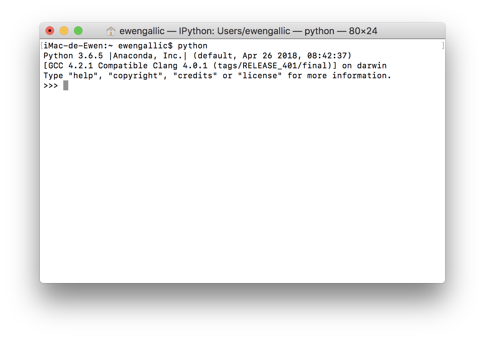
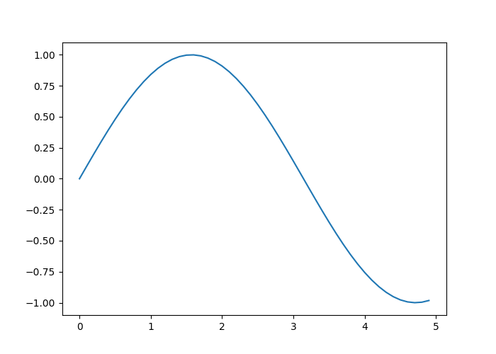

```{r knitr_init, echo=FALSE, cache=FALSE, include=FALSE}

library(knitr)
library(tidyverse)

## Global options
options(max.print="75")
opts_chunk$set(echo=TRUE,
	             cache=FALSE,
               prompt=TRUE,
               tidy=TRUE,
               # comment=NA,
               message=FALSE,
               warning=FALSE,
               size="scriptsize",
               tidy.opts=list(width.cutoff=80))
opts_knit$set(width=80)


# library(reticulate)
# use_python('/anaconda3/bin/python')

knitr::opts_chunk$set(engine.path = list(
  python = '/anaconda3/bin/python'
))
knitr::knit_engines$set(python = reticulate::eng_python)
# use_python("/anaconda3/bin/python/")
# py_config()


# toto <- import("pandas")

# ## a common hook for messages, warnings and errors
# hook_lst_bf = function(x, options) {
#     paste("\\begin{lstlisting}[basicstyle={\\bfseries}]\n", x, 
#         "\\end{lstlisting}\n", sep = "")
# }
# knit_hooks$set(source = function(x, options) {
#     paste("\\begin{lstlisting}\n", x, 
#         "\\end{lstlisting}\n", sep = "")
# }, output = function(x, options) {
#     paste("\\begin{lstlisting}[basicstyle={\\ttfamily}]\n", x, 
#         "\\end{lstlisting}\n", sep = "")
# }, warning = hook_lst_bf, message = hook_lst_bf, error = hook_lst_bf)
# 
# ## empty highlight header since it is not useful any more
# set_header(highlight = "")

options(bookdown.post.latex = function(x) {
  # x is the content of the LaTeX output file
  gsub('^\\\\(begin|end)\\{verbatim\\}$', '\\\\\\1{lstlisting}', x)
})


```


# Propos liminaires {-}

<!-- ```{r, echo=F} -->
<!-- invisible(py_config()) -->
<!-- ``` -->

```{r}
1+1
```


Ici, on va parler de ce qu'est un algorithme, et pourquoi c'est cool de savoir en rédiger.


# Introduction


Ce document est construit principalement à l'aide de différentes références, parmi lesquelles :

- des livres : @briggs_2013_python, @grus_2015_data, @vanderplas2016python, @mckinney_2017_python ;
- des (excellents) notebooks : @navaro_python.


## Historique


Python est un langage de programmation multi plates-formes, écrit en `C`, placé sous une licence libre. Il s'agit d'un langage interprété, c'est-à-dire qu'il nécessite un interprète pour exécuter les commandes, et n'a pas de phase de compilation. Sa première version publique date de 1991. L'auteur principal, [Guido van Rossum](https://en.wikipedia.org/wiki/Guido_van_Rossum) avait commencé à travailler sur ce langage de programmation durant la fin des années 1980. Le nom accordé au langage Python provient de l'intérêt de son créateur principal pour une série télévisée britannique diffusée sur la BBC intitulée "*Monty Python's Flying Circus*".

La popularité de Python a connu une croissance forte ces dernières années, comme le confirment les résultats de sondages proposés par [Stack Overflow](https://stackoverflow.com/) depuis 2011. Stack Overflow propose à ses utilisateurs de répondre à une enquête dans laquelle de nombreuses questions leur sont proposées, afin de décrire leur expérience en tant que développeur. [Les résultats de l'enquête de 2018](https://insights.stackoverflow.com/survey/2018#technology) montrent une nouvelle avancée de l'utilisation de Python par les développeurs. En effet, comme le montre la Figure\ \@ref(fig:intro-stack-langages), 38.8% des répondants indiquent développer en Python, soit 6.8 points de pourcentage de plus qu'un an auparavant, ce qui fait de ce langage de programmation celui dont la croissance a été la plus importante entre 2017 et 2018.

```{r intro-stack-langages, echo=FALSE, fig.cap="Langages de programmation, de scripting et de balisage.", fig.align='center'}
df_stack <-
  c("JavaScript", 69.8,
"HTML", 68.5,
"CSS",65.1,
"SQL",57.0,
"Java",45.3,
"Bash/Shell",39.8,
"Python",38.8,
"C#",34.4,
"PHP",30.7,
"C++",25.4,
"C",23.0,
"TypeScript",17.4,
"Ruby",10.1,
"Swift",8.1,
"Assembly",7.4,
"Go",7.1,
"Objective-C",7.0,
"VB.NET",6.7,
"R",6.1,
"Matlab",5.8,
"VBA",4.9,
"Kotlin",4.5,
"Scala",4.4,
"Groovy",4.3,
"Perl",4.2) %>%
  matrix(ncol=2, byrow = TRUE) %>%
  data.frame(stringsAsFactors = FALSE) %>%
  magrittr::set_colnames(c("Langage", "Pourcentage"))

df_stack <-
  df_stack %>%
  mutate(Langage = factor(Langage, levels = df_stack$Langage),
         Pourcentage = as.numeric(Pourcentage),
         py = Langage == "Python")

ggplot(df_stack, aes(x = Langage, y = Pourcentage, fill = py)) +
  geom_bar(stat="identity") +
  xlab(NULL) +
  ylab("Pourcentage de répondants") +
  coord_flip() +
  scale_fill_manual(values = c("TRUE" = "#0065bd", "FALSE" = "grey"), guide = "none")
```

## Versions

Ces notes de cours visent à fournir une introduction à Python, dans sa version 3.x. En ce sens, les exemples fournis corresponderont à cette version, non pas aux précédentes.

Comparativement à la version 2.7, la version 3.0 a apporté des modofications profondes. Il faut noter que Python 2.7 prendra "[sa retraite](https://pythonclock.org/)" le premier janvier 2020. Passée cette date, le support ne sera plus assuré.

## Espace de travail

Il existe de nombreux environnements dans lesquels programmer en Python. Nous allons en présenter succinctement quelques uns.

Il est supposé ici que vous vous avez installé [Anaconda](https://www.anaconda.com/) sur votre poste. Anaconda est une distribution gratuite et open source des langages de programmation Python et R pour les applications en *data science* et apprentissage automatique. Par ailleurs, lorsqu'il est fait mention du terminal dans les notes, il est supposé que le système d'exploitation de votre machine est soit Linux, soit Mac OS.

### Python dans un terminal

Il est possible d'appeler Python depuis un terminal, en exécutant la commande suivante (sous Windows : dans le menu démarrer, lancer le logiciel "Python 3.6") :
```{shell, echo=T, eval=F}
python
```

Ce qui donne le rendu visible sur la Figure\ \@ref(fig:intro-python-terminal) :

```{r intro-python-terminal, echo=F, out.width = "70%", fig.cap="Python dans un terminal.", fig.align='center', fig.pos='H'}

```

On note la présence des caractères `>>>` (*prompt*), qui invitent l'utilisateur à inscrie une commande. Les expressions sont évaluées une fois qu'elle sont soumises (à l'aide de la touche `ENTREE`) et le résultat est donné, lorsqu'il n'y a pas d'erreur dans le code.

Par exemple, lorsque l'on évalue `2+1` :
```{shell, echo=TRUE, eval=FALSE}
>>> 2+1
3
>>>
```

On note la présence du *prompt* à la fin, indiquant que Python est prêt à recevoir de nouvelles instructions.


### IPython

Il existe un environnement un peu plus chaleureux que Python dans le terminal : IPython. Il s'agit également d'un terminal interactif, mais avec davantages de fonctionnalités, notamment la coloration syntaxique ou l'auto-complétion (en utilisant la touche de tabulation).

Pour lancer IPython, on peut ouvrir un terminal et taper (puis valider) :
```{shell, echo=T, eval=F}
ipython
```

On peut également lancer IPython depuis la fenêtre d'accueil d'Anaconda, en cliquant sur le bouton `Launch` de l'application `qtconsole`, visible sur la Figure\ \@ref(fig:intro-anaconda-navigator).


```{r intro-anaconda-navigator, echo=F, out.width = "100%", fig.cap="Fenêtre d'accueil d'Anaconda.", fig.align='center', fig.pos='H'}

```


La console IPython, une fois lancée, ressemble à ceci :
```{r, echo=F, out.width = "70%", fig.cap="Console IPython.", fig.align='center', fig.pos='H'}
include_graphics("figs/ipython.png")
```

Soumettons une instruction simple pour évaluation à Python :
```{python, echo=TRUE, eval=FALSE}
print("Hello World")
```


Le résultat donne :
```{shell, echo=T,eval=FALSE}
In [1]: print("Hello World")
Hello World

In [2]:
```


Plusieurs choses sont à noter. Premièrement, on note qu'à la fin de l'exécution de l'instruction, IPython nous indique qu'il est prêt à recevoir de nouvelles instruction, par la présence du *prompt* `In [2]:`. Le numéro entre les crochets désigne le numéro de l'instruction. On note qu'il est passé de 1 à 2 après l'exécution. Ensuite, on note que le résultat de l'appel à la fonction `print()`, avec la chaîne de caractères (délimitée par des guillemets), affiche à l'écran ce qui était contenu entre les parenthèses.

### Spyder

Tandis que lorsqu'on utilise Python via un terminal, il est préférable d'avoir un éditeur de texte ouvert à côté (pour pouvoir sauvegarder les instructions), comme, par exemple, [Sublime Text](https://www.sublimetext.com/) sous Linux ou Mac OS, ou [notepad++](https://notepad-plus-plus.org/) sous Windows.

Une autre alternative consiste à utiliser un environnement de développement (IDE, pour *Integrated development environment*) unique proposant notamment, à la fois un éditeur et une console. C'est ce que propose [Spyder](https://www.spyder-ide.org/), avec en outre de nombreuses fonctionnalités supplémentaires, comme la gestion de projet, un explorateur de fichier, un historique des commandes, un débugger, etc.


Pour lancer Spyder, on peut passer par un terminal, en évaluant tout simplement `Spyder` (ou en lançant le logiciel depuis le menu démarrer sous Windows). Il est également possible de lancer Spyder depuis Anaconda.

L'environnement de développement, comme visible sur la Figure\ \@ref(fig:intro-spyder), se décompose en plusieurs fenêtres :

- à gauche : l'éditeur de script ;
- en haut à droite : une fenêtre permettant d'afficher l'aide de Python, l'arborescence du système ou encore les variables créées ;
- en bas à droite : une ou plusieurs consoles.


```{r intro-spyder, echo=F, out.width = "100%", fig.cap="Spyder.", fig.align='center', fig.pos='H'}
include_graphics("figs/spyder.png")
```

### Jupyter

Il existe une interface graphique par navigateur d'IPython, appelée [Jupyter Notebook](http://jupyter.org/). Il s'agit d'une application en open-source permettant de créer et partager des documents qui contiennent du code, des équations, des représentations graphiques et du texte. Il est possible de faire figurer et exécuter des codes de langages différents dans les notebook Jupyter.


Pour lancer Jupyter, on peut passer par Anaconda. Après avoir cliqué sur le bouton `Launch`, de Jupyter Notebook, le navigateur web se lance et propose une arborescence, comme montré sur la Figure\ \@ref(fig:intro-jupyter). Sans que l'on s'en rendiez compte, un serveur local web a été lancé ainsi qu'un processus Python (un *kernel*).

Si le navigateur en se lance pas automatiquement, on peut accéder à la page qui aurait dû s'afficher, en se rendant à l'adresse suivante : http://localhost:8890/tree?.

```{r intro-jupyter, echo=F, out.width = "100%", fig.cap="Jupyter.", fig.align='center', fig.pos='H'}
include_graphics("figs/jupyter.png")
```


Pour aborder les principales fonctions de Jupyter, nous allons créer un dossier `jupyter` dans un répertoire de notre choix. Une fois ce dossier créé, y naviguer à travers l'arborescence de Jupyter, dans le navigateur web.


Une fois dans le dossier, créer un nouveau Notebook `Python 3` (en cliquant sur le bouton `New` en haut à gauche de la fenêtre, puis sur  Python 3`).


Un notebook intitulé `Untitled` vient d'être créé, la page affiche un document vide, comme visible sur la Figure\ \@ref(fig:intro-jupyter-notebook).


```{r intro-jupyter-notebook, echo=F, out.width = "100%", fig.cap="Un notebook vide.", fig.align="center", fig.pos="H"}
include_graphics("figs/jupyter_notebook.png")
```


Si on regarde dans notre explorateur de fichier, dans le dossier `jupyter` fraîchement créé, un nouveau fichier est apparu : `Untitled.ipynb`.


#### Évaluation d'une instruction

Retournons dans le navigateur web, sur la page affichant notre *notebook*.

En dessous de la barre des menus, on note la présence d'une zone encadrée, **une cellule**, commençant, à l'instar de ce que l'on voyait dans la console sur IPython, par `IN []:`. À droite, la zone grisée nous invite à soumettre des instructions en Python.

Inscrivons :
```{python, echo=T,eval=F}
2+1
```

Pour soumettre l'instruction à évaluation, il existe plusieurs manières (il s'assurer d'avoir cliqué à l'intérieur de la cellule) :

- dans la barre des menus : `Cell > Run Cells` ;
- dans la barre des raccourcis : bouton `Run` ;
- avec le clavier : maintenir la touche `CTRL`et presser sur `Entree`.

```{r, echo=F, out.width = "100%", fig.cap="Cellule évaluée.", fig.pos="H", fig.align="center"}

```

#### Cellules de texte

Un des intérêts des *notebooks* est qu'il est possible d'ajouter des cellules de texte.

Ajoutons une cellule en-dessous de la première. Pour ce faire, on peut procéder soit :

- par la barre de menu : `Insert > Insert Cell Below` (pour insérer une cellule en-dessous ; si on désire une insertion au-dessus, il suffit de choisir `Insert Cell Above`) ;
- en cliquant dans le cadre de la cellule à partir de laquelle on désire faire un ajout (n'importe où, sauf dans la zone grisée de code, de manière à passer en mode `commande`), puis en appuyant sur la touche `B` du clavier (`A` pour une insertion au-dessus).

La nouvelle cellule appelle à nouveau à inscrire une instruction en Python. Pour indiquer que le contenu doit être interprété comme du texte, il est nécessaire de le préciser. Encore une fois, plusieurs méthodes permettent de le faire :

- par la barre de menu : `Cell > Cell Type > Markdown` ;
- par la barre des raccourcis : dans le menu déroulant où est inscrit `Code`, en sélectionnant `Markdown` ;
- en mode commande (après avoir cliqué à l'intérieur du cadre de la cellule, mais pas dans la zone de code), en appuyant sur la touche `M` du clavier.

La cellule est alors prête à recevoir du texte, rédigé en markdown. Pour plus d'informations sur la rédaction en Markdown, se référer à cette [antisèche](https://github.com/adam-p/markdown-here/wiki/Markdown-Cheatsheet) par exemple.

Entrons quelques lignes de texte pour voir très rapidement le fonctionnement des cellules rédigées en Markdown.

```{shell, echo=T, eval=F}
# Un titre de niveau 1

Je vais écrire *du texte en italique* et aussi **en gras**.

## Un titre de niveau 2

Je peux faire des listes :

- avec un item ;
- un second ;
- et un troisième imbriquant une nouvelle liste :
    - avec un sous-item,
    - et un second ;
- un quatrième incluant une liste imbriquée numérotée :
    1. avec un sous-item,
    1. et un autre.

## Un autre titre de niveau 2


Je peux même faire figurer des équation $\LaTeX$.
Comme par exemple $X \sim \mathcal{N}(0,1)$.

Pour en savoir plus sur $\LaTeX$, on peut se référer à cette :
  [page Wikipédia](https://en.wikibooks.org/wiki/LaTeX/Mathematics).
```

Ce qui donne, dans Jupyter :

```{r, echo=F, out.width = "100%", fig.cap="Cellule textuelle non évaluée.", fig.align="center", fig.pos="h"}

```

Reste alors à l'évaluer, comme s'il s'agissait d'une cellule contenant une instruction Python, pour basculer vers un affichage Markdown (`CTRL` et `ENTREE`).

Pour **éditer le texte** une fois que l'on a basculé en markdown, un simple double-clic dans la zone de texte de la cellule fait l'affaire.

Pour **changer le type de la cellule pour qu'elle devienne du code** :

- par la barre de menu : `Cell > Cell Type > Code` ;
- par la barre des raccourcis : dans le menu déroulant où est inscrit `Code`, en sélectionnant `Code` ;
- en mode commande, appuyer sur la touche du clavier `Y`.


#### Suppression d'une cellule

Pour supprimer une cellule :

- par la barre de menu : `Edit > Delete Cells` ;
- par la barre des raccourcis : icône en forme de ciseaux ;
- en mode commande, appuyer deux fois sur la touche du clavier `D`.


## Les variables

### Assignation et suppression

Lorsque nous avons évalué les instructions `2+1` précédemment, le résultat s'est affiché dans la console, mais il n'a pas été enregistré. Dans de nombreux cas, il est utile de conserver le contenu du résultat dans un objet, pour pouvoir le réutiliser par la suite. Pour ce faire, on utilise des *variables*. Pour créer une variable, on utilise le signe d'égalité (`=`), que l'on fait suivre par ce que l'on veut sauvegarder (du texte, un nombre, plusieurs nombres, etc.) et précéder par le nom que l'on utilisera pour désigner cette variable.

Par exemple, si on souhaite stocker le résultat du calcul `2+1` dans une variable que l'on nommera `x`, il faudra écrire :
```{python, eval=T, echo=T}
x = 2+1
```

Pour afficher la valeur de notre variable `x`, on fait appel à la fonction `print()` :
```{python, eval=T, echo=T}
print(x)
```


Pour changer la valeur de la variable, il suffit de faire une nouvelle assignation :
```{python, eval=T, echo=T}
x = 4
print(x)
```

Il est également possible de donner plus d'un nom à un même contenu (on réalise une copie de `x`) :
```{python, eval=T, echo=T}
x = 4;
y = x;
print(y)
```


Si on modifie la copie, l'original ne sera pas affecté :
```{python, eval=T, echo=T}
y = 0
print(y)
```

```{python, eval=T, echo=T}
print(x)
```

Pour **supprimer** une variable, on utilise l'instruction `del` :
```{python, eval=T, echo=T, error=TRUE}
del y
```

L'affichage du contenu de `y` renvoit une erreur :
```{python, eval=T, echo=T, error=TRUE}
print(y)
```

Mais on note que la variable `x` n'a pas été supprimée :
```{python, eval=T, echo=T}
print(x)
```

### Conventions de nommage

Le nom d'une variable peut être composé de caractères alphanumériques ainsi que du trait de soulignement (`_`) (il n'y a pas de limite sur la longueur du nom). Il est proscrit de faire commencer le nom de la variable par un nombre. Il est également interdit de faire figurer une espace dans le nom d'une variable.

Pour accroitre la lisibilité du nom des variables, plusieurs méthodes existes. Nous adopterons la suivante :

- toutes les lettres en minuscule ;
- la séparation des termes par un trait de soulignement.

Exemple, pour une variable contenant la valeur de l'identifiant d'un utilisateur : `id_utilisateur`.

Il faut noter que le nom des variables est **sensible à la casse** :
```{python, eval=T, echo=T, error=TRUE}
x = "toto"
print(x)
```

```{python, eval=T, echo=T, error=TRUE}
print(X)
```

## Les commentaires


Pour ajouter des commentaires en python, il existe plusieurs façons.


Une des manières de faire est d'utiliser le symbole dièse (`#`) pour effectuer un **commentaire sur une seule ligne**. Tout ce qui suit le dièse jusqu'à la fin de la ligne ne sera pas évalué par Python. En revanche, ce qui vient avant le dièse le sera.
```{python, eval=T, echo=T, error=TRUE}
# Un commentaire print("Bonjour")
print("Hello") # Un autre commentaire
```

L'introduction d'un **bloc de commentaires** (des commentaires sur plusieurs lignes) s'effectue quant à elle en entourant ce qui est ) commenter d'un délimiteur : trois guillemets simples ou doubles :
```{python, eval=F, echo=T, error=TRUE}
"""
Un commentaire qui commencer sur une ligne
et qui continue sur une autre
et s'arrête à la troisième
"""
```

## Les modules et les packages


Certaines fonctions de base en Python sont chargées par défaut. D'autres, nécessitent de charger un **module**. Ces modules sont des fichiers qui contiennent des **définitions** ainsi que des **instructions**.

Lorsque plusieurs modules sont réunis pour offrir un ensemble de fonctions, on parle alors de _**package**_.

Parmi les *packages* qui seront utilisés dans ces notes, on peut citer :

- [NumPy](http://www.numpy.org/), un *package* fondamental pour effectuer des calculs scientifiques ;
- [pandas](https://pandas.pydata.org/), un *package* permettant de manipuler facilement les données et de les analyser ;
- [Matplotlib](https://matplotlib.org/), un *package* permettant de réaliser des graphiques.

Pour charger un module (ou un *package*), on utilise la commande `import`. Par exemple, pour charger le *package* `pandas` :
```{python, eval=T, echo=T, error=TRUE}
import pandas
```

Ce qui permet de faire appel à des fonctions contenues dans le module ou le *package*. Par exemple, ici, on peut faire appel à la fonction `Series()`, contenue dans le *package* `pandas`, permettant de créer un tableau de données indexées à une dimension :

```{python, eval=T, echo=T, error=TRUE}
x = pandas.Series([1, 5, 4])
print(x)
```

Il est possible de donner un alias au module ou au *package* que l'on importe, en le précisant à l'aide de la syntaxe suivante :
```{python, echo=T, eval=F}
import module as alias
```

Cette pratique est courante pour abréger les noms des modules que l'on va être amené à utiliser beaucoup. Par exemple, pour `pandas`, il est coutume d'écourter le nom en `pd` :

```{python, eval=T, echo=T, error=TRUE}
import pandas as pd
x = pd.Series([1, 5, 4])
print(x)
```

On peut également importer une seule fonction d'un module, et lui attribuer (optionnellement) un alias. Par exemple, avec la fonction `pyplot` du *package* `matplotlib`, il est coutume de faire comme suit :

```{python, eval=F, echo=T, error=TRUE}
import matplotlib
import matplotlib.pyplot  as plt
import numpy  as np
x = np.arange(0, 5, 0.1);
y = np.sin(x)
plt.plot(x, y)
```

```{python, eval=T, echo=FALSE, error=TRUE}
import matplotlib
import matplotlib.pyplot  as plt
import numpy  as np

x = np.arange(0, 5, 0.1);
y = np.sin(x)

fig, ax = plt.subplots()
ax.plot(x, y)
fig.savefig("figs/intro_pyplot.png")
plt.close(fig)
```


```{r, echo=FALSE, fig.pos="H", fig.align="center"}

```


## L'aide


Pour conclure cette introduction, il semble important de mentionner la présence de l'**aide** et de la **documentation** en Python.

Pour obtenir des informations sur des fonctions, il est possible de se référer à la [documentation en ligne](https://docs.python.org/3/). Il est également possible d'obtenir de l'aide à l'intérieur de l'environnement que l'on utilise, en utilisant le point d'interrogation (`?`).

Par exemple, lorsque l'on utilise IPython (ce qui, rappelons-le, est le cas dans Jupyter), on peut accéder à l'aide à travers différentes syntaxes :

- `?` : fournit une introduction et un aperçu des fonctionnalités offertes en Python (on la quitte avec la touche `ESC` par exemple);
- `object?` : fournit des détails au sujet de `'object'` (par exemple `x?` ou encore `plt.plot?`) ;
- `object??` : plus de détails à propos de `'object'` ;
- `%quickref` : référence courte sur les syntaxes en Python ;
- `help()` : accès à l'aide de Python.


*Note* : la touche de **tabulation** du clavier permet non seulement une **autocomplétion**, mais aussi une **exploration du contenu** d'un objet ou module.

Par ailleurs, lorsqu'il s'agit de trouver de l'aide sur un problème plus complèxe, le bon réflèxe à adopter est de ne pas hésiter à chercher sur un moteur de recherche, dans des mailing-lists et bien évidemment sur les nombreuses questions sur [Stack Overflow](https://stackoverflow.com).


# Types de données

Il existe quelques types de données intégrés dans Python. Nous allons dans cette partie évoquer les chaînes de caractères, les valeurs numériques, les bouléens (`TRUE`/`FALSE`), la valeur `null` et les dates et temps.


## Chaînes de caractères


Une chaîne de caractères, ou *string* en anglais, est une collection de caractères comme des lettres, des nombres, des espaces, des signes de ponctuation, etc.

Les chaînes de caractères sont repérées à l'aide de guillemets simples, doubles, ou triples.

Voici un exemple :

```{python, eval=T, echo=TRUE, error=TRUE}
x = "Hello World"
```

Pour afficher dans la console le contenu de notre variable `x` contenant la chaîne de caractères, on fait appel à la fonction `print()` :

```{python, eval=T, echo=TRUE, error=TRUE}
print(x)
```


Comme indiqué juste avant, des guillemets simples peuvent être utilisés pour créer une chaîne de caractères :
```{python, eval=T, echo=TRUE, error=TRUE}
y = 'How are you?'
print(y)
```


Pour faire figurer des apostrophes dans une chaîne de caractères créée à l'aide de guillemets simples, il est nécessaire d'utiliser un caracrère d'échappement : une barre oblique inversée (`\`) :
```{python, eval=T, echo=TRUE, error=TRUE}
z = 'I\'m fine'
print(z)
```

On peut noter que si la chaîne de caractères est créée à l'aide de guillemets doubles, il n'est pas nécessaire d'avoir recours au caractère d'échappement :
```{python, eval=T, echo=TRUE, error=TRUE}
z = "I'm \"fine\""
print(z)
```


Pour indiquer un retour à la ligne, on utilise la chaîne `\n` :

```{python, eval=T, echo=TRUE, error=TRUE}
x = "Hello, \nWorld"
print(x)
```

Dans le cas de chaînes de caractères sur **plusieurs lignes**, le fait d'utiliser des guillemets simples ou doubles renverra une erreur (*EOL while scanning trial literal*, *i.e.*, détection d'une erreur de syntaxe, Python s'attendait à quelque chose d'autre à la fin de la ligne). Pour écrire une chaîne de caractères sur plusieurs lignes, Python propose d'utiliser trois fois des guillemets (simples ou doubles) en début et fin de chaîne :
```{python, eval=T, echo=TRUE, error=TRUE}
x = """Hello,
World"""
print(x)
```

```{block2, type='remarque', echo=TRUE}
Le caractère `\` (barre oblique inversée, ou *backslash*) est le caractère d'échappement. Il permet d'afficher certains caractères, comme les guillemets dans une chaîne elle-même définie à l'aide de guillemets, ou bien les caractères de contrôle, comme la tabulation, le saut de ligne, etc. Voici quelques exemples courants :

| Code  | Description | Code | Description |
| :---: |:-----------:| :---:|:-----------:|
| `\n` | Nouvelle ligne | `\r` | Retour à la ligne |
| `\t` | Tabulation | `\b` | Retour arrière |
| `\` | Barre oblique inversée | `\'` | Apostrophe |
| `\"` | Apostrophe double | `` \` `` | Accent grave |

```


Pour récupérer la **longueur d'une chaîne de caractères**, Python propose la fonction `len()` :
```{python, eval=T, echo=TRUE, error=TRUE}
x = "Hello World !"
print(len(x))
print(x, len(x))
```


### Concaténation de chaînes {#type-chaines-concatenation}

Pour concaténer des chaînes de caractères, c'est-à-dire les mettre bout à bout, Python propose d'utiliser l'opérateur `+` :

```{python, eval=T, echo=TRUE, error=TRUE}
print("Hello" + " World")
```

L'opérateur `*` permet quant à lui de répéter plusieurs fois une chaîne :

```{python, eval=T, echo=TRUE, error=TRUE}
print( 3 * "Go Habs Go! " + "Woo Hoo!")
```

Lorsque deux littéraux de chaînes sont côte à côte, Python les concatène :
```{python, eval=T, echo=TRUE, error=TRUE}
x = ('You shall ' 'not ' "pass!")
print(x)
```


Il est également possible d'**ajouter à une chaîne de caractères le contenu d'une variable**, à l'aide du marqueur `%s` :
```{python, eval=T, echo=TRUE, error=TRUE}
x = "J'aime coder en %s"
langage_1 = "R"
langage_2 = "Python"
preference_1 = x % langage_1
print(preference_1)
preference_2 = x % langage_2
print(preference_2)
```

Il est tout à fait possible d'ajouter **plus d'un contenu de variable** dans une chaîne de caractères, toujours avec le marqueur `%s` :
```{python, eval=T, echo=TRUE, error=TRUE}
x = "J'aime coder en %s et en %s"
preference_3 = x % (langage_1, langage_2)
print(preference_3)
```


### Indexation et extraction


Les chaînes de caractères peuvent être indexées. Attention, **l'indice du premier caractère commence à 0*.

Pour obtenir le ie caractère d'une chaîne, on utilise des crochets. La syntaxe est la suivante :
```{python, eval=F, echo=TRUE, error=TRUE}
x[i-1]
```

Par exemple, pour afficher le premier caractère, puis le cinquième de la chaîne `Hello` :

```{python, eval=T, echo=TRUE, error=TRUE}
x = "Hello"
print(x[0])
print(x[4])
```

L'extraction peut s'effectuer en partant par la fin de la chaîne, en faisant précéder la veleur de l'indice par le signe moins (`-`).

Par exemple, pour afficher l'avant-dernier caractère de notre chaîne `x` :
```{python, eval=T, echo=TRUE, error=TRUE}
print(x[-2])
```


L'extraction d'une sous-chaîne en précisant sa position de début et de fin (implicitement ou non) s'effectue avec les crochets également. Il suffit de préciser les deux valeurs d'indices : `[debut:fin]`.

```{python, eval=T, echo=TRUE, error=TRUE}
x = "You shall not pass!"

# Du quatrième caractère (non inclus) au neuvième (inclus)
print(x[4:9])
```

Lorsque l'on ne précise pas la première valeur, le début de la chaîne est pris par défaut ; lorsque le second n'est pas précisé, la fin de la chaîne est prise par défaut.


```{python, eval=F, echo=TRUE, error=TRUE}
# Du 4e caractère (non inclus) à la fin de la chaîne
print(x[4:])
# Du début de la chaîne à l'avant dernier caractère (inclus)
print(x[:-1])
# Du 3e caractère avant la fin (inclus) jusqu'à la fin
print(x[-5:])
```

```{python, eval=T, echo=FALSE, error=TRUE}
# Du 4e caractère (non inclus) à la fin de la chaîne
print(x[4:])
# Du début de la chaîne à l'avant dernier caractère (inclus)
print(x[:-1])
# Du 3e caractère avant la fin (inclus) jusqu'à la fin
print(x[-5:])
```


Il est possible de rajouter un troisième indice dans les crochets : **le pas**.
```{python, eval=T, echo=TRUE, error=TRUE}
# Du 4e caractère (non inclus), jusqu'à la fin de la chaîne,
# par pas de 3.
print(x[4::3])
```


Pour obtenir la chaîne en dans le sens opposé :
```{python, eval=T, echo=TRUE, error=TRUE}
print(x[::-1])
```


### Méthodes disponibles avec les chaînes de caractères


De nombreuses méthodes sont disponibles pour les chaînes de caractères. En ajoutant un point (`.`) après le nom d'un objet désignant une chaîne de caractères puis en appuyant sur la touche de tabulation, les méthodes disponibles s'affichent dans un menu déroulant.


Par exemple, la méthode `count()` permet de compter le nombre d'occurrences d'un motif dans la chaîne. Pour compter le nombre d'occurrence de `in` dans la chaîne suivante :
```{python, eval=T, echo=TRUE, error=TRUE}
x = "le train de tes injures roule sur le rail de mon indifférence"
print(x.count("in"))
```


```{block2, type='remarque', echo=TRUE}
Une fois l'appel à méthode écrit, en plaçant le curseur à la fin de la ligne et en appuyant sur les touches `Shift` et `Tabulation`, on peut afficher des explications.
```


#### Conversion en majuscules ou en minuscules


Les méthodes `lower()` et `upper()` permettent de passer une chaîne de caractères en caractères minuscules et majuscules, respectivement.
```{python, eval=F, echo=TRUE, error=TRUE}
x = "le train de tes injures roule sur le rail de mon indifférence"
print(x.lower())
print(x.upper())
```

```{python, eval=T, echo=F, error=TRUE}
x = "le train de tes injures roule sur le rail de mon indifférence"
print(x.lower())
print(x.upper())
```

#### Recherche de chaînes de caractères


Quand on souhaite **retrouver un motif** dans une chaîne de caractères, on peut utiliser la méthode `find()`. On fournit en paramètres un motif à rechercher. La méthode `find()` retourne le plus petit indice dans la chaîne où le motif est trouvé. Si le motif n'est pas retrouvé, la valeur retournée est `-1`.


```{python, eval=F, echo=TRUE, error=TRUE}
print(x.find("in"))
print(x.find("bonjour"))
```

```{python, eval=T, echo=F, error=TRUE}
print(x.find("in"))
print(x.find("bonjour"))
```


Il est possible d'ajouter en option une indication permettant de **limiter la recherche sur une sous-chaîne**, en précisant l'indice de début et de fin :
```{python, eval=T, echo=T, error=TRUE}
print(x.find("in", 7, 20))
```

Note : on peut omettre l'indice de fin ; en ce cas, la fin de la chaîne est utilisée :
```{python, eval=T, echo=T, error=TRUE}
print(x.find("in", 20))
```

```{block2, type='remarque', echo=TRUE}
Si on ne désire pas connaître la position de la sous-chaîne, mais uniquement sa présence ou son absence, on peut utiliser l'opérateur `in` : `print("train" in x)`
```

Pour effectuer une recherche **sans prêter attention à la casse**, on peut utiliser la méthode `capitalize()` :

```{python, eval=T, echo=TRUE, error=TRUE}
x = "Mademoiselle Deray, il est interdit de manger de la choucroute ici."
print(x.find("deray"))
print(x.capitalize().find("deray"))
```


#### Découpage en sous-chaînes

Pour **découper une chaîne de caractères en sous-chaînes**, en fonction d'un motif servant à la délimitation des sous-chaînes (par exemple une virgule, ou une espace), on utilise la méthode `split()` :
```{python, eval=T, echo=TRUE, error=TRUE}
print(x.split(" "))
```

En indiquant en paramètres une valeur numérique, on peut limiter le nombre de sous-chaînes retournées :
```{python, eval=T, echo=TRUE, error=TRUE}
# Le nombre de sous-chaînes maximum sera de 3
print(x.split(" ", 3))
```

La méthode `splitlines()` permet également de séparer une chaîne de caractères en fonction d'un motif, ce motif étant un caractère de fin de ligne, comme un saut de ligne ou un retour chariot par exemple.

```{python, eval=T, echo=TRUE, error=TRUE}
x = '''"Luke, je suis ton pere !
- Non... ce n'est pas vrai ! C'est impossible !
- Lis dans ton coeur, tu sauras que c'est vrai.
- Noooooooon ! Noooon !"'''
print(x.splitlines())
```


#### Nettoyage, complétion

Pour retirer des caractères blancs (*e.g.*, des espaces, sauts de ligne, quadratins, etc.) présents en début et fin de chaîne, on peut utiliser la méthode `strip()`, ce qui est parfois très utile pour nettoyer des chaînes.

```{python, eval=T, echo=TRUE, error=TRUE}
x = "\n\n    Pardon, du sucre ?     \n  \n"
print(x.strip())
```

On peut préciser en paramètre quels caractères retirer en début et fin de chaîne :

```{python, eval=T, echo=TRUE, error=TRUE}
x = "www.egallic.fr"
print(x.strip("wrf."))
```


Parfois, il est nécessaire de s'assurer d'obtenir une **chaîne d'une longueur donnée** (lorsque l'on doit fournir un fichier avec des largeurs fixes pour chaque colonne par exemple). La méthode `rjust()` est alors d'un grand secours. En lui renseignant une longueur de chaîne et un caractère de remplissage, elle retourne la chaîne de caractères avec une complétion éventuelle (si la longueur de la chaîne retournée n'est pas assez longue au regard de la valeur demandée), en répétant le caractère de remplissage autant de fois que nécessaire.

Par exemple, pour avoir une coordonnée de longitude, stockée dans une chaîne de caractères de longueur 7, en rajoutant des espaces si nécessaire :
```{python, eval=T, echo=TRUE, error=TRUE}
longitude = "48.11"
print(x.rjust(7," "))
```


#### Remplacements

La méthode `replace()` permet d'effectuer des **remplacements de motifs** dans une chaîne de caractères.

```{python, eval=T, echo=TRUE, error=TRUE}
x = "Criquette ! Vous, ici ? Dans votre propre salle de bain ? Quelle surprise !"
print(x.replace("Criquette", "Ridge"))
```

Cette méthode est très pratique pour **retirer des espaces** par exemple :

```{python, eval=T, echo=TRUE, error=TRUE}
print(x.replace(" ", ""))
```


Voici un tableau répertoriant quelques méthodes disponibles ([liste exhaustive dans la documentation](https://docs.python.org/3/library/stdtypes.html#string-methods)) :

| Méthode | Description |
|-------------:|-------------------------------------------------------------------------------:|
| `capitalize()` | Mise en majuscule du premier caractère et en minuscile du reste |
| `casefold()` | retire les distinctions de casse (utile pour la comparaison de chaînes sans faire attention à la casse) |
| `count()` | Compte le nombre d'occurrence (sans chevauchement) d'un motif |
| `encode()` | Encode une chaîne de caractères dans un encodage spécifique |
| `find()` | Retourne le plus petit indice où une sous-chaîne est trouvée |
| `lower()` | Retourne la chaîne en ayant passé chaque caractère alphabétique en minuscules |
| `replace()` | Remplace un motif par un autre |
| `split()` | Sépare la chaîne en sous-chaînes en fonction d'un motif |
| `title()` | Retourne la chaîne en ayant passé chaque première lettre de mot par une majuscule |
| `upper()` | Retourne la chaîne en ayant passé chaque caractère alphabétique en majuscules |


### Conversion en chaînes de caractères

Lorsque l'on veut concaténer une chaîne de caractères avec un nombre, Python retourne une erreur.
```{python, eval=T, echo=TRUE, error=TRUE}
nb_followers = 0
message = "He has " + nb_followers + "followers."
print(message)
```


Il est alors nécessaire de convertir au préalable l'objet n'étant pas une chaîne en une chaîne de caractères. Pour ce faire, Python propose la fonction `str()` :
```{python, eval=T, echo=TRUE, error=TRUE}
message = "He has " + str(nb_followers) + " followers."
print(message)
```


### Exercice


```{block2, type='exframe', echo=TRUE}
1. Créer deux variables nommées `a` et `b` afin qu'elles contiennent respectivement les chaînes de caractères suivantes : `23 à 0` et `C'est la piquette, Jack!`.
2. Afficher le nombre de caractères de `a`, puis de `b`.
3. Concaténer `a` et `b` dans une seule chaîne de caractères, en ajoutant une virgule comme caractère de séparation.
4. Même question en choisissant une séparation permettant un retour à la ligne entre les deux phrases.
5. À l'aide de la méthode appropriée, mettre en majuscules `a` et `b`.
6. À l'aide de la méthode appropriée, mettre en minuscules `a` et `b`.
7. Extraire le mot `la` et `Jack` de la chaîne `b`, en utilisant les indices.
8. Rechercher si la sous-chaîne `piqu` est présente dans `b`, puis faire de même avec la sous-chaîne `mauvais`.
9. Retourner la position (indice) du premier caractère `a` retrouvé dans la chaîne `b`, puis essayer avec le caractère `w`.
10. Remplacer les occurrences du motif `a` par le motif `Z` dans la sous-chaîne `b`.
11. Séparer la chaîne `b` en utilisant la virgule comme séparateur de sous-chaînes.
12. (Bonus) Retirer tous les caractères de ponctuation de la chaîne b, puis utiliser une méthode appropriée pour retirer les caractères blancs en début et fin de chaîne. (Utiliser la librairie `regex`).

```


## Valeurs numériques

Il existe quatre catégories de nombres en Python : les entiers, les nombres à virgule flottante et les complèxes.


### Entiers

Les entiers (`ints`), en Python, sont des nombres entiers signés.

```{block2, type='remarque', echo=TRUE}
On accède au type d'un objet à l'aide de la fonction `type()` en Python.
```

```{python, eval=T, echo=TRUE, error=TRUE}
x = 2
y = -2
print(type(x))
print(type(y))
```

### Nombre à virgule flottante

Les nombres à virgule flottante (`floats`) représentent les nombres réels. Ils sont écrits à l'aide d'un point permettant de distinguer la partie entière de la partie décimale du nombre.

```{python, eval=T, echo=TRUE, error=TRUE}
x = 2.0
y = 48.15162342
print(type(x))
print(type(y))
```

Il est également possible d'avoir recours aux notations scientifiques, en utilisant `E` ou `e` pour indiquer une puissance de 10. Par exemple, pour écrire $3,2^12$, on procèdera comme suit :
```{python, eval=T, echo=TRUE, error=TRUE}
x = 3.2E12
y = 3.2e12
print(x)
print(y)
```

### Nombres complèxes

Python permet nativement de manipuler des nombres complèxes, de la forme $z=a+ib$, où $a$ et $b$ sont des nombres à virgule flottante, et tel que $i^2=(-i)^2=1$. La partie réelle du nombre, $\mathfrak{R}(z)$, est $a$ tandis que sa partie imaginaire, $\mathfrak{I}(z)$, est $b$.

En python, l'unité imaginaire $i$ est dénotée par la lettre `j`.

```{python, eval=T, echo=TRUE, error=TRUE}
z = 1+3j
print(z)
print(type(z))
```


Il est également possible d'utiliser la fonction `complex()`, qui demande deux paramètres (la partie réelle et la partie imaginaire) :
```{python, eval=T, echo=TRUE, error=TRUE}
z = complex(1, 3)
print(z)
print(type(z))
```

Plusieurs méthodes sont disponibles avec les nombres complèxes. Par exemple, pour accéder au conjugué, Python fournit la méthode `conjugate()` :
```{python, eval=T, echo=TRUE, error=TRUE}
print(z.conjugate())
```

L'accès à la partie réelle d'un complèxe ou à sa partie imaginaire s'effectue à l'aide des méthodes `real()` et `imag()`, respectivement.
```{python, eval=T, echo=TRUE, error=TRUE}
z = complex(1, 3)
print(z.real())
print(z.imag())
```

### Conversions

Pour convertir un nombre dans un autre format numérique, Python dispose de quelques fonctions.


#### Conversion en entier

La **conversion d'un nombre ou d'une chaîne de caractères en entier** s'effectue à l'aide de la fonction `int()` :
```{python, eval=T, echo=TRUE, error=TRUE}
x = "3"
x_int = int(x)
print(type(x))
```

On note que la conversion d'un nombre à virgule flottante tronque le nombre pour ne garder que la partie entière :
```{python, eval=T, echo=TRUE, error=TRUE}
x = 3.6
x_int = int(x)
print(x_int)
```


#### Conversion en nombre à virgule flottante

Pour **convertir un nombre ou une chaîne de caractères en nombre à virgule flottante** (si possible), Python propose d'utiliser la fonction `float()`.

```{python, eval=T, echo=TRUE, error=TRUE}
x = "3.6"
x_float = float(x)
print(type(x_float))
```

Avec un entier à l'origine :

```{python, eval=T, echo=TRUE, error=TRUE}
x = 3
x_float = float(x)
print(x_float)
```

#### Conversion en complèxe


La conversion d'un nombre ou d'une chaîne de caractères en nombre complèxe s'effectue avec la fonction `complex()` :

```{python, eval=T, echo=TRUE, error=TRUE}
x = "2"
x_complex = complex(x)
print(x_complex)
```

Avec un *float* :

```{python, eval=T, echo=TRUE, error=TRUE}
x = 2.4
x_complex = complex(x)
print(x_complex)
```


## Booléens

Les données de type logique peuvent prendre deux valeurs : `True` ou `False`. Elles répondent
à une condition logique. Il faut faire attention à bien respecter la casse.

```{python, eval=T, echo=TRUE, error=TRUE}
x = True
y = False
print(x, y)
```


`True` peut être converti automatiquement en 1 ;  `False` en 0. Cela peut s'avérer très pratique, pour faire des comptages de valeurs vraies ou fausses dans les colonnes d'un tableau de données, par exemple.

```{python, eval=T, echo=TRUE, error=TRUE}
res = True + True + False + True*True
print(res)
```


## Objet vide

L'objet vide, communément appelé `null`, possède un équivalent en Python : `None`. Pour l'assigner à une variable, il faut faire attention à la casse :
```{python, eval=T, echo=TRUE, error=TRUE}
x = None
print(x)
print(type(x))
```


L'objet `None` est une variable neutre, au comportement "null".

Pour tester si un objet est l'objet `None`, on procède comme suit (le résultat est un booléen) :
```{python, eval=T, echo=TRUE, error=TRUE}
x = 1
y = None
print(x is None)
print(y is None)
```


## Dates et temps

Il existe plusieurs moduels pour gérer les dates et le temps en Python. Nous allons explorer une partie du module `datetime`.

### Module datetime

Python possède un module appelé `datetime` qui offre la possibilité de manipuler des dates et des durées (*dates* et *times*).

Il existe plusieurs types d'objets désignant des dates :

- `date` : une date suivant le calendrier grégorien, renseignant l'année, le mois et le jour ;
- `time` : un temp donné, sans prise en compte d'un jour particulier, renseignant l'heure, la minute, la seconde (possiblement la microseconde et le fuseau horaire également).
- `datetime` : une date combinant `date` et `time` ;
- `timedelta` : une durée entre deux objets de type `dates`, `time` ou `datetime` ;
- `tzinfo` : un type de base abstraite, renseignant au sujet des fuseaux horaires ;
- `timezone` : un type utilisant le type `tzinfo` comme un décalage fixe par rapport à l'UTC.


#### Date {#type-date}

Les objets de type `date` désignent des dates du calendrier grégorien, pour lesquelles sont mentionnées les caractéristiques suivantes : l'année, le mois et le jour.

Pour créer un objet `date`, la syntaxe est la suivante :
```{python, eval=F, echo=TRUE, error=TRUE}
date(year, month, day)
```

Par exemple, pour créer la date renseignant le 23 avril 2013 :
```{python, eval=T, echo=TRUE, error=TRUE}
from datetime import date
debut = date(year = 2013, month = 4, day = 23)
print(debut)
print(type(debut))
```

```{block2, type='remarque', echo=TRUE}
Il n'est pas obligatoire de préciser le nom des paramètres dans l'appel à la fonction `date`. L'ordre à respecter devra toutefois être le suivant : année, mois, jour.
```

On peut ensuite accéder aux attributs de la date créée (ce sont des entiers) :

```{python, eval=T, echo=TRUE, error=TRUE}
print(debut.year) # Extraire l'année
print(debut.month) # Extraire le mois
print(debut.day) # Extraire le jour
```


Les objets du type `date` possèdent quelques méthodes. Nous allons passer en revue quelques-unes d'entre-elles.

##### `ctime()`

La méthode `ctime()` retourne la date sous forme d'une chaîne de caractères.
```{python, eval=T, echo=TRUE, error=TRUE}
debut.ctime()
```

##### `weekday()`

La méthode `weekday()` retourne la position du jour de la semaine (lundi valant 0, dimanche 6)
```{python, eval=T, echo=TRUE, error=TRUE}
debut.weekday()
```

```{block2, type='remarque', echo=TRUE}
Cette méthode peut être très pratique lors d'une analyse des données, pour explorer les aspects de saisonnalité hebdomadaire.
```

##### `isoweekday()`

Dans la même veine que `weekday()`, la méthode `isoweekday()` retourne la position du jour de la semaine, en attribuant cette fois la valeur 1 au lundi et 7 au dimanche.
```{python, eval=T, echo=TRUE, error=TRUE}
debut.isoweekday()
```

##### `toordinal()`

La méthode `toordinal()` retourne le numéro du jour, en prenant comme référence la valeur 1 pour le premier jour de l'an 1.

```{python, eval=T, echo=TRUE, error=TRUE}
debut.toordinal()
```

##### `isoformat()`

La méthode `isoformat()` retourne la date en [numérotation ISO](https://fr.wikipedia.org/wiki/Num%C3%A9rotation_ISO_des_semaines), sous forme d'une chaîne de caractères.
```{python, eval=T, echo=TRUE, error=TRUE}
debut.isoformat()
```


##### `isocalendar()`

La méthode `isocalendar()` retourne un nuplet (c.f. Section\ \@ref(n-uplets-tuples)) comprenant trois éléments : l'année, le numéro de la semaine et le jour de la semaine (les trois en numérotation ISO).

```{python, eval=T, echo=TRUE, error=TRUE}
debut.isocalendar()
```


##### `replace()`

La méthode `replace()` retourne la date après avoir effectué une modification

```{python, eval=T, echo=TRUE, error=TRUE}
x = debut.replace(year=2014)
y = debut.replace(month=5)
z = debut.replace(day=24)
print(x, y, z)
```

Cela n'a pas d'incidence sur l'objet d'origine :
```{python, eval=T, echo=TRUE, error=TRUE}
print(debut)
```

Il est possible de modifier plusieurs éléments en même temps :
```{python, eval=T, echo=TRUE, error=TRUE}
x = debut.replace(day=24, month=5)
print(x)
```


##### `strftime()`

La méthode `strftime()` retourne, sous la forme d'une chaîne de caractères, une représentation de la date, selon un masque utilisé.

Par exemple, pour que la date soit représentée sous la forme `DD-MM-YYYY` (jour sur deux chiffres, mois sur deux chiffres et année sur 4) :

```{python, eval=T, echo=TRUE, error=TRUE}
print(debut.strftime("%d-%m-%Y"))
```

Dans l'exemple précédent, on note deux choses : la présence de directives de formatage (qui commencent par le symbole de pourcentage) et des caractères autres (ici, les tirets). On peut noter que les caractères peuvent être remplacés par d'autres, il s'agit ici d'un choix pour représenter la date en séparant ses éléments par ddes tirets. Il est tout à fait possible d'adopter une autre écriture, par exemple avec des barres obliques, ou même d'autres chaînes de caractères :
```{python, eval=T, echo=TRUE, error=TRUE}
print(debut.strftime("%d/%m/%Y"))
print(debut.strftime("Jour : %d, Mois : %m, Annee : %Y"))
```

Concernant les directives de formatage, elles correspondent aux codes requis par le standard C (c.f. la [documentation de Python](https://docs.python.org/fr/3/library/datetime.html#strftime-strptime-behavior)). En voici quelques-uns :

| Code | Description | Exemple |
| -------: | -----------------------------------------------------: | ------------------: |
| `%a` | Abréviation du jour de la semaine (dépend du lieu) | `Tue` |
| `%A` | Jour de la semaine complet (dépend du lieu) | `Tuesday` |
| `%b` | Abréviation du mois (dépend du lieu) | `Apr` |
| `%B` | Nom du mois complet (dépend du lieu) octobre | `April` |
| `%c`| Date et heure (dépend du lieu) au format %a %e %b %H:%M:%S:%Y | `Tue Apr 23 00:00:00 2013` |
| `%C`| Siècle (00-99) -1 (partie entière de la division de l’année par 100) | `20` |
| `%d`| Jour du mois (01–31) | `23` |
| `%D`| Date au format %m/%d/%y | `04/23/13` |
| `%e`| Jour du mois en nombre décimal (1–31) | `23` |
| `%F`| Date au format %Y-%m-%d | `2013-04-23` |
| `%h`| Même chose que %b | `Apr` |
| `%H`| Heure (00–24) | `00` |
| `%I`| Heure (01–12) | `12` |
| `%j`| Jour de l’année (001–366) | `113` |
| `%m`| Mois (01–12)  | `04` |
| `%M`| Minute (00-59)  | `00` |
| `%n`| Retour à la ligne en output, caractère blanc en input | `\n` |
| `%p`| AM/PM PM | `AM` |
| `%r`| Heure au format 12 AM/PM | `12:00:00 AM` |
| `%R`| Même chose que %H:%M  | `00:00` |
| `%S`| Seconde (00-61)  | `00` |
| `%t`| Tabulation en output, caractère blanc en input | `\t` |
| `%T`| Même chose que %H:%M:%S | `00:00:00` |
| `%u`| Jour de la semaine (1–7), commence le lundi | `2` |
| `%U`| Semaine de l’anné (00–53), dimanche comme début de semaine, et le premier dimanche de l’année définit la semaine | `16` |
| `%V`| Semaine de l’année (00-53). Si la semaine (qui commence un lundi) qui contient le 1 er janvier a quatre jours ou plus dans la nouvelle année, alors elle est considérée comme la semaine 1. Sinon, elle est considérée comme la dernière de l’année précédente, et la semaine suivante est considérée comme semaine 1 (norme ISO 8601) | `17` |
| `%w`| Jour de la semaine (0–6), dimanche étant 0  | `2` |
| `%W`| Semaine de l’année (00–53), le lundi étant le premier jour de la semaine, et typiquement, le premier lundi de l’année définit la semaine 1 (conviention G.B.) | `16` |
| `%x`| Date (dépend du lieu) | `04/23/13` |
| `%X`| Heure (dépend du lieu) | `00:00:00'` |
| `%y`| Année sans le "siècle"" (00–99)  | `13` |
| `%Y`| Année (en input, uniquement de 0 à 9999)  | `2013` |
| `%z`| offset en heures et minutes par rapport au temps UTC  |  |
| `%Z`| Abréviation du fuseau horaire (en output seulement) CEST |  |

Table: Codes de formatages


#### Time {#type-time}


Les objets de type `time` désignent des temps précis sans prise en compte d'un jour particulier. Ils renseignant l'heure, la minute, la seconde (possiblement la microseconde et le fuseau horaire également).

Pour créer un objet `time`, la syntaxe est la suivante :
```{python, eval=F, echo=TRUE, error=TRUE}
time(hour, minute, second)
```

Par exemple, pour créer le moment 23:04:59 (vingt-trois heures, quatre minutes et cinquante-neuf secondes) :

```{python, eval=T, echo=TRUE, error=TRUE}
from datetime import time
moment = time(hour = 23, minute = 4, second = 59)
print(moment)
print(type(moment))
```


On peut rajouter des informations sur la microseconde. Sa valeur doit être comprise entre zéro et un million.
```{python, eval=T, echo=TRUE, error=TRUE}
moment = time(hour = 23, minute = 4, second = 59, microsecond = 230)
print(moment)
print(type(moment))
```

On peut ensuite accéder aux attributs de la date créée (ce sont des entiers), parmi lesquels :

```{python, eval=T, echo=TRUE, error=TRUE}
print(moment.hour) # Extraire l'heure
print(moment.minute) # Extraire la minute
print(moment.second) # Extraire la seconde
print(moment.microsecond) # Extraire la microseconde
```


Les objets du type `time` possèdent quelques méthodes, dont l'utilisation est similaire aux objets de classe `date` (se référer à la Section\ \@ref(type-date)).


#### Datetime


Les objets de type `datetime` combinent les éléments des objets de type `date` et `time`. Ils renseignant le jour dans le calendrier grégorien ainsi que l'heure, la minute, la seconde (possiblement la microseconde et le fuseau horaire).

Pour créer un objet `datetime`, la syntaxe est la suivante :
```{python, eval=F, echo=TRUE, error=TRUE}
datetime(year, month, day, hour, minute, second, microsecond)
```


Par exemple, pour créer la date 23-04-2013 à 17:10:00 :

```{python, eval=T, echo=TRUE, error=TRUE}
from datetime import datetime
x = datetime(year = 2013, month = 4, day = 23,
  hour = 23, minute = 4, second = 59)
print(x)
print(type(x))
```

Les objets de type `datetime` disposent des attributs des objets de type `date` (c.f. Section\ \@ref(type-date)) et de type `time` (c.f. Section\ \@ref(type-time)).

Pour ce qui est des méthodes, davantage sont disponibles. Nous allons en commenter certaines.


##### `today()` et `now()`

Les méthodes `today()` et `now()` retournent le `datetime` courant, celui au moment où est évaluée l'instruction :
```{python, eval=T, echo=TRUE, error=TRUE}
print(x.today())
print(datetime.today())
```

La distinction entre les deux réside dans le fuseau horaire. Avec `today()`, l'attribut `tzinfo` est mis à `None`, tandis qu'avec `now()`, l'attribut `tzinfo`, s'il est indiqué, est pris en compte.


##### `timestamp()`

La méthode `timestamp()` retourne, sous forme d'un nombre à virgule flottante, le *timestamp* POSIX correspondant à l'objet de type `datetime`. Le *timestamp* POSIX correspond à l'heure Posix, équivalent au nombre de secondes écoulées depuis le premier janvier 1970, à 00:00:00 UTC.
```{python, eval=T, echo=TRUE, error=TRUE}
print(x.timestamp())
```


##### `date()`

La méthode `date()` retourne un objet de type `date` dont les attributs d'année, de mois et de jour sont identiques à ceux de l'objet :
```{python, eval=T, echo=TRUE, error=TRUE}
x_date = x.date()
print(x_date)
print(type(x_date))
```


##### `time()`

La méthode `time()` retourne un objet de type `time` dont les attributs d'heure, minute, seconde, microseconde sont identiques à ceux de l'objet :
```{python, eval=T, echo=TRUE, error=TRUE}
x_time = x.time()
print(x_time)
print(type(x_time))
```


#### Timedelta

Les objets de type `timedelta` représentent des durées séparant deux dates ou heures.

Pour créer un objet de type `timedelta`, la syntaxe est la suivante :
```{python, eval=F, echo=TRUE, error=TRUE}
timedelta(days, hours, minutes, seconds, microseconds)
```

Il n'est pas obligatoire de fournir une valeur à chaque paramètre. Lorsque qu'un paramètre ne reçoit pas de valeur, celle qui lui est attribuée par défaut est 0.

Par exemple, pour créer un objet indiquant une durée de 1 jour et 30 secondes :
```{python, eval=T, echo=TRUE, error=TRUE}
from datetime import timedelta
duree = timedelta(days = 1, seconds = 30)
duree
```

```{python, eval=F, echo=TRUE, error=TRUE}
datetime.timedelta(1, 30)
```

On peut accéder ensuite aux attributs (ayant été définis). Par exemple, pour accéder au nombre de jours que représente la durée :

```{python, eval=T, echo=TRUE, error=TRUE}
duree.days
```
```{python, eval=F, echo=TRUE, error=TRUE}
1
```


La méthode `total_seconds()` permet d'obtenir la durée exprimée en secondes :

```{python, eval=F, echo=TRUE, error=TRUE}
duree = timedelta(days = 1, seconds = 30, hours = 20)
duree.total_seconds()
158430.0
```


##### Durée séparant deux objets `date` ou `datetime`

Lorsqu'on soustrait deux objets de type `date`, on obtient le nombre de jours séparant ces deux dates, sous la forme d'un objet de type `timedelta` :
```{python, eval=T, echo=TRUE, error=TRUE}
from datetime import timedelta
debut = date(2018, 1, 1)
fin = date(2018, 1, 2)
nb_jours = fin-debut
print(type(nb_jours))
print(nb_jours)
```


Lorsqu'on soustrait deux objets de type `datetime`, on obtient le nombre de jours, secondes (et microsecondes, si renseignées) séparant ces deux dates, sous la forme d'un objet de type `timedelta` :
```{python, eval=T, echo=TRUE, error=TRUE}
debut = datetime(2018, 1, 1, 12, 26, 30, 230)
fin = datetime(2018, 1, 2, 11, 14, 31)
duree = fin-debut
print(type(duree))
print(duree)
```


On peut noter que les durée données prennent en compte les années bissextiles. Regardons d'abord pour une année non-bissextile, le nombre de jours séparant le 28 février du premier mars :
```{python, eval=F, echo=TRUE, error=TRUE}
debut = date(2021, 2,28)
fin = date(2021, 3, 1)
duree = fin - debut
duree
```

```{python, eval=F, echo=TRUE, error=TRUE}
datetime.timedelta(1)
```

Regardons à présent la même chose, mais dans le cas d'une année bissextile :
```{python, eval=F, echo=TRUE, error=TRUE}
debut_biss = date(2020, 2,28)
fin_biss = date(2020, 3, 1)
duree_biss = fin_biss - debut_biss
duree_biss
```

```{python, eval=F, echo=TRUE, error=TRUE}
datetime.timedelta(2)
```


Il est également possible d'**ajouter des durées à une date** :
```{python, eval=T, echo=TRUE, error=TRUE}
debut = datetime(2018, 12, 31, 23, 59, 59)
print(debut + timedelta(seconds = 1))
```

### Module `pytz`

Si la gestion des dates revêt une importance particulière, une librairie propose d'aller un peu plus loins, notamment en ce qui concerne la gestion des fuseaux horaires. Cette librarie s'appelle `pytz`. De nombreux exemples sont proposés sur [la page web du projet](https://pypi.org/project/pytz/).

### Exercices

```{block2, type='exframe', echo=TRUE}
1. En utilisant la fonction appropriée, stocker la date du 29 août 2019 dans un objet que l’on appellera
`d` puis afficher le type de l’objet.
2. À l’aide de la fonction appropriée, afficher la date du jour.
3. Stocker la date suivante dans un objet nommé `d2` : "2019-08-29 20:30:56". Puis, afficher dans la console avec la fonction `print()` les attributs d'année, de minute et de seconde de `d2`.
4. Ajouter 2 jours, 3 heures et 4 minutes à `d2`, et stocker le résultat dans un objet appelé `d3`.
5. Afficher la différence en secondes entre `d3` et `d2`.
6. À partir de l'objet `d2`, afficher sous forme de chaîne de caractères la date de `d2` de manière à ce qu'elle respecte la syntaxe suivante : "Mois Jour, Année", avec "Mois" le nom du mois (August), "Jour" le numéro du jour sur deux chiffres (29) et "Année" l'année de la date (2019).

```


# Structures

Python dispose de plusieurs structures différentes intégrées de base. Nous allons aborder dans cette partie quelques unes d'entre-elles : les listes, les N-uplet (ou *tuples*), les ensembles et les dictionnaires.


## Listes {#structures-listes}

Une des structures les plus flexibles en Python est la liste. Il s'agit d'un regroupement de valeurs. La création d'une liste s'effectue en écrivant les valeurs en les séparant par une virgule et en entourant l'ensemble par des crochets (`[` et `]`).

```{python, eval=T, echo=TRUE, error=TRUE}
x = ["Pascaline", "Gauthier", "Xuan", "Jimmy"]
print(x)
```


Le contenu d'une liste n'est pas forcément du texte :

```{python, eval=T, echo=TRUE, error=TRUE}
y = [1, 2, 3, 4, 5]
print(y)
```

Il est même possible de faire figurer des éléments de type différent dans une liste :
```{python, eval=T, echo=TRUE, error=TRUE}
z = ["Piketty", "Thomas", 1971]
print(z)
```

Une liste peut contenir une autre liste :
```{python, eval=T, echo=TRUE, error=TRUE}
tweets = ["aaa", "bbb"]
followers = ["Anne", "Bob", "Irma", "John"]
compte = [tweets, followers]
print(compte)
```


### Extraction des éléments {#stucture-liste-extraction}

L'accès aux éléments se fait grace à son indexation (attention, l'indice du premier élément est 0) :
```{python, eval=T, echo=TRUE, error=TRUE}
print(x[0]) # Le premier élément de x
print(x[1]) # Le second élément de x
```

L'accès à un élément peut aussi se faire en parant de la fin, en faisant figurer le signe moins (`-`) devant l'indice :
L'accès aux éléments se fait grace à son indexation (attention, l'indice du premier élément est 0) :
```{python, eval=T, echo=TRUE, error=TRUE}
print(x[-1]) # Le dernier élément de x
print(x[-2]) # L'avant dernier élément de x
```

Le découpage d'une liste de manière à obtenir un sous-ensemble de la liste s'effectue avec les deux points (`:`) :

```{python, eval=T, echo=TRUE, error=TRUE}
print(x[1:2]) # Les premiers et seconds éléments de x
print(x[2:]) # Du second (non inclus) à la fin de x
print(x[:-2]) # Du premier à l'avant dernier (non inclus)
```

```{block2, type='remarque', echo=TRUE}
Le découpage retourne également une liste.
```


Lors de l'extraction des éléments de la liste à l'aide des crochets, il est possible de rajouter un troisième paramètre, le pas :

```{python, eval=T, echo=TRUE, error=TRUE}
print(x[::2]) # Un élément sur deux
```


L'accès à des listes imbriquées s'effectue en utilisant plusieurs fois les crochets :
```{python, eval=T, echo=TRUE, error=TRUE}
tweets = ["aaa", "bbb"]
followers = ["Anne", "Bob", "Irma", "John"]
compte = [tweets, followers]
res = compte[1][3] # Le 4e élément du 2e élément de la liste compte
```


Le **nombre d'éléments d'une liste** s'obtient avec la fonction `len()` :
```{python, eval=T, echo=TRUE, error=TRUE}
print(len(compte))
print(len(compte[1]))
```


### Modification

Les listes sont mutables, c'est-à-dire que leur contenu peut être modifié une fois l'objet créé.

#### Remplacement

Pour **modifier** un élément dans une liste, on utilise l'indiçage :
```{python, eval=T, echo=TRUE, error=TRUE}
x = [1, 3, 5, 6, 9]
x[3] = 7 # Remplacement du 4e élément
print(x)
```

#### Ajout d'éléments

Pour **ajouter des éléments à une liste**, on utilise la méthode `append()` :
```{python, eval=T, echo=TRUE, error=TRUE}
x.append(11) # Ajout de la valeur 11 en fin de liste
print(x)
```

Il est aussi possible d'utiliser la méthode `extend()`, pour concaténer des listes :
```{python, eval=T, echo=TRUE, error=TRUE}
y = [13, 15]
x.extend(y)
print(x)
```


#### Suppression d'éléments

Pour **retirer un élément d'une liste**, on utilise la méthode `remove()` :
```{python, eval=T, echo=TRUE, error=TRUE}
x.remove(3) # Retire le 4e élément
print(x)
```

On peut aussi utiliser la commande `del` :
```{python, eval=T, echo=TRUE, error=TRUE}
x = [1, 3, 5, 6, 9]
del x[3] # Retire le 4e élément
print(x)
```


#### Affectations multiples

On peut modifier plusieurs valeurs en même temps :

```{python, eval=T, echo=TRUE, error=TRUE}
x = [1, 3, 5, 6, 10]
x[3:5] = [7, 9] # Remplace les 4e et 5e valeurs
print(x)
```

La modification peut agrandir la taille de la liste :
```{python, eval=T, echo=TRUE, error=TRUE}
x = [1, 2, 3, 4, 5]
x[2:3] = ['a', 'b', 'c', 'd'] # Remplace la 3e valeur
print(x)
```


On peut supprimer plusieurs valeurs en même temps :
```{python, eval=T, echo=TRUE, error=TRUE}
x = [1, 2, 3, 4, 5]
x[3:5] = [] # Retire les 4e et 5e valeurs
print(x)
```

### Test d'appartenance

En utilisant l'opérateur `in`, on peut tester l'appartenance d'un objet à une liste :

```{python, eval=T, echo=TRUE, error=TRUE}
x = [1, 2, 3, 4, 5]
print(1 in x)
```


### Copie de liste

Attention, la copie d'une liste n'est pas triviale en Python. Prenons un exemple.
```{python, eval=T, echo=TRUE, error=TRUE}
x = [1, 2, 3]
y = x
```

Modifions le premier élément de `y`, et observons le contenu de `y` et de `x` :

```{python, eval=T, echo=TRUE, error=TRUE}
y[0] = 0
print(y)
print(x)
```


Comme on peut le constater, le fait d'avoir utilisé le signe égal a simplement créé une référence et non pas une copie.

Pour effectuer une copie de liste, plusieurs façons existent. Parmi elles, l'utilisation de la fonction `list()` :
```{python, eval=T, echo=TRUE, error=TRUE}
x = [1, 2, 3]
y = list(x)
y[0] = 0
print("x : ", x)
print("y : ", y)
```

On peut noter que lorsque l'on fait un découpement, un nouvel objet est créé, pas une référence :

```{python, eval=T, echo=TRUE, error=TRUE}
x = [1, 2, 3, 4]
y = x[:2]
y[0] = 0
print("x : ", x)
print("y : ", y)
```

### Tri

Pour trier les objets de la liste (sans en créer une nouvelle), Python propose la méthode `sort()` :
```{python, eval=T, echo=TRUE, error=TRUE}
x = [2, 1, 4, 3]
x.sort()
print(x)
```

Cela fonctionne également avec des valeurs textuelles, en triant par ordre alphabétique :

```{python, eval=T, echo=TRUE, error=TRUE}
x = ["c", "b", "a", "a"]
x.sort()
print(x)
```

Il est possible de fournir à la méthode `sort()` des paramètres. Parmi ces paramètres, il en est un, `key`, qui permet de fournir une fonction pour effectuer le tri. Cette fonction doit retourner une valeur pour chaque objet de la liste, sur laquelle le tri sera effectué. Par exemple, avec la fonction `len()`, qui, lorsqu'appliquée à du texte, retourne le nombre de caractères  :


```{python, eval=T, echo=TRUE, error=TRUE}
x = ["aa", "a", "aaaaa", "aa"]
x.sort(key=len)
print(x)
```


## N-uplets (Tuples)

Les n-uplets, ou *tuples* sont des séquences d'objets Python.

Pour créer un n-uplet, on liste les valeurs, séparées par des virgules :
```{python, eval=T, echo=TRUE, error=TRUE}
x = 1, 4, 9, 16, 25
print(x)
```

On note que les n-uplets sont repérés par une suite de valeurs, entourées dans deux parenthèses.

### Extraction des éléments

Les éléments d'un n-uplet s'extraient de la même manière que ceux des listes (c.f. Section\ \@ref(structures-listes)).

```{python, eval=T, echo=TRUE, error=TRUE}
print(x[0])
```

### Modification

Contrairement aux listes, les n-uplets sont **inaltérables** (c'est-à-dire ne pouvant pas être modifés après avoir été créés) :
```{python, eval=T, echo=TRUE, error=TRUE}
x[0] = 1
```


Il est possible d'**imbriquer des n-uplets** à l'intérieur d'un autre n-uplet. Pour ce faire, on a recours à l'utilisation de parenthèses :
```{python, eval=T, echo=TRUE, error=TRUE}
x = ((1, 4, 9, 16), (1, 8, 26, 64))
print(x)
```


## Ensembles {#structure-ensembles}

Les ensembles (*sets*) sont des collections non ordonnée d'éléments uniques. Les ensembles sont inaltérables, et non indexés.

Pour créer un ensemble, Python fournit la fonction `set()`. On fournit un ou plusieurs éléments constituant l'ensemble, en les séparant par des virgules et en entourant l'ensemble d'accolades (`{}`) :
```{python, eval=T, echo=TRUE, error=TRUE}
ensemble = set({"Marseille", "Aix-en-Provence", "Nice", "Rennes"})
print(ensemble)
```

De manière équivalent, on peut ne pas utiliser la fonction `set()` et définir l'ensemble uniquement à l'aide des crochets :
```{python, eval=T, echo=TRUE, error=TRUE}
ensemble = {"Marseille", "Aix-en-Provence", "Nice", "Rennes"}
print(ensemble)
```

En revanche, si l'ensemble est vide, Python retourne un erreur si la fonction `set()` n'est pas utilisée :
il est nécessaire d'utiliser la fonction set :
```{python, eval=T, echo=TRUE, error=TRUE}
ensemble_vide = {}
type(ensemble_vide)
```

Le type de l'objet que l'on vient de créer n'est pas `set` mais `dict` (c.f. Section\ \@ref(type-dict)). Aussi, pour créer l'ensemble vide, on utilise `set()` :

```{python, eval=T, echo=TRUE, error=TRUE}
ensemble_vide = set()
type(ensemble_vide)
```


Lors de la création, s'il existe des doublons dans les valeurs fournies, ils seront supprimés pour ne garder qu'une seule valeur :

```{python, eval=T, echo=TRUE, error=TRUE}
ensemble = set({"Marseille", "Aix-en-Provence", "Nice", "Marseille", "Rennes"})
print(ensemble)
```

La longueur d'un ensemble s'obtient à l'aide de la fonction `len()` :
```{python, eval=T, echo=TRUE, error=TRUE}
print(len(ensemble))
```

### Modifications

#### Ajout

Pour ajouter un élément à un ensemble, Python offre la méthode `add()` :
```{python, eval=T, echo=TRUE, error=TRUE}
ensemble.add("Toulon")
print(ensemble)
```

Si l'élément est déjà présent, il ne sera pas ajouté :
```{python, eval=T, echo=TRUE, error=TRUE}
ensemble.add("Toulon")
print(ensemble)
```


#### Suppression

Pour supprimer une valeur d'un ensemble, Python propose la méthode `remove()` :
```{python, eval=T, echo=TRUE, error=TRUE}
ensemble.remove("Toulon")
print(ensemble)
```

Si la valeur n'est pas présente dans l'ensemble, Python retourne un message d'erreur :
```{python, eval=T, echo=TRUE, error=TRUE}
ensemble.remove("Toulon")
print(ensemble)
```

### Test d'appartenance

Un des intérêts des ensembles est la recherche rapide de présence ou absence de valeurs (plus rapide que dans une liste). Comme pour les listes, les tests d'appartenance s'effectuent à l'aide de l'opérateur `in` :
```{python, eval=T, echo=TRUE, error=TRUE}
print("Marseille" in ensemble)
print("Paris" in ensemble)
```


### Copie d'ensemble 


Pour copier un ensemble, comme pour les listes (c.f. Section\ \@ref(copie-de-liste)), il ne faut pas utiliser le signe d'égalité. La copie d'un ensemble se fait à l'aide de la méthode `copy()` :
```{python, eval=T, echo=TRUE, error=TRUE}
ensemble = set({"Marseille", "Aix-en-Provence", "Nice"})
y = ensemble.copy()
y.add("Toulon")
print("y : ", y)
print("ensemble : ", ensemble)
```


### Conversion en liste

Un des intérêts des ensembles est est qu'ils contiennent des éléments uniques. Aussi, lorsque l'on souhaite obtenir les éléments distincts d'une liste, il est possible de la convertir en ensemble (avec la fonction `set()`), puis de convertir l'ensemble en liste (avec la fonction `list()`) :
```{python, eval=T, echo=TRUE, error=TRUE}
ma_liste = ["Marseille", "Aix-en-Provence", "Marseille", "Marseille"]
print(ma_liste)

mon_ensemble = set(ma_liste)
print(mon_ensemble)

ma_nouvelle_liste = list(mon_ensemble)
print(ma_nouvelle_liste)
```


## Dictionnaires {#type-dict}

Les dictionnaires en Python sont une implémentation d'objets clé-valeurs, les clés étant indexées.

Les clés sont souvent du texte, les valeurs peuvent être de différents types et différentes structures.


Pour créer un dictionnaire, on peut procéder en utilisant des accolades (`{}`). Comme rencontré dans la Section\ \@ref(structure-ensembles), si on évalue le code suivant, on obtient un dictionnaire :
```{python, eval=T, echo=TRUE, error=TRUE}
dict_vide = {}
print(type(dict_vide))
```

Pour créer un dictionnaire avec des entrée, on peut utiliser les accolades, on sépare chaque entrée par des virgules, et on distingue la clé de la valeur associée par deux points (`:`) :
```{python, eval=T, echo=TRUE, error=TRUE}
mon_dict = { "nom": "Kyrie",
  "prenom": "John",
  "naissance": 1992,
  "equipes": ["Cleveland", "Boston"]}
print(mon_dict)
```


Il est aussi possible de créer un dictionnaire à l'aide de la fonction `dict()`, en fournissant une séquence de clés-valeurs :
```{python, eval=T, echo=TRUE, error=TRUE}
x = dict([("Julien-Yacine", "Data-scientist"),
  ("Sonia", "Directrice")])
print(x)
```


### Extraction des éléments

L'extraction dans les dictionnaires repose sur le même principe que pour les listes et les n-uplets (c.f. Section\ \@ref(#stucture-liste-extraction)). Toutefois, l'extraction d'un élément d'un dictionnaire ne se fait pas en fonction de sa position dans le dictionnaire, mais par sa clé :
```{python, eval=T, echo=TRUE, error=TRUE}
print(mon_dict["prenom"])
print(mon_dict["equipes"])
```


Si l'extraction s'effectue par une clé non présente dans le dictionnaire, une erreur sera retournée :
```{python, eval=T, echo=TRUE, error=TRUE}
print(mon_dict["age"])
```


On peut tester la présence d'une clé avec l'opérateur `in` :
```{python, eval=T, echo=TRUE, error=TRUE}
print("prenom" in mon_dict)
print("age" in mon_dict)
```

L'extraction de valeurs peut aussi se faire à l'aide de la méthode `get()`, qui retourne une valeur `None` si la clé n'est pas présente :
```{python, eval=T, echo=TRUE, error=TRUE}
print(mon_dict.get("prenom"))
print(mon_dict.get("age"))
```


### Clés et valeurs

À l'aide de la méthode `key()`, on peut accéder aux clés du dictionnaire :
```{python, eval=T, echo=TRUE, error=TRUE}
les_cles = mon_dict.keys()
print(les_cles)
print(type(les_cles))
```

Il est possible par la suite de transformer cette énumération de clés en liste :
```{python, eval=T, echo=TRUE, error=TRUE}
les_cles_liste = list(les_cles)
print(les_cles_liste)
```


La méthode `values()` fournit quand à elle les valeurs du dictionnaire :
```{python, eval=T, echo=TRUE, error=TRUE}
les_valeurs = mon_dict.values()
print(les_valeurs)
print(type(les_valeurs))
```


La méthode `items()` fournit quand à elle les clés et valeurs sous forme de n-uplets :
```{python, eval=T, echo=TRUE, error=TRUE}
les_items = mon_dict.items()
print(les_items)
print(type(les_items))
```


### Recherche d'appartenance

Grâce aux méthodes `keys()`, `values()` et `items()`, il est aisé de rechercher la présence d'objets dans un dictionnaire.

```{python, eval=T, echo=TRUE, error=TRUE}
print("age" in les_cles)
print("nom" in les_cles)
print(['Cleveland', 'Boston'] in les_valeurs)
```


### Modification

#### Remplacement

Pour remplacer la valeur associée à une clé, on peut utiliser les crochets (`[]`) et le signe d'égalité (`=`).

Par exemple, pour remplacer les valeurs associées à la clé `equipes` :
```{python, eval=T, echo=TRUE, error=TRUE}
mon_dict["equipes"] = ["Montclair Kimberley Academy",
  "Cleveland Cavaliers", "Boston Celtics"]
print(mon_dict)
```


#### Ajout d'éléments

L'ajout d'un élément dans un dictionnaire peut s'effectuer avec les crochets (`[]`) et le signe d'égalité (`=`) :

```{python, eval=T, echo=TRUE, error=TRUE}
mon_dict["taille_cm"] = 191
print(mon_dict)
```


Pour ajouter le contenu d'un autre dictionnaire à un dictionnaire, Python propose la méthode `update()`.

Créons un second dictionnaire dans un premier temps :
```{python, eval=T, echo=TRUE, error=TRUE}
second_dict = {"masse_kg" : 88, "debut_nba" : 2011}
print(second_dict)
```

Ajoutons le contenu de ce second dictionnaire au premier :
```{python, eval=T, echo=TRUE, error=TRUE}
mon_dict.update(second_dict)
print(mon_dict)
```

Si on modifie par la suite le second dictionnaire, cela n'aura pas d'incidence sur le premier :
```{python, eval=T, echo=TRUE, error=TRUE}
second_dict["poste"] = "PG"
print(second_dict)
print(mon_dict)
```


#### Suppression d'éléments


La suppression d'un élément dans un dictionnaire peut s'effectuer de plusieurs manières. Par exemple, avec l'opérateur `del` :
```{python, eval=T, echo=TRUE, error=TRUE}
del mon_dict["debut_nba"]
print(mon_dict)
```

Il est également possible d'utiliser la méthode `pop()` :

```{python, eval=T, echo=TRUE, error=TRUE}
res = mon_dict.pop("masse_kg")
print(mon_dict)
```

Dans l'instruction précédente, nous avons ajouté une assignation du résultat de l'appliation de la méthode `pop()` à une variable nommée `res`. Comme on peut le constater, la méthode `pop()`, en plus d'avoir supprimé la clé, a retourné la valeur associée :
```{python, eval=T, echo=TRUE, error=TRUE}
print(res)
```

### Copie de dictionnaire


Pour copier un dictionnaire, et non créer une référence (ce qui est le cas si on utilise le signe d'égalité), Python fournit comme pour les ensembles, une méthode `copy()` :

```{python, eval=T, echo=TRUE, error=TRUE}
d = {"Marseille": 13, "Rennes" : 35}
d2 = d.copy()
d2["Paris"] = 75
print("d: ", d)
print("d2: ", d2)
```

### Exercice

```{block2, type='exframe', echo=TRUE}
1. Créer un dictionnaire nommé `photo`, comprenant les couples clés-valeurs suivants :
  1. clé : `id`, valeur : `1`,
  2. clé : `description`, valeur : `Une photo du Vieux-port de Marseille`,
  3. clé : `loc`, valeur : une liste dans laquelle sont données les coordonnées suivantes `5.3772133`, `43.302424`.
2.Ajouter le couple de clé-valeur suivant au dictionnaire `photo` : clé : `utilisateur`, valeur : `bob`.
3. Rechercher s'il existe une entrée dont la clé vaut `description` dans le dictionnaire `photo`. Si tel est le cas, afficher l'entrée correspondante (clé et valeur).
4. Supprimer l'entrée dans `photo` dont la clé vaut `utilisateur`.
5. Modifier la valeur de l'entrée `loc` dans le dictionnaire `photo`, pour proposer une nouvelle liste, dont les coordonnées sont les suivantes : `5.3692712` et `43.2949627`.

```


# Opérateurs

Python comprend différents opérateurs, permettant d'effectuer des opérations entre les opérandes, c'est-à-dire entre des variables, des littéraux ou encore des expressions.

## Opérateurs arithmétiques {#operateurs-arithmetiques}

Les opérateurs arithmétiques de base sont intégrés dans Python.

Nous avons déjà utilisé dans les chapitres précédents certains d'entre eux, pour effectuer des opérations sur les entiers ou les nombres à virgule flotante (addition, soustraction, etc.). Faisons un tour rapide des opérateurs arithmétiques les plus courants permettant de réaliser des opérations sur des nombres.

### Addition

On effectue une addition entre deux nombres à l'aide du symbole `+` :

```{python, eval=T, echo=TRUE, error=TRUE}
print(1+1) # Addition
```


### Soustraction

On effectue une soustraction entre deux nombres à l'aide du symbole `-` :

```{python, eval=T, echo=TRUE, error=TRUE}
print(1+1) # Soustraction
```


### Multiplication

On effectue une multiplication entre deux nombres à l'aide du symbole `*` :

```{python, eval=T, echo=TRUE, error=TRUE}
print(2*2) # Multiplication
```


### Division

On effectue une division (réelle) entre deux nombres à l'aide du symbole `/` :

```{python, eval=T, echo=TRUE, error=TRUE}
print(3/2) # Division
```

Pour effectuer une division entière, on double la barre oblique :
```{python, eval=T, echo=TRUE, error=TRUE}
print(3//2) # Division entière
```

### Modulo

Le modulo (reste de la division euclidienne) s'obtient à l'aide du symbole `%` :

```{python, eval=T, echo=TRUE, error=TRUE}
print(12%10) # Modulo
```

### Puissance

Pour élever un nombre à une puissance données, on utilise deux étoiles (`**`) :
```{python, eval=T, echo=TRUE, error=TRUE}
print(2**3) # 2 élevé à la puissance 3
```


### Ordre

L'ordre des opérations suit la règle PEMDAS (*Parentheses*, *Exponents*, *Multiplication and Division*, *Addition and Subtraction*).

Par exemple, l'instruction suivante effectue d'abord le calcul $2\times 2$, puis ajoute $1$ :

```{python, eval=T, echo=TRUE, error=TRUE}
print(2*2+1) 
```


L'instruction suivante, grâce aux parenthèses, effectue d'abord le calcul $2+1$, puis la multiplication du résultat avec $2$ :
```{python, eval=T, echo=TRUE, error=TRUE}
print(2*(2+1)) 
```


### Opérateurs mathématiques sur des chaînes de caractères

Certains opérateurs mathématiques présentés dans la Section\ \@ref(operateurs-arithmetiques) peuvent-être appliquées à des chaînes de caractères.


Lorsque l'on utilise le symbole `+` entre deux chaînes de caractères, Python concatène ces deux chaînes (cf. Section\ \@ref(type-chaines-concatenation)) :
```{python, eval=T, echo=TRUE, error=TRUE}
a = "euro"
b = "dollar"
print(a+b)
```


Lorsqu'on "multiplie" une chaîne par un scalaire $n$, Python répète la chaîne le nombre $n$ fois :
```{python, eval=T, echo=TRUE, error=TRUE}
2*a
```

### Opérateurs mathématiques sur des listes ou des n-uplets

Certains opérateurs mathématiques peuvent également être appliquées à des listes.

Lorsque l'on utilise le symble `+` entre deux listes, Python les concatène en une seule :
```{python, eval=T, echo=TRUE, error=TRUE}
l_1 = [1, "pomme", 5, 7]
l_2 = [9, 11]
print(l_1 + l_2)
```

Idem avec des n-uplets =
```{python, eval=T, echo=TRUE, error=TRUE}
t_1 = (1, "pomme", 5, 7)
t_2 = (9, 11)
print(t_1 + t_2)
```

En "multipliant" une liste par un scalaire $n$, Python répète $n$ fois cette liste :
```{python, eval=T, echo=TRUE, error=TRUE}
print(3*l_1)
```

Idem avec des n-uplets :
```{python, eval=T, echo=TRUE, error=TRUE}
print(3*t_1)
```

## Opérateurs de comparaison


Les opérateurs de comparaisons permettent de comparer entre eux des objets de tous les types de base. Le résultat d'un test de comparaison produit des valeurs booléennes.

| Opérateur | Opérateur en Python | Description |
| --------: | --------: | --------------------------------------: |
| $=$ | `==` |  Égal à |
| $\ne$ | `!=` (ou `<>`) |  Différent de |
| $>$ | `>` |  Supérieur à |
| $\geq$ | `>=` | & Supérieur ou égal à |
| $<$ | `<`  |Inférieur à |
| $\leq$ | `<=` | Inférieur ou égal à |
| $\in$ | `in` | Dans  |
| $\notin$ | `not in` | Exclu  |

Table: Opérateurs de comparaison

### Égalité, inégalité

Pour tester l'égalité de contenu entre deux objets :
```{python, eval=T, echo=TRUE, error=TRUE}
a = "Hello"
b = "World"
c = "World"

print(a == c)
print(b == c)
```

L'inégalité entre deux objets :
```{python, eval=T, echo=TRUE, error=TRUE}
x = [1,2,3]
y = [1,2,3]
z = [1,3,4]

print(x != y)
print(x != z)
```


### Infériorité et supériorité, stricts ou larges

Pour savoir si un objet est inférieur (strictement ou non) ou inférieur (strictement ou non) à un autre :

```{python, eval=T, echo=TRUE, error=TRUE}
x = 1
y = 1
z = 2

print(x < y)
print(x <= y)
print(x > z)
print(x >= z)
```


On peut également effectuer la comparaison entre deux chaînes de caractères. La comparaison s'effectue en fonction de l'ordre lexicographique :
```{python, eval=T, echo=TRUE, error=TRUE}
m_1 = "mange"
m_2 = "manger"
m_3 = "boire"
print(m_1 < m_2) # mange avant manger
print(m_3 > m_1) # boire avant manger
```


Lorsque l'on compare deux listes entre-elles, Python fonctionne pas à pas. Regardons à travers un exemple comment cette comparaison est effectuée.

Créons deux listes :
```{python, eval=T, echo=TRUE, error=TRUE}
x = [1, 3, 5, 7]
y = [9, 11]
```

Python va commencer par comparer les premiers éléments de chaque liste (ici, c'est possible, les deux éléments sont comparables ; dans le cas contraire, une erreur serait retournée) :

```{python, eval=T, echo=TRUE, error=TRUE}
print(x < y)
```

Comme `1<9`, Python retourne `True`.

Changeons `x` pour que le premier élément soit supérieur au premier de `y`
```{python, eval=T, echo=TRUE, error=TRUE}
x = [10, 3, 5, 7]
y = [9, 11]
print(x < y)
```

Cette fois, comme $10>9$, Python retourne `False`.

Changeons à présent le premier élément de `x` pour qu'ils soit égal à celui de `y` :
```{python, eval=T, echo=TRUE, error=TRUE}
x = [10, 3, 5, 7]
y = [10, 11]
print(x < y)
```

Cette fois, Python compare le premier élement de `x` avec celui de `y`, comme les deux sont identiques, les seconds éléments sont comparés. On peut s'en convaincre en évaluant le code suivant :

```{python, eval=T, echo=TRUE, error=TRUE}
x = [10, 12, 5, 7]
y = [10, 11]
print(x < y)
```


### Inclusion et exclusion

Comme rencontré plusieurs fois dans le Chapitre\ \@ref(structures), les tests d'inclusions s'effectuent à l'aide de l'opérateur `in`.

```{python, eval=T, echo=TRUE, error=TRUE}
print(3 in [1,2, 3])
```


Pour tester si un élément est exclu d'une liste, d'un n-uplet, dictionnaire, etc., on utilise `not in` :

```{python, eval=T, echo=TRUE, error=TRUE}
print(4 not in [1,2, 3])
print(4 not in [1,2, 3, 4])
```

Avec un dictionnaire :
```{python, eval=T, echo=TRUE, error=TRUE}
dictionnaire = {"nom": "Rockwell", "prenom": "Criquette"}
"age" not in dictionnaire.keys()
```


## Opérateurs logiques

Les opérateurs logiques opèrent sur un ou plusieurs objets de type logique (des booléens).

### Et logique

L'opérateur `and` permet d'effectuer des comparaisons "ET" logiques. On compare deux objets, `x` et `y` (ces objets peuvent résulter d'une comparaison préalable, il suffit juste que tous deux soient des booléens).

Si l'un des deux objets `x` et `y` est vrai, la comparaison "ET" logique retourne vrai :

```{python, eval=T, echo=TRUE, error=TRUE}
x = True
y = True
print(x and y)
```

Si au moins l'un des deux est faux, la comparaison "ET" logique retourne faux :

```{python, eval=T, echo=TRUE, error=TRUE}
x = True
y = False

print(x and y)
print(y and y)
```

Si un des deux objets comparés vaut la valeur vide (`None`), alors la comparaison "ET" logique retourne :

- la valeur `None` si l'autre objet vaut `True` ou `None` ;
- la valeur `False` si l'autre objet vaut `False`
```{python, eval=T, echo=TRUE, error=TRUE}
x = True
y = False
z = None
print(x and z)
print(y and z)
print(z and z)
```


### Ou logique


L'opérateur `or` permet d'effectuer des comparaisons "OU" logiques. À nouveau, on compare deux booléens, `x` et `y`.

Si au moins un des deux objets `x` et `y` est vrai, la comparaison "OU" logique retourne vrai :

```{python, eval=T, echo=TRUE, error=TRUE}
x = True
y = False
print(x or y)
```

Si les deux sont faux, la comparaison "OU" logique retourne faux :

```{python, eval=T, echo=TRUE, error=TRUE}
x = False
y = False
print(x or y)
```

Si l'un des deux objets vaut `None`, la comparaison "OU" logique retourne :

- `True` si l'autre objet vaut `True` ;
- `None` si l'autre objet vaut `False` ou `None`

```{python, eval=T, echo=TRUE, error=TRUE}
x = True
y = False
z = None
print(x or z)
print(y or z)
print(z or z)
```


### Non logique


L'opérateur `not`, lorsqu'appliqué à un booléen, évalue ce dernier à sa valeur opposée :


```{python, eval=T, echo=TRUE, error=TRUE}
x = True
y = False
print(not x)
print(not y)
```


Lorsque l'on utilise l'opérateur `not` sur une valeur vide (`None`), Python retourne `True` :
```{python, eval=T, echo=TRUE, error=TRUE}
x = None
not x
```


## Quelques fonctions


Python dispose de nombreuses fonctions utiles pour manipuler les structures et données. Le tableau suivant en répertorie quelques-unes. Certaines nécessitent le chargement de la librairie `math`. Nous verrsons d'autres fonctions propres à la librairie `NumPy` au Chapitre\ \@ref(numpy).

| Fonction | Description |
| ---------: | --------------------------------------------: |
| `math.ceil(x)` | Plus petits entier supérieur ou égal à `x` |
| `math.copysign(x, y)` | Valeur absolue de `x` mais avec le signe de `y` |
| `math.floor(x)` | Plus petits entier inférieur ou égal à `x` |
| `math.round(x, ndigits)` | Arrondi de `x` à `ndigits` décimales près |
| `math.fabs(x)` | Valeur absolue de `x` |
| `math.exp(x)` | Exponentielle de `x` |
| `math.log(x)` | Logarithme naturel de `x` (en base e) |
| `math.log(x, b)` | Logarithme en base `b`  de `x` |
| `math.log10(x)` | Logarithme en base 10  de `x` |
| `math.pow(x,y)` | `x` élevé à la puissance `y` |
| `math.sqrt(x)` | Racine carrée de `x` |
| `math.fsum()` | Somme des valeurs de `x` |
| `math.sin(x)` | Sinus de `x` |
| `math.cos(x)` | Cosinus de `x` |
| `math.tan(x)` | Tangente de `x` |
| `math.asin(x)` | Arc-sinus de `x` |
| `math.acos(x)` | Arc-cosinus de `x` |
| `math.atan(x)` | Arc-tangente de `x` |
| `math.sinh(x)` | Sinus hyperbolique de `x` |
| `math.cosh(x)` | Cosinus hyperbolique de `x` |
| `math.tanh(x)` | Tangente hyperbolique de `x` |
| `math.asinh(x)` | Arc-sinus hyperbolique de `x` |
| `math.acosh(x)` | Arc-cosinus hyperbolique de `x` |
| `math.atanh(x)` | Arc-tangente hyperbolique de `x` |
| `math.degree(x)` | Conversion de `x` de radians en degrés |
| `math.radians(x)` | Conversion de `x` de degrés en radians |
| `math.factorial()` | Factorielle de `x` |
| `math.gcd(x, y)` | Plus grand commun diviseur de `x` et `y` |
| `math.isclose(x, y, rel_tol=1e-09, abs_tol=0.0)` | Compare `x` et `y` et retourne s'ils sont proches au reard de la tolérance `rel_tol` (`abs_tol` est la tolérance minimum absolue) |
| `math.isfinite(x)` | Retourne `True` si `x` est soit l'infini, soir `NaN`  |
| `math.isinf(x)` | Retourne `True` si `x` est l'infini, `False` sinon |
| `math.isnan(x)` | Retourne `True` si `x` est `NaN`, `False` sinon |

Table: Quelques fonctions numériques

## Quelques constantes

La librairie `math` propose quelques constantes :

| Fonction | Description |
| ---------: | --------------------------------------------: |
| `math.pi` | Le nombre Pi ($\pi$) |
| `math.e` | La constante $e$  |
| `math.tau` | La constante $\tau$, égale à $2\pi$ |
| `math.inf` | L'infini ($\infty$) |
| `-math.inf` | Moins l'infini ($-\infty$) |
| `math.nan` | Nombre à virgule flotante *not a number* |

Table: Quelques constantes intégrées dans Python

## Exercice

```{block2, type='remarque', echo=TRUE}
1. Calculer le reste de la division euclidienne de 10 par 3.
2. Afficher le plus grand commun diviseur entre 6209 et 4435.
3. Soient deux objets : `a = 18` et `b = -4`. Tester si: 
  
  - `a` est inférieur à `b` strictement,
  - `a` est supérieur ou égal à `b`,
  - `a` est différent de `b`.
4. Soit la liste `x = [1, 1, 2, 3, 5, 8]`. Regarder si :
  
  - `1` est dans `x` ;
  - `0` est dans `x` ;
  - `1` et `0` sont dans `x` ;
  - `1` ou `0` sont dans `x` ;
  - `1` ou `0` n'est pas présent dans `x`.

```


# Chargement et sauvegarde de données

## Charger des données

### Fichiers textes

### Fichiers CSV

### Fichiers Excel


## Exporter des données

### Fichiers textes

### Fichiers CSV


# Conditions

## Les conditions `if... else`

## Switch ?


# Boucles

## Boucles avec `while()`

## Boucles avec `for()`


# Fonctions


## Définition

## Portée

## Fonctions lambda

## Erreurs


# Introduction à Numpy {#numpy}


# Manipulation de données avec Pandas

## Importation et exportation de données

## Sélection

## Filtrage

## Retrait des valeurs dupliquées

## Modification des colonnes

## Tri

## Jointures

## Agrégation

## Stacking et unstacking


# Visualisation de données

# Programmation parallèle

# References


